class: title-slide, middle

<style type="text/css">
  .title-slide {
    background-image: url('../assets/img/bg.jpg');
    background-color: #23373B;
    background-size: contain;
    border: 0px;
    background-position: 600px 0;
    line-height: 1;
  }
</style>

# Séance 1

<hr width="65%" align="left" size="0.3" color="orange"></hr>

## Introduction: Méthodes en écologie computationnelle

<hr width="65%" align="left" size="0.3" color="orange" style="margin-bottom:40px;" alt="@Martin Sanchez"></hr>

.instructors[
  **BIO500** - Dominique Gravel
]

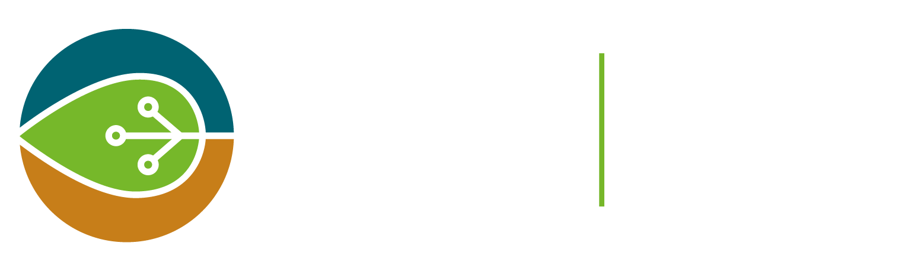</img>

---

# Séance 1

- Ces diapositives sont disponibles en [version web](https://econumuds.github.io/BIO500/bloc1/).
- L'ensemble du matériel de cours est disponible sur la page du cours [github](https://github.com/EcoNumUdS/BIO500).

---
class: inverse, center, middle

# Introduction

<hr width="65%" size="0.3" color="orange" style="margin-top:-20px;"></hr>

---

# L'importance des réseaux

.center[
  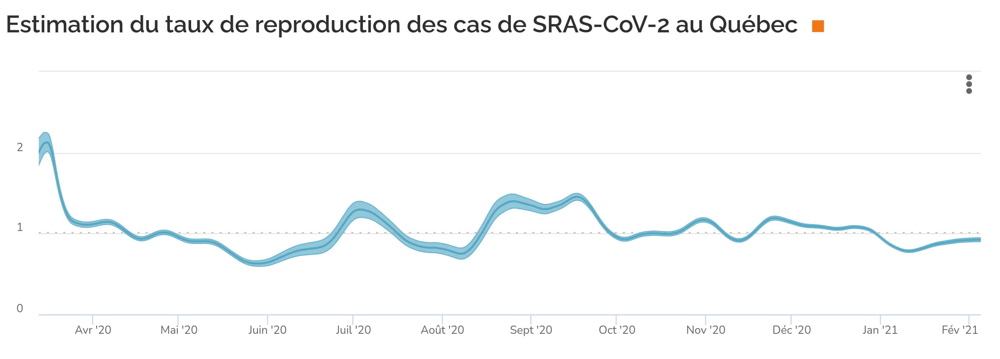</img>
]

---

# L'importance des réseaux

.center[
  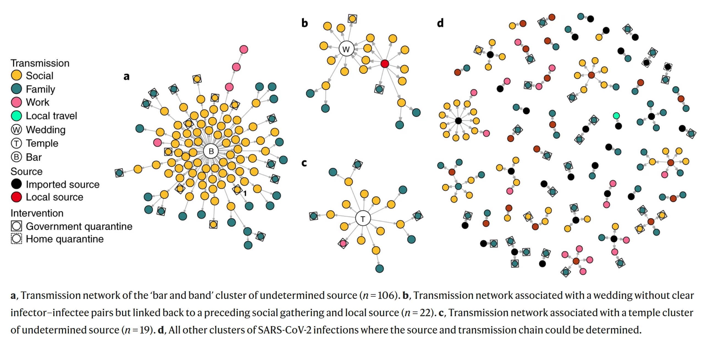</img>
]

---

# Le Bacon number

.center[
  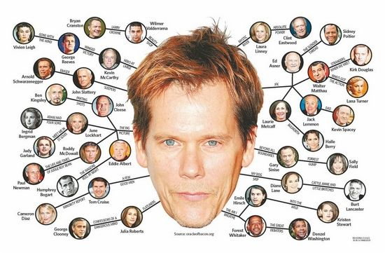</img>
]

---
# Le Bacon number

Une hypothèse selon laquelle n'importe quel acteur peut être relié à Kevin Bacon via ses rôles dans 6 films ou moins.

---
# Exemple

- Kevin Bacon a lui-même un Bacon number de 0
- Sean Penn a un Bacon number de 1 pour son rôle dans *Mystic River*
- Madonna a un Bacon number de 2 pour son rôle dans *Shadows and Fog*, dans lequel figurait Camille Saviola, qui a elle-même joué avec Kevin Bacon dans *Queens Logic*

Si le jeu vous amuse, allez consulter le site [The Oracle of Bacon](https://oracleofbacon.org/movielinks.php)

---
# Six degrés de séparation

Le jeu est une parodie du mythe urbain de six degrés de séparation, qui propose que tous les humains sur la terre soient à moins de six degrés de séparation dans une chaine "d'ami à ami".

Kochen a proposé dans les années 50 que "*it is practically certain that any two individuals can contact one another by means of at most two intermediaries. In a [socially] structured population it is less likely but still seems probable. And perhaps for the whole world's population, probably only one more bridging individual should be needed.*"

---
# L'expérience de Milgram

- Inspiré des travaux de Gurevich
- Étude des réseaux sociaux
- Souhait d'évaluer la probabilité que deux personnes sélectionnées au hasard se connaissent

---
# L'expérience de Milgram

- Individus choisis au hasard au Nebraska et au Kansas, et qui devaient rejoindre des personnes à Boston.
- Un paquet était envoyé, incluant des instructions, une lettre ainsi que de l'information sur la personne ciblée à Boston
- Si la personne de départ connaissait directement la cible, elle devait lui envoyer directement la lettre
- Sinon, la personne devait choisir un ami ou une connaissance qui était susceptible de connaître la personne cible
- Une fois rendu à destination, le destinataire envoyait la chaîne de communication au chercheur

---
# Résultats

- 64 lettres sur 296 envoyées sont arrivées à destination
- Le nombre de degrés moyens était entre 5 et 6

---
# Suivi

- L'expérience a été répliquée de nombreuses fois, notamment par Dodds et al. qui ont aussi confirmé un nombre de 6
- Watts et Strogatz (1998) ont élaboré un modèle qui permet d'expliquer les propriétés de petit monde trouvées dans de nombreux réseaux

---
# Le modèle de petits mondes

.center[
  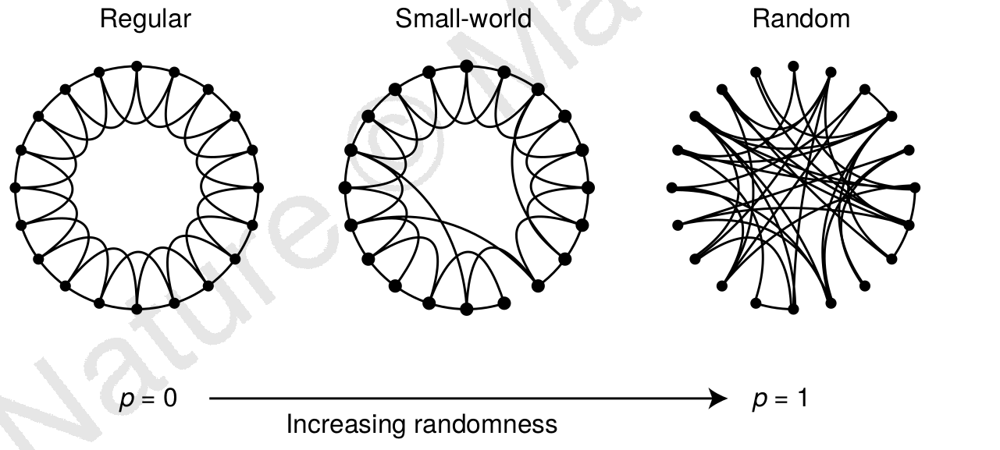</img>
]

---
# Les propriétés de petit monde en écologie

.center[
  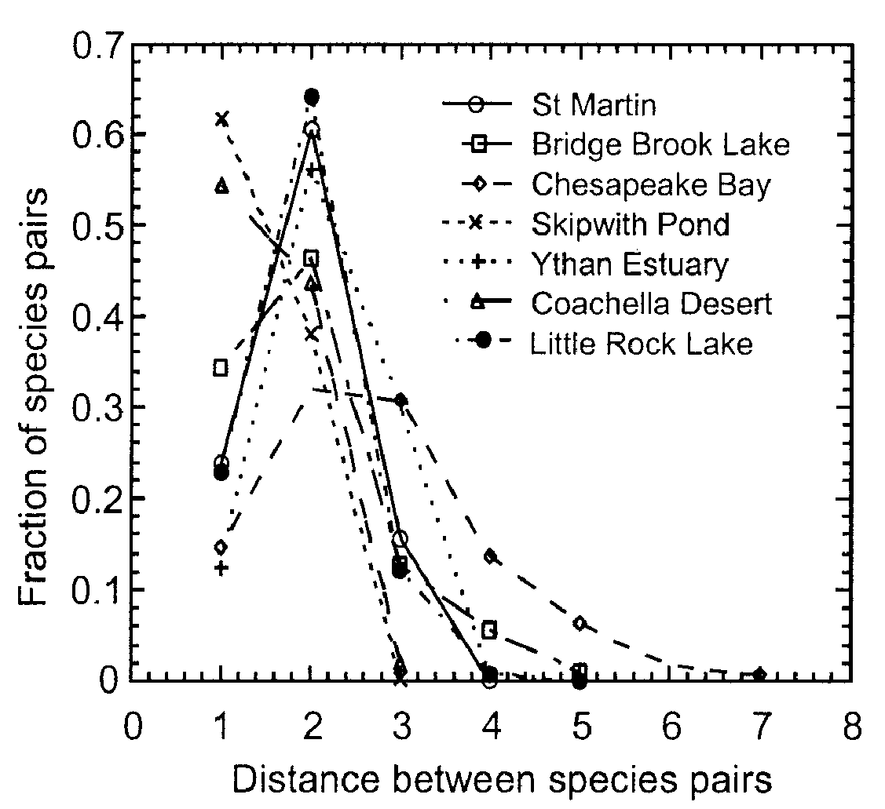</img>
]

---

# Les propriétés de petit monde en écologie

.center[
  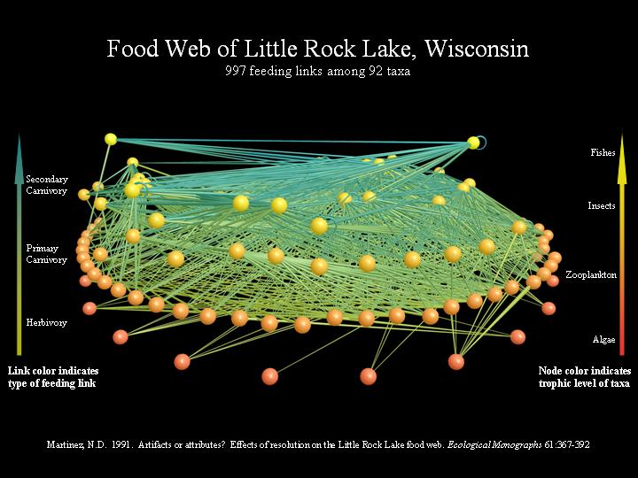</img>
]

---

# Les propriétés de petit monde en écologie

.center[
  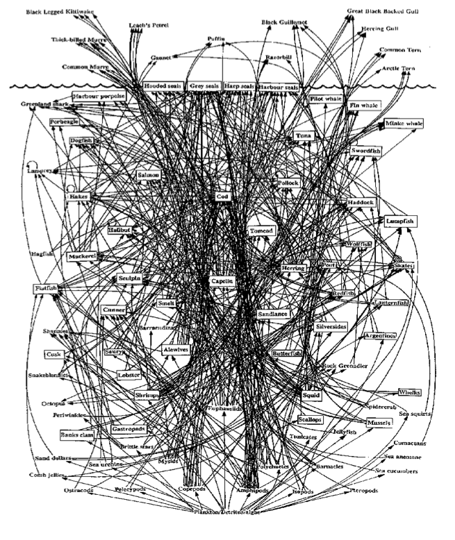</img>
]

---

# Les propriétés de petit monde en écologie

.center[
  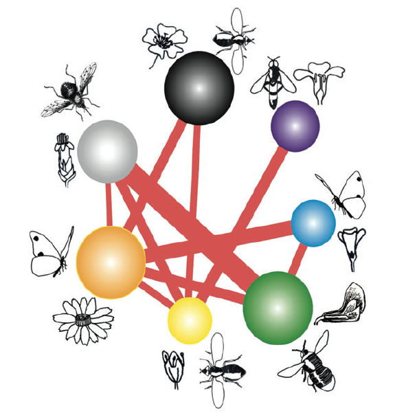</img>
]

<!-- ---

TODO: MISSING FILE bacteries.png

# Les propriétés de petit monde en écologie

<div style='text-align:center;'>
</img>
</div> -->

---

# Les propriétés de petit monde en écologie

.center[
  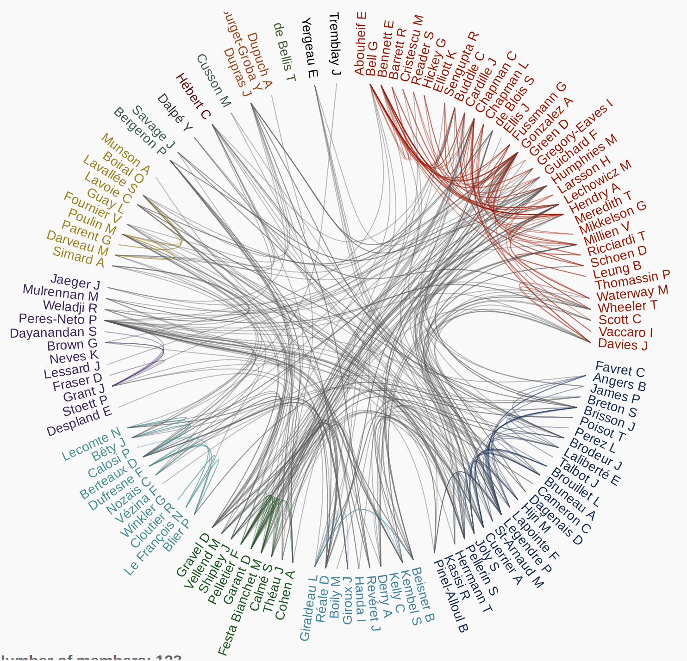</img>
]

---
# Le projet de session

Est-ce que le réseau de collaborations entre les étudiants du bacc en écologie a les mêmes propriétés que les réseaux écologiques ?

---
class: inverse, center, middle

# La science reproductible

<hr width="65%" size="0.3" color="orange" style="margin-top:-20px;"></hr>

---

# L'importance de la reproductibilité.

## Ces situations peuvent survenir lors de votre carrière professionnelle:

**Situation 1.** Un employeur souhaite que vous réalisiez les mêmes analyses 3 ans plus tard sur des données différentes.

**Situation 2.** Vous avez commis une erreur dans votre saisie de données, vous devez reconduire vos analyses.

**Situation 3.** Un des réviseurs de votre article scientifique vous demande de refaire vos analyses en tenant compte d'une nouvelle variable environnementale.

---

# Les étapes du travail d'un biologiste

.center[
  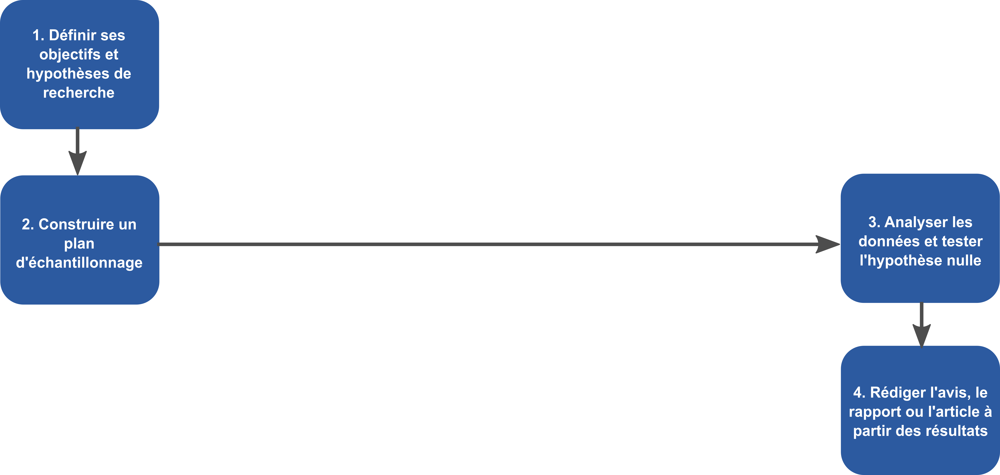</img>
]

---

# Les étapes du travail d'un biologiste

.center[
</img>
]

## Certaines étapes intermédiaires sont souvent oubliées.


---

# Discussion

Identification des étapes d'une étude scientifique susceptibles d'influer sur la reproductibilité.


---
class: inverse, center, middle

# Présentation du cours BIO500

<hr width="65%" size="0.3" color="orange" style="margin-top:-20px;"></hr>

---

# Objectif général

Au terme de ce cours, l'étudiant sera en mesure de réaliser l'ensemble de la  séquence d'une étude d'écologie en respectant les standards de gestion,  d'analyse et de présentation des données. Le cours portera sur la réalisation d'un projet intégrateur, de la collecte des données à la production du rapport final.

---

# Objectifs spécifiques

- Planifier une base de données et la préparation de formulaires pour leur acquisition ;
- Programmer et interroger une base de données relationnelle ;
- Compiler et exécuter un script au moyen de makefile ;
- Maintenir un cahier de laboratoire au moyen de RMarkdown ;
- Représenter visuellement les données au moyen de R ;
- Préparer un rapport d'étude au moyen de LaTeX ;
- Utiliser un système de contrôle de version pour le suivi des modifications sur du code ;
- Porter un regard critique sur la reproductibilité et la transparence d'études scientifiques ;

---

# Contenu du cours

## Bloc 1: Planification de la collecte et organisation des données

- Types de données
- Formulaires de saisie
- Bases de données relationnelles (SQL)
- Requêtes

---

# Contenu du cours

## Bloc 2: Outils pour une science reproductible et transparente

- Système de contrôle de version git
- Le makefile et ses alternatives sur R
- Le cahier de laboratoire RMarkdown

---

# Contenu du cours

## Bloc 3: Visualisation des données

- Les types de graphiques
- Fonctions graphiques de base sur R
- Paramètres graphiques
- Packages R spécialisés

---

# Contenu du cours

## Bloc 4: Communication scientifique au moyen de LaTeX

- Rédaction de rapports et d'articles scientifiques
- Mise en page
- Insertion de figures et tableaux
- Gestion des références
- Utilisation de Beamer pour les présentations

---

# Approche

Les cours vont comprendre une période de présentation entrecoupée d'exercices, suivie d'une discussion générale sur des enjeux de reproductibilité.

Nous progresserons dans l'exécution du travail de session. Le travail sera divisé en étapes et l'évaluation portera sur son intégration.

---

# Évaluation

L'évaluation porte sur la réalisation d'un travail de session (75%), réalisé en équipe de 4 personnes. Le travail sera divisé en 3 étapes réparties au cours de la session. L'évaluation finale (25%) portera sur la rédaction d'un essai de 1500 mots sur les enjeux de reproductibilité en science expérimentale.

```{r echo=FALSE, eval=FALSE}

---
class: inverse, center, middle

# Survol de Linux / Ubuntu

<hr width="65%" size="0.3" color="orange" style="margin-top:-20px;"></hr>

---
# Un nouveau monde s'ouvre à vous...

.pull-left[
  Il existe une [grande diversité de distributions](https://fr.wikipedia.org/wiki/Liste_des_distributions_Linux) Linux (Systèmes d'exploitation). L'ensemble de ces distributions sont gratuites et libres (OpenSource) !

  ## Alors, pourquoi Ubuntu?

  - Une importante communauté d'utilisateurs (estimé à 25 millions)
  - Aussi facile d'utilisation que Microsoft Windows
]

.pull-right[
  .center[
  </img>
  ]
]
---

# Sur la machine virtuelle Ubuntu...

**Les logiciels/langages que nous utiliserons dans le cours ont déjà été installés pour vous.**

- R (avec les librairies nécessaires)
- La distribution complète de LaTeX
- Git
- SQL
- SublimeText
- Le terminal (crt+alt+t)

---

# L'environnement UNITY

.pull-left[
  - Le lanceur
  - Naviguer dans les fichers : `<ctrl> <n>`
  - Chercher un programme
  - Changer les paramètres
]

.pull-right[
  .center[
    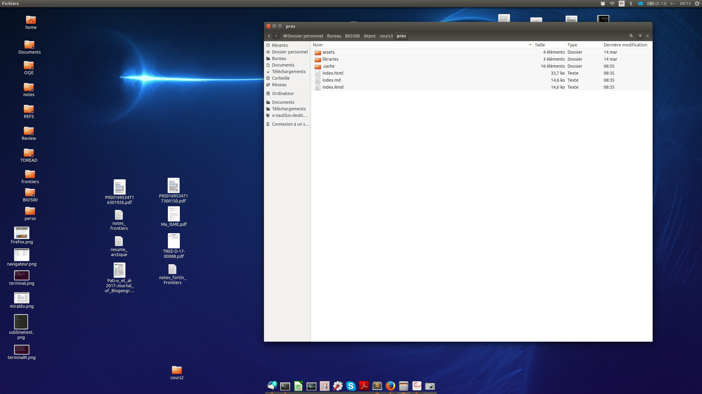</img>
  ]
]

---

# L'environnement UNITY

.pull-left[
  ## Le terminal

  - Lancer le terminal: <br> `<ctrl> <alt> <t>`
  - Changer de répertoire avec `cd`
  - Liste des fichiers dans le dossier actuel avec `ls`
  - Installer des programmes: <br> `sudo apt install unity-tweak-tool`
]

.pull-right[
  .center[
    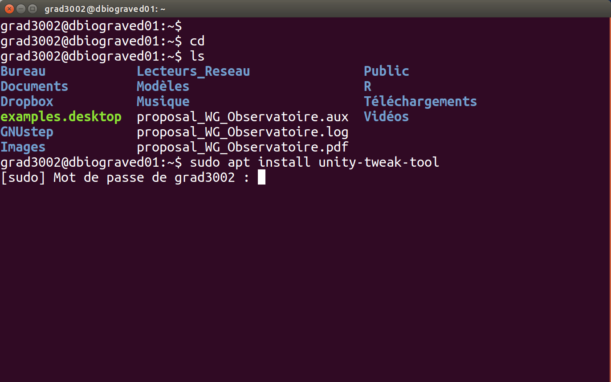</img>
  ]
]

---
# L'environnement UNITY

.pull-left[
  ## Lire un PDF

  - Le programme par défaut est `Visionneur`
  - D'autres programmes sont disponibles, notamment pour éditer des PDFs. J'utilise `xournal`.
]

.pull-right[
  .center[
    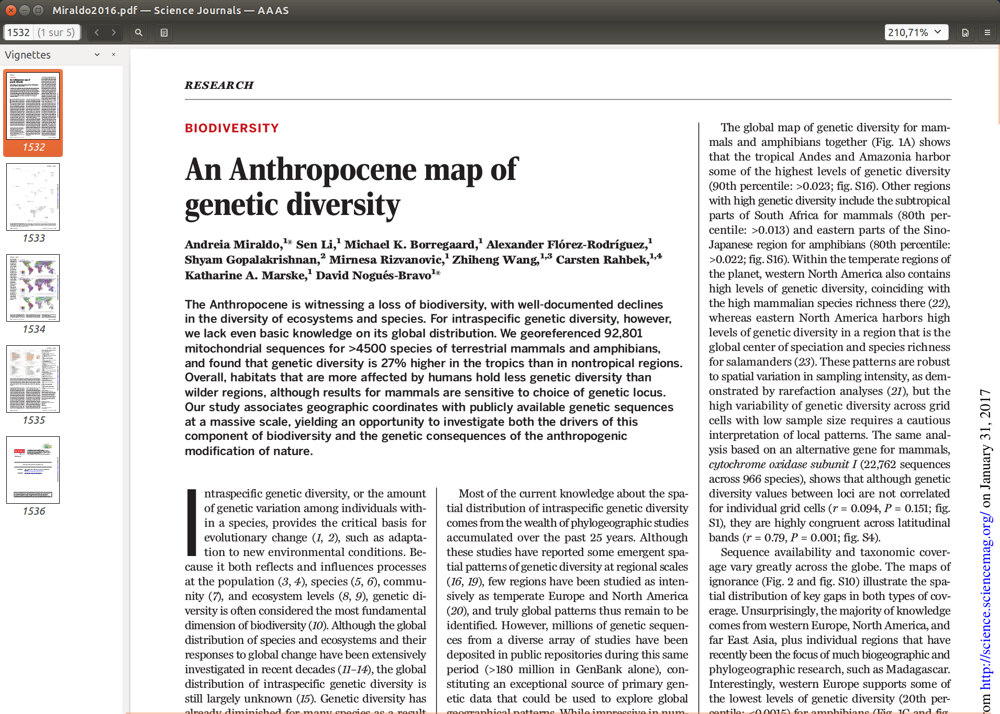</img>
  ]
]

---

# L'environnement UNITY

.pull-left[
  ## Naviguer sur le web

  - `FireFox` est le navigateur par défaut, vous pouvez aussi utiliser `Chrome`
]

.pull-right[
  .center[
    </img>
  ]
]

---

# Démarrer des programmes

.pull-left[
  ## SublimeText2

  - Ouvrir un script
  - Nouveau script
  - Changer le surligneur de syntaxe
]

.pull-right[
  .center[
    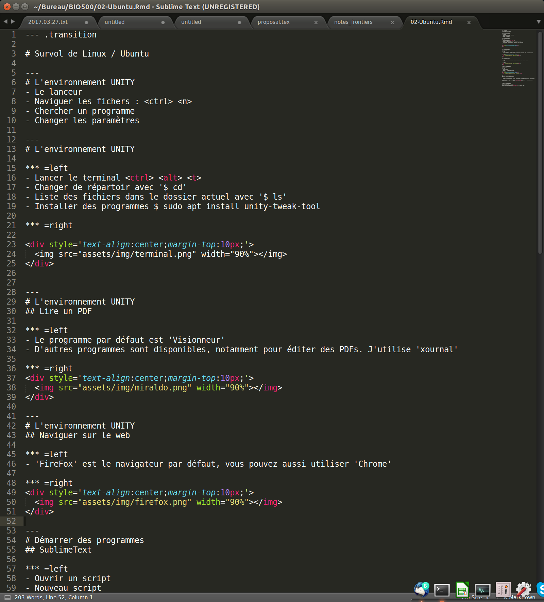</img>
  ]
]

---
# Démarrer des programmes

## Lancer R à partir de SublimeText

- Il faut lancer 'SublimeREPL' au moyen des touches `<ctrl> <shift> <p>` et sélection R
- Une fois la nouvelle fenêtre ouverte, les commandes peuvent être soumises avec `<ctrl> <enter>`

**ASTUCE:** les fenêtres sur Linux peuvent être alignées sur la gauche, la droite ou le centre automatiquement au moyen de la commande `<ctr> <alt> <flèche>`

---

# Démarrer des programmes

.pull-left[
  ## R directement dans le terminal

  Il faut ouvrir un terminal avec `<ctrl> <alt> <t>` et ensuite taper `R`
]

.pull-right[
  .center[
    </img>
  ]
]
```

---
class: inverse, center, middle

# Projet de session

<hr width="65%" size="0.3" color="orange" style="margin-top:-20px;"></hr>

---

# Rappel du problème

Est-ce que le réseau de collaboration entre les étudiants est affecté par l'enseignement à distance et les règles de distanciation ?

---

# Pour commencer

En équipe de 4, on vous demande de commencer à planifier une campagne de collecte de données. Commencez par discuter des types de données que vous souhaitez récolter, faites la liste des informations nécessaires pour répondre à la question. Ensuite, établissez un protocole afin de récolter ces données.

---

# Deuxième étape

Préparez un formulaire de saisie de données avec Excel et commencez à le remplir avec les données entre les membres de votre équipe.

---

# Troisième étape

Retour en classe : partage de l'information et harmonisation des formulaires.

---
class: inverse, center, middle

# Lectures et travail pour la semaine prochaine

<hr width="65%" size="0.3" color="orange" style="margin-top:-20px;"></hr>

---
# Lectures et travail

## Travail

- Prenez le temps de vous familiariser avec la Machine virtuelle Ubuntu.
  - Exemples: Créer des fichiers et des dossiers, changer le fond d'écran, etc.

- Commencez à récolter les données pour le travail de session.

## Lectures

- Baker, M. 2016. Is there a reproducibility crisis ? Nature, 533 : 452:454
- Munafo, M.R. et al. 2017. A manifesto for reproducible science. Nature Human Behaviour 1: 0021
- Open Science Collaboration. 2015. Estimating the reproducibility of psychological science. Science 349 : 943.
