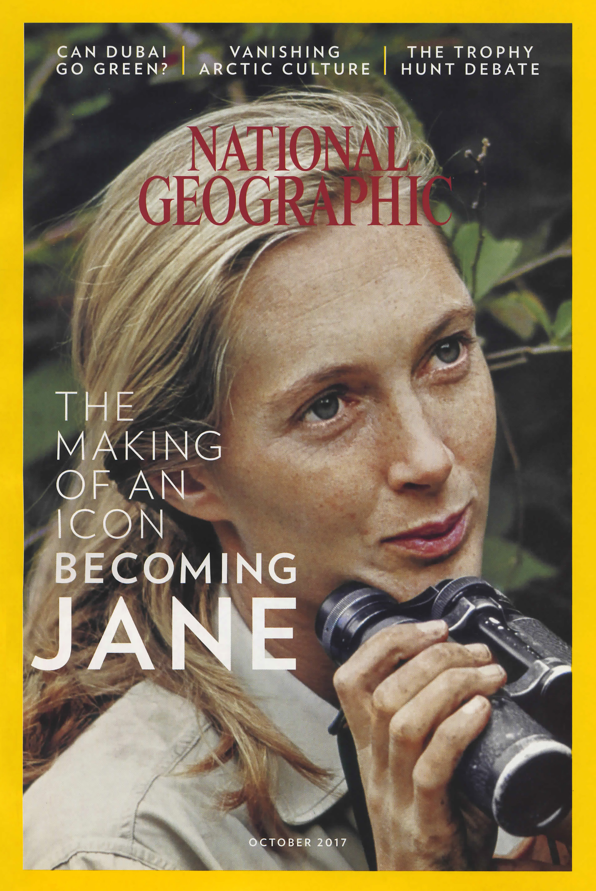
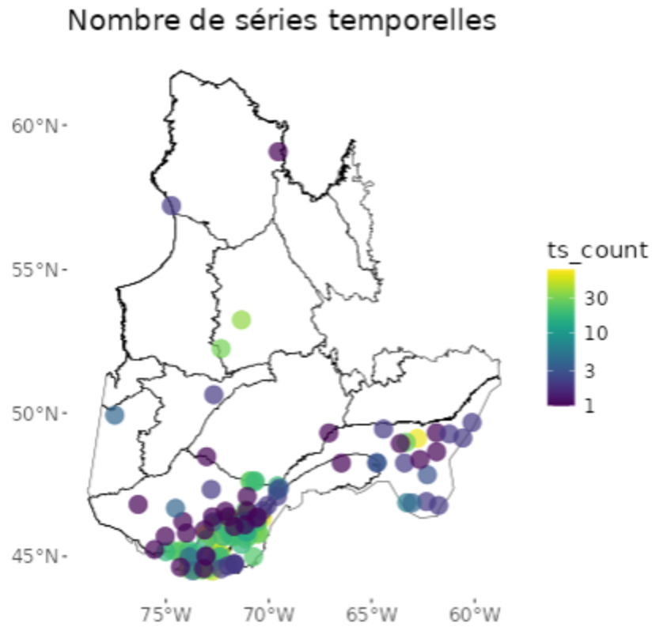
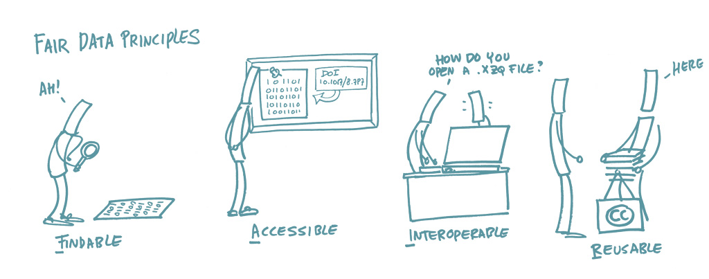

class: title-slide, middle

<style type="text/css">
  .title-slide {
    background-image: url('../assets/img/bg.jpg');
    background-color: #23373B;
    background-size: contain;
    border: 0px;
    background-position: 600px 0;
    line-height: 1;
  }
</style>

<div class="lab-logo"></div>

# Séance 1

<hr width="65%" align="left" size="0.3" color="orange"></hr>

## Introduction: Méthodes en écologie computationnelle

<hr width="65%" align="left" size="0.3" color="orange" style="margin-bottom:40px;" alt="@Martin Sanchez"></hr>

.instructors[
  **BIO500** - Victor Cameron
]

---

# Séance 1

- Ces diapositives sont disponibles en [version web](https://econumuds.github.io/BIO500/bloc1/).
- L'ensemble du matériel de cours est disponible dans le [livre du cours](https://econumuds.github.io/BIO500/) et sur [Moodle](https://moodle.usherbrooke.ca/course/view.php?id=30394).

---
class: inverse, center, middle

# Introduction

<hr width="65%" size="0.3" color="orange" style="margin-top:-20px;"></hr>

---

# Introduction

<div style='text-align:center;'>
</img>
</div>

---

# Introduction

<div style='text-align:center;'>
</img>
</div>

---

# L'écologie computationnelle

<div style='text-align:center;'>
</img>
</div>

---

# L'écologie computationnelle

S'intéresse aux mêmes questions, mais utilise une approche interdisciplinaire 
entre l'informatique et l'analyse de données pour étudier les systèmes écologiques.

Les outils utilisés incluent les modèles, les mathématiques et les statistiques et 
les données.

--

.pull-left[
  ## Pourquoi ?
  - Systèmes complexes
  - Données massives
  - Problèmes de conservation
]

.pull-right[
  ## Comment ?
  - Modélisation
  - Analyse de données
  - Programmation
]

---

# L'écologie computationnelle

## Projections de biodiversité pour trois scénarios

.center[
  </img>
]


---

# L'écologie computationnelle

.pull-left[
  ## Dynamiques des populations
  .center[
    </img>
  ]
]

.pull-right[
  ## Écologie des communautés
  .center[
    </img>
  ]
]

.pull-left[
  ## Biologie de la conservation
  .center[
    </img>
  ]
]

.pull-right[
  ## Modélisation des écosystèmes
  .center[
    </img>
  ]
]

---

# Enseignant

## Victor Cameron
- Victor.Cameron@usherbrooke.ca
- D8-0012

## Zacharie Scalzo (assistant)
- Zacharie.Scalzo@usherbrooke.ca
- D8-0022

## Pour les questions d'intérêt général, utilisez le forum de discussion sur Moodle.

---

# Biodiversité Québec

<div style='text-align:center;'>
</img>
</div>

---

# Biodiversité Québec

<div style='text-align:center;'>
</img>
</div>

---

# Biodiversité Québec

<div style='text-align:center;'>
</img>
</div>

---
class: inverse, center, middle

# Présentation du cours BIO500

<hr width="65%" size="0.3" color="orange" style="margin-top:-20px;"></hr>

---

# Objectif général

Au terme de ce cours, l'étudiant sera en mesure de **réaliser l'ensemble de la  séquence d'une étude d'écologie en respectant les standards de gestion, d'analyse et de présentation des données**. Le cours portera sur la réalisation d'un projet intégrateur, de la gestion des données à la production du rapport final.

---

# Objectifs spécifiques

- Planifier une base de données et la préparation de formulaires pour l'acquisition de données ;
- Programmer et interroger une base de données relationnelle ;
- Compiler et exécuter un projet au moyen de la librairie target ;
- Maintenir un cahier de laboratoire au moyen de RMarkdown ;
- Représenter visuellement les données au moyen de R ;
- Préparer un rapport d'étude ;
- Utiliser un système de contrôle de version pour le suivi des modifications sur du code ;
- Porter un regard critique sur la reproductibilité et la transparence d'études scientifiques ;

---

# Contenu du cours

## Bloc 1: Planification de la collecte et organisation des données

- Types de données
- Gestion des données 
- Bases de données relationnelles (SQL)
- Requêtes

---

# Contenu du cours

## Bloc 2: Outils pour une science reproductible et transparente

- Système de contrôle de version git
- La librarie targets pour l'exécution de projets sur R
- Le cahier de laboratoire RMarkdown

---

# Contenu du cours

## Bloc 3: Visualisation des données

- Les types de graphiques
- Fonctions graphiques de base sur R
- Paramètres graphiques
- Libraries R spécialisés

---

# Contenu du cours

## Bloc 4: Communication scientifique au moyen de RMarkdown

- Rédaction de rapports et d'articles scientifiques
- Mise en page
- Insertion de figures et tableaux
- Gestion des références


---

# Approche

Les cours vont comprendre une période de présentation entrecoupée d'exercices, suivie d'une discussion générale sur des enjeux de reproductibilité.

Nous progresserons dans l'exécution du travail de session. Le travail sera divisé en étapes et l'évaluation portera sur son intégration.

---

# Matériel de cours

Sur **moodle**, vous trouverez le matériel de cours. C'est l'endroit de référence où toute l'information se trouvera.

Le contenu du cours est rassemblé dans le livre en ligne [https://econumuds.github.io/BIO500/](https://econumuds.github.io/BIO500/).

.center[
  </img>
]


---

# Évaluation

## L'évaluation porte sur la réalisation d'un travail de session (75%) et d'un essai (25%).

Le projet sera réalisé en équipe de 4 personnes et sera divisé en 3 étapes réparties au cours de la session. 

L'essai portera sur les enjeux de reproductibilité en écologie.

---
class: inverse, center, middle

# Projet de session

<hr width="65%" size="0.3" color="orange" style="margin-top:-20px;"></hr>

---

# Inventaires écologiques

.center[
  </img>
]

---

# Les inventaires écologiques

## Inventaire lépidotères

- Observations ponctuelles de différentes sources


## Inventaire benthos

- Suivi de la biodiversité benthique

## Séries temporelles

- Mesures répétées de taille de populations

---

# Le projet de session

## Comment les variations spatiales et temporelles influent-elles sur la structure des communautés ?

Vous avez à choisir et analyser un inventaire écologique qui vous permettra de répondre à cette question.

---

# Inventaire lépidoptères

Résolution spatiale et temporelle

- Assemblage d'observations ponctuelles de différentes sources
- > 100 000 observations
- Données : nom de l'espèce, date, coordonnées spatiales, source

<div style='text-align:center;'>
</img>
</div>


---

# Inventaire benthos

Résolution spatiale et temporelle

- Suivi de la biodiversité benthique
- 43 stations d'échantillonnage
- Données : abondance, taxons, substrat, 20+ variables d'habitat

<div style='text-align:center;'>
</img>
</div>

---

# Séries temporelles

Résolution spatiale et temporelle

- 8248 suivis de populations 
- Entre 2 et ~40 mesures répétées
- Données : espèces, année, coordonnées spatiales, taille de population

<div style='text-align:center;'>
</img>
</div>

---

# Pour commencer

Les données disponibles sont sur Moodle (Généralités > Dossier Projet de session - données).

En équipe de 4, on vous demande d'explorer les jeux de données. Commencez par lire les README.md et discuter des données disponibles. Ensuite, choisissez un de ces jeux de données pour votre travail de session.

---

# Deuxième étape

Faites la liste des informations disponibles et de celles nécessaires pour répondre à la question de recherche.

## Comment les variations spatiales et temporelles influent-elles sur la structure des communautés ?

---
class: inverse, center, middle

# Retour sur les notions de programmation

<hr width="65%" size="0.3" color="orange" style="margin-top:-20px;"></hr>

---

# Retour sur les notions de programmation

1. Débugguer [[chapitre 15](https://econumuds.github.io/BIO500/debugger.html)]
2. Fonctions [[chapitre 16](https://econumuds.github.io/BIO500/fonctions.html)]

---

# Débugguer

Les erreurs de programmation sont inévitables.

## Comment les gérer ?

.center[
</img>
]

---

# Erreurs courantes

- **Syntaxe** : oubli de parenthèse, de virgule, de guillemets, etc.
- **Erreur d'indexation** : vérifier que les index sont dans les limites de l'objet
- **Erreur de type** : tentatives d'effectuer des opérations incompatibles avec le type de données (`result <- "10" + 5`)
- **Objet inexistant** : vérifier l'orthographe de l'objet et qu'il existe dans l'environnement de travail
- **Erreurs logiques** : problèmes liés à la logique du code, comme des boucles infinies ou des conditions incorrectes
-  **Données manquantes (NA)** : problèmes liés à la présence de données manquantes et à la manière dont elles sont traitées 
```R
my_vector <- c(1, 2, NA, 4)
sum(my_vector)
```
- **Packages** : Problèmes avec l'installation, le chargement ou l'utilisation de packages

---

# Astuces

- Tester régulièrement son code
- Lire attentivement les messages d'erreurs et les avertissements (warnings) imprimés dans la console
- **Redémarrer sa session R** et réessayer son code. Parfois des objets sont sauvés dans la mémoire et causent ou masquent les erreurs
- Rechercher la documentation de la commande `??` (eg. `??plot`)
- Googler le message d'erreur pour en comprendre la signification
- Inspecter les objets dans l'environnement de travail avec `ls()`

## Ressources

- Stackoverflow
- Ateliers R du [CSBQ](https://r.qcbs.ca/fr/workshops/) 
- Google
- Ateliers [Data Carpentry](https://datacarpentry.org/R-genomics/index.html)
- ChatGPT n'est pas formidable pour R, mais peut donner des pistes d'interprétation

---

# Exercice

## À faire à la maison

```R
# Script R avec des erreurs

# Fonction pour calculer la somme des carrés des éléments d'un vecteur
somme_carres <- function(vecteur) {
  somme <- 0
  for (i in 1:length(vecteur)) {
    somme <- somme + vecteur[i]^2
  }
  retourne(somme)
}

# Vecteur d'exemple
mon_vecteur <- c(1, 2, 3, 4, 5)

# Appel de la fonction et affichage du résultat
resultat <- somme_carres(mon_vecteur)
print("La somme des carrés est : ", resultat)
```

---

# Hackathon - Fonctions

Préparez un script qui retournera le nombre d'auteurs par institution de recherche.


| auteur | statut | institution |
|:-------|:-------|:------------|
| Jean-Baptiste Lamarck | NA | Académie de sciences |
| Charles Darwin | NA | London Royal Society |
| Comte de Buffon | Professor | MHNP |

---

# Hackathon - Fonctions

Préparez un script qui retournera le nombre d'auteurs par institution de recherche.

1. Un script principal qui contiendra le nom du fichier de données à lire, fera appel aux fonctions pour produire les résultats et imprimera le résultat.
2. Un script qui contient une fonction qui prendra en argument le nom de fichier et retournera les données sous forme de dataframe.
3. Un script qui contient une fonction qui prendra en argument le dataframe et retournera le nombre d'auteurs par institution.

> Utilisez les données disponibles sur Moodle dans le fichier **Bloc1 > Exercice fonctions > `auteurs.csv`**.

> Chapitre 16 du livre

---

# Hackathon - Fonctions

## Retour en groupe

--

```bash
.
├── 0_programme_principal.R
├── 1_import_csv.R
├── 2_analyse.R
└── auteurs.csv
```

---
class: inverse, center, middle

# La science reproductible

<hr width="65%" size="0.3" color="orange" style="margin-top:-20px;"></hr>

---

# Discussion

## La réplication en science : diagnostic et remède 

[Les Jeux de la réplication: mettre des études à l'épreuve](https://ici.radio-canada.ca/tele/decouverte/site/segments/reportage/2020355/universite-social-science-economie)

---

# L'importance de la reproductibilité

## Ces situations peuvent survenir lors de votre carrière professionnelle:

**Situation 1.** Un employeur souhaite que vous réalisiez les mêmes analyses 3 ans plus tard sur des données différentes.

**Situation 2.** Vous avez commis une erreur dans votre saisie de données, vous devez reconduire vos analyses.

**Situation 3.** Un des réviseurs de votre article scientifique vous demande de refaire vos analyses en tenant compte d'une nouvelle variable environnementale.

---

# Les étapes du travail d'un biologiste

.center[
  </img>
]

---

# Les étapes du travail d'un biologiste

.center[
</img>
]

## Certaines étapes intermédiaires sont souvent oubliées.

---

# Discussion

Identification des étapes d'une étude scientifique susceptibles d'influer sur la reproductibilité.

--

.center[
</img>
]

---

# Principes FAIR

S'applique aux données, algorithmes et workflows.

.center[
</img>
]

---

# Principes FAIR

## Findable

(Trouvable) : Les données doivent être bien documentées et indexées pour être facilement retrouvées.

DOI, métadonnées, catalogues de données.

--

## Accessible

(Accessible) : Les données doivent être accessibles avec des protocoles ouverts et, si elles sont restreintes, clairement expliquées.

Dépôts de données ouverts, licences claires, accès via des API.

---

# Principes FAIR

## Interoperable

(Interopérable) : Les données doivent être lisibles et utilisables par différents outils et logiciels.

Formats ouverts, vocabulaire standardisé.

--

## Reusable

(Réutilisable) : Les données doivent être suffisamment bien décrites et structurées pour être réutilisées dans d’autres contextes.

Documentation détaillée, traçabilité des versions, attribution claire des auteurs.

---

# Discussion

## Quels sont les liens concrets entre les principes FAIR et les étapes d'une étude scientifique ?

.center[
</img>
]

<!-- 
### **1. Contexte et importance des principes FAIR (5 min)**  
- **Problème actuel en science** : Difficulté à reproduire des études, accès limité aux données, méthodes peu documentées.  
- **Pourquoi les principes FAIR ?** : Créés pour améliorer la gestion, le partage et la réutilisation des données scientifiques.  
- **Objectif** : Assurer que les données soient facilement retrouvables, accessibles, compatibles avec différents systèmes et réutilisables par d’autres chercheurs.  

### **2. Présentation des quatre principes FAIR (10 min)**  

1. **Findable (Trouvable)**  
   - Définition : Les données doivent être bien documentées et indexées pour être facilement retrouvées.  
   - Exemples : Utilisation d’identifiants uniques (DOI), métadonnées complètes, catalogues de données.  

2. **Accessible (Accessible)**  
   - Définition : Les données doivent être accessibles avec des protocoles ouverts et, si elles sont restreintes, clairement expliquées.  
   - Exemples : Dépôts de données ouverts, licences claires (ex. Creative Commons), accès via des API.  

3. **Interoperable (Interopérable)**  
   - Définition : Les données doivent être lisibles et utilisables par différents outils et logiciels.  
   - Exemples : Formats ouverts (CSV, JSON), vocabulaire standardisé (ex. Darwin Core pour la biodiversité).  

4. **Reusable (Réutilisable)**  
   - Définition : Les données doivent être suffisamment bien décrites et structurées pour être réutilisées dans d’autres contextes.  
   - Exemples : Documentation détaillée, traçabilité des versions, attribution claire des auteurs.  

### **3. Lien avec la reproductibilité (5 min)**  
- Une étude reproductible nécessite que ses données soient bien organisées et accessibles.  
- Les principes FAIR réduisent les obstacles à la reproduction des résultats en rendant les données plus compréhensibles et exploitables.  
- **Question de transition pour la discussion** : Quels sont les liens concrets entre ces principes et les étapes d’une étude scientifique ?  
-->

---
class: inverse, center, middle

# Lectures et travail pour la semaine prochaine

<hr width="65%" size="0.3" color="orange" style="margin-top:-20px;"></hr>

---
# Lectures et travail

## Lecture

- Baker, M. 2016. Is there a reproducibility crisis ? Nature, 533 : 452:454
- Poisot et al. 2014. Moving toward a sustainable ecological science: don't let data go to waste ! Ideas in Ecology and Evolution 6: 11-19
- Mills et al. 2015. Archivin Primary Data: Solutions for Long-term Studies. Trends in Ecology and Evolution.

> Disponible sur Moodle dans le dossier **Bloc 1 > Lectures**