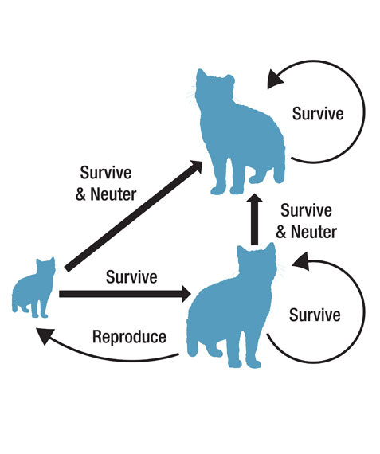
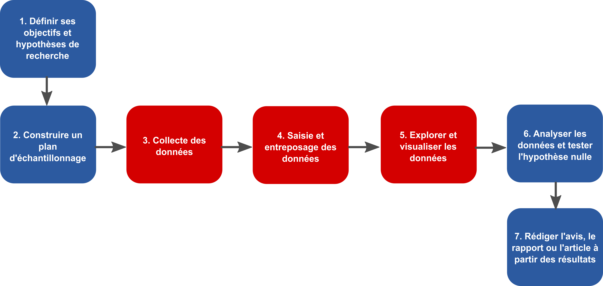

class: title-slide, middle

# Séance 1

## Introduction: Méthodes en écologie computationnelle

.instructors[
  **BIO500** - Victor Cameron
]

---

# Séance 1

- Ces diapositives sont disponibles en [version web](https://econumuds.github.io/BIO500/bloc1/).
- L'ensemble du matériel de cours est disponible sur la page du cours [github](https://github.com/EcoNumUdS/BIO500).

---
class: inverse, center, middle

# Introduction

---

# Introduction

</img>

---

# Introduction

</img>

---

# L'écologie computationnelle

</img>

---

# L'écologie computationnelle

S'intéresse aux mêmes questions, mais utilise une approche interdisciplinaire 
entre l'informatique et l'analyse de données pour étudier les systèmes écologiques.

Les outils utilisés incluent les modèles, les mathématiques et les statistiques et 
les données.

---

# L'écologie computationnelle

Les projections sont nécessaires pour identifier les facteurs qui menacent la
biodiversité et identifier les stratégies pour la protéger.

La modélisation, elle est essentielle à l'étude des systèmes complexes.

---

# L'écologie computationnelle

.pull-left[
  ## Dynamiques des populations
  .center[
    </img>
  ]
]

.pull-right[
  ## Écologie des communautés
  .center[
    </img>
  ]
]

.pull-left[
  ## Biologie de la conservation
  .center[
    </img>
  ]
]

.pull-right[
  ## Modélisation des écosystèmes
  .center[
    </img>
  ]
]

---

# Enseignant

## Victor Cameron
- victor.cameron@usherbrooke.ca
- D8-0012

## Benjamin Mercier (assistant)
- benjamin.b.mercier@usherbrooke.ca
- D8-0022

## Pour les questions d'intérêt général, utilisez le forum de discussion sur Moodle.

---

# Biodiversité Québec

</img>

---

# Biodiversité Québec

</img>

---

# Biodiversité Québec

</img>

---

# Biodiversité Québec

</img>

---
class: inverse, center, middle

# Présentation du cours BIO500

---

# Objectif général

Au terme de ce cours, l'étudiant sera en mesure de réaliser l'ensemble de la  séquence d'une étude d'écologie en respectant les standards de gestion,  d'analyse et de présentation des données. Le cours portera sur la réalisation d'un projet intégrateur, de la collecte des données à la production du rapport final.

---

# Objectifs spécifiques

- Planifier une base de données et la préparation de formulaires pour l'acquisition de données ;
- Programmer et interroger une base de données relationnelle ;
- Compiler et exécuter un projet au moyen de la librairie target ;
- Maintenir un cahier de laboratoire au moyen de RMarkdown ;
- Représenter visuellement les données au moyen de R ;
- Préparer un rapport d'étude ;
- Utiliser un système de contrôle de version pour le suivi des modifications sur du code ;
- Porter un regard critique sur la reproductibilité et la transparence d'études scientifiques ;

---

# Contenu du cours

## Bloc 1: Planification de la collecte et organisation des données

- Types de données
- Formulaires de saisie
- Bases de données relationnelles (SQL)
- Requêtes

---

# Contenu du cours

## Bloc 2: Outils pour une science reproductible et transparente

- Système de contrôle de version git
- La librarie targets pour l'exécution de projets sur R
- Le cahier de laboratoire RMarkdown

---

# Contenu du cours

## Bloc 3: Visualisation des données

- Les types de graphiques
- Fonctions graphiques de base sur R
- Paramètres graphiques
- Libraries R spécialisés

---

# Contenu du cours

## Bloc 4: Communication scientifique au moyen de RMarkdown

- Rédaction de rapports et d'articles scientifiques
- Mise en page
- Insertion de figures et tableaux
- Gestion des références

---

# Approche

Les cours vont comprendre une période de présentation entrecoupée d'exercices, suivie d'une discussion générale sur des enjeux de reproductibilité.

Nous progresserons dans l'exécution du travail de session. Le travail sera divisé en étapes et l'évaluation portera sur son intégration.

---

# Évaluation

L'évaluation porte sur la réalisation d'un travail de session (75%), réalisé en équipe de 4 personnes. Le travail sera divisé en 3 étapes réparties au cours de la session. L'évaluation finale (25%) portera sur la rédaction d'un essai de 1500 mots sur les enjeux de reproductibilité en écologie.

---
class: inverse, center, middle

# Projet de session

---

# Réseaux écologiques

.center[
  </img>
]

---

# Réseaux écologiques

Les réseaux sont la clef pour comprendre le fonctionnement des écosystèmes
> Ils sont complexes et fascinants !

  
***Les réseaux sont des outils vraiment utiles pour voir différents problèmes sous un autre angle, ce qui ouvre tout un autre monde d'analyses possibles***

\- Benjamin -

---

# Les propriétés des réseaux en écologie

.center[
  </img>
]

---

# Les propriétés des réseaux en écologie

.center[
  </img>
]

---

# Les propriétés des réseaux en écologie

## Propriétés des réseaux

.pull-left[
- Distance entre nodes
- Taille des nodes
- Modularité (regroupement des nodes)
]

.pull-right[
  </img>
]

---

# Les propriétés des réseaux en écologie

.center[
  </img>
]

---

# Les propriétés des réseaux en écologie

La théorie des réseaux et l'étude de leurs propriétés sont des outils puissants. On les utilise pour comprendre 
- Les interactions entre les espèces, 
- Les interactions entre les groupes sociaux, 
- La planification des réseaux de distribution d'électricité (grids), 
- L'internet, 
- etc.

.center[
  </img>
]

---

# Le projet de session

Est-ce que les propriétés du réseau de collaboration entre étudiants d'écologie diffèrent de celles des réseaux écologiques ?

---

# Pour commencer

En équipe de 4, on vous demande de commencer à planifier une campagne de collecte de données. Commencez par discuter des types de données que vous souhaitez récolter, faites la liste des informations nécessaires pour répondre à la question. Ensuite, établissez un protocole afin de récolter ces données.

---

# Deuxième étape

Préparez un formulaire de saisie de données avec Excel et commencez à le remplir avec les données entre les membres de votre équipe.

---

# Troisième étape

Retour en classe : partage de l'information et harmonisation des formulaires.

---
class: inverse, center, middle

# La science reproductible

---

# L'importance de la reproductibilité.

## Ces situations peuvent survenir lors de votre carrière professionnelle:

**Situation 1.** Un employeur souhaite que vous réalisiez les mêmes analyses 3 ans plus tard sur des données différentes.

**Situation 2.** Vous avez commis une erreur dans votre saisie de données, vous devez reconduire vos analyses.

**Situation 3.** Un des réviseurs de votre article scientifique vous demande de refaire vos analyses en tenant compte d'une nouvelle variable environnementale.

---

# Les étapes du travail d'un biologiste

.center[
  </img>
]

---

# Les étapes du travail d'un biologiste

.center[
</img>
]

## Certaines étapes intermédiaires sont souvent oubliées.

---

# Discussion

Identification des étapes d'une étude scientifique susceptibles d'influer sur la reproductibilité.

---
class: inverse, center, middle

# Lectures et travail pour la semaine prochaine

---
# Lectures et travail

## Travail

- Commencez à récolter les données pour le travail de session.

## Lecture

- Baker, M. 2016. Is there a reproducibility crisis ? Nature, 533 : 452:454
