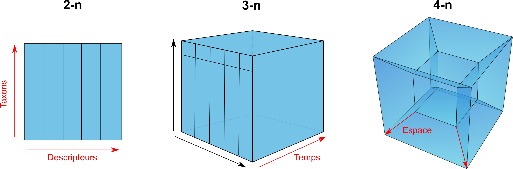
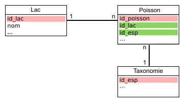

---
class: inverse

---
class: title-slide, middle

<style type="text/css">
  .title-slide {
    background-image: url('../assets/img/bg.jpg');
    background-color: #23373B;
    background-size: contain;
    border: 0px;
    background-position: 600px 0;
    line-height: 1;
  }
</style>

# Séance 2

<hr width="65%" align="left" size="0.3" color="orange"></hr>

## La gestion des données biologiques

<hr width="65%" align="left" size="0.3" color="orange" style="margin-bottom:40px;" alt="@Martin Sanchez"></hr>

.instructors[
  **BIO500** - Dominique Gravel
]

</img>

---

# Séance 2

- Ces diapositives sont disponibles en [version web](https://econumuds.github.io/BIO500/cours2/) et en [PDF](./assets/pdf/S2-BIO500.pdf).
- L'ensemble du matériel de cours est disponible sur la page du portail [moodle](https://www.usherbrooke.ca/moodle2-cours/course/view.php?id=12189).

---

# Retour sur la semaine précédente

Quels sont les champs à documenter ?

---
class: inverse, center, middle

# Les données en biologie

<hr width="65%" size="0.3" color="orange" style="margin-top:-20px;"></hr>

---

# La collecte de données

.center[
  </img>
]

---

# Le constat

.pull-left[
  Trop souvent en écologie, les données sont représentées et entreposées dans un format proche des analyses que l'on veut réaliser.

  Par exemple, on utilise souvent une matrice $sites \times espèces$ pour analyser la structure des communautées.

  La question scientifique ne devrait jamais conditionner notre façon de stocker l'information sur un système écologique (données brutes).
]

.pull-right[
  .center[
  </img>
  ]
]

---

# La collecte de données en biologie

## D'abord, qu'est ce qu'une donnée en écologie?


<!-- Présenter qu'est qu'une données biologiques, comme elle est représentée -->
<!-- Qu'est ce qui est représenté en ligne versus en colonne -->


.center[
  </img>
]


---

# La collecte de données en biologie

## Le problème de multi-dimensionnalité

.center[
  </img>
]


---

# La collecte de données en biologie

## Le problème de multi-dimensionnalité

.center[
  </img>
]

---

# La collecte de données en biologie

## **En biologie**, on classifie les données selon 4 dimensions/classes d'information:

1. Environnementale
2. Taxonomique
3. Temporelle
4. Spatial

Au sein de ce cours, nous nous attarderons à la façon de structurer ces données. Les spécificités propres à chacune de ces dimensions seront présentées. D'abord le format des données, puis les types de données.

---
class: inverse, center, middle

#  Le format des données

<hr width="65%" size="0.3" color="orange" style="margin-top:-20px;"></hr>

---

#  Le format des données

.font70[

.pull-left[
  ## </img> Format long

```{r echo=FALSE}
library("knitr")
ids <- c("567-1","567-2","567-3","598","876")
esp <- c("acsa","acsa","acsa","piru","abba")
annees <- c(2010,2010,2010,2011,2014)
dhp_mm <- c(460,100,120,380,160)
df <- data.frame(ID=ids,esp=esp,annees=annees,dhp_mm=dhp_mm)
kable(df,format="markdown")
```

- Noms de colonnes courts, sans accents, sans espaces et explicites.
- Attacher les unités au nom de la colonne (si absence de métadonnées).

]

.pull-right[
## </img> Format large

```{r echo=FALSE}
library(reshape2)
df2 <- dcast(ids + esp ~ annees, data=df, value.var="dhp_mm")
names(df2)[1] <- "ID"
kable(df2,format="markdown")
```
- Privilégier le format long
- Une ligne = une observation
]]

---

#  Le format des données: tableaux

## </img> Un tableau doit contenir un type d'information
.font70[
.pull-left[
  ```{r echo=FALSE}
  ID_plot <- c("A","A","A","B","B")
  ids <- c(567,567,567,598,876)
  sub_ids <- c(1,2,3,NA,NA)
  df <- data.frame(ID_plot=ID_plot,ID_arbre=ids,ID_multi=sub_ids,esp=esp,annees=annees,dhp_mm=dhp_mm)
  kable(df,format="markdown")
  ```
]

.pull-right[
  ```{r echo=FALSE, warnings=FALSE}
  clim <- data.frame(ID_plot=c('A','B','B'),annees=c(2010,2011,2014),pp_tot_mm=c(880,560,900),temp_max_deg=c(24,26,28))
  kable(melt(clim,id.vars=c("ID_plot",'annees'),value.name="valeur"),format="markdown")
  ```

  - Si l'on veut ajouter des données sur le climat, on ajoutera un nouveau tableau.
]]

---

#  Le format des données: colonnes

## </img> Ne pas agréger l'information dans une seule colonne

.font70[
.pull-left[
  ```{r echo=FALSE}
  ids <- c("567-1","567-2","567-3","598","876")
  esp <- c("acsa","acsa","acsa","piru","abba")
  annees <- c(2010,2010,2010,2011,2014)
  dhp_mm <- c(460,100,120,380,160)
  df5 <- data.frame(ID_arbre=ids,esp=esp,annees=annees,dhp_mm=dhp_mm)
  kable(df5,format="markdown")
  ```

  - Une colonne = une information
]

.pull-right[
  ```{r echo=FALSE}
  ids <- c("567","567","567","598","876")
  sub_ids <- c("1","2","3",NA,NA)
  df <- data.frame(ID_arbre=ids,ID_multi=sub_ids,esp=esp,annees=annees,dhp_mm=dhp_mm)
  kable(df,format="markdown")
  ```
]
]

---

#  Le format des données: colonnes

<span style="color:rgb(194, 0, 0);"> Important:</span> votre fichier de données brutes (destiné au stockage à long terme) ne doit pas contenir de champ calculé (c.a.d. une nouvelle colonne avec une moyenne, etc..)


---
class: inverse, center, middle

# Les types de données

<hr width="65%" size="0.3" color="orange" style="margin-top:-20px;"></hr>

---

#  Les types de données en informatique

## **En informatique**, on distingue plusieurs types de données:

| Appelation                | Type                 | Valeurs     | Taille           |
|---------------------------|----------------------|-------------|------------------|
| `BOLEAN`                  | Boléen               | vrai/faux   | 1 octet          |
| `INTEGER`                 | Entiers              | -998, 123   | 1 à 4 octets     |
| `DOUBLE`, `FLOAT`, `REAL` | Nombres réels        | 9.98, -4.34 | 4 à 8 octets     |
| `CHAR`,`VARCHAR`          | Chaine de caractères | lapin       | n x 1 à 8 octets |
| `TIMESTAMP`,`DATE`,`TIME` | Dates et heures      | 1998-02-16  | 4 à 8 octets     |


- Ce sont ces types qui seront utilisés pour entreposer nos données.
- Le choix d'un type approprié permet de réduire la taille du fichier de données.
- Il est *TRES IMPORTANT* de bien définir les types et de les utiliser rigoureusement.

---

# Les données temporelles

La plupart des languages/programmes disposent d'un type `TIMESTAMP`, `DATE` et `TIME` pour représenter une donnée temporelle.

On utilisera préférablement la norme [ISO8601](https://fr.wikipedia.org/wiki/ISO_8601) pour représenter ces données.

  - `TIMESTAMP` (Heure et temps): `YYYY-MM-ddThh:mm:ss`. *ex. `1977-04-22T01:00:00-05:00` ou `1977-04-22T06:00:00Z`*
  - `DATE`: `YYYY-MM-dd`. *ex. 1997-04-22*
  - `TIME`: `HH:mm:ss` dans un systéme de 24 heures. *ex. 01:30:00.*

Gardez à l'esprit que vos données pourraient être réutilisées à travers le monde.


---

# Les données taxonomiques

*Un exemple avec l'érable à sucre*

.pull-left[
  .small[
  **Selon vous quelle option est la meilleure?**

  ```{r echo=FALSE}
  way <- c("1. Code spécifique à l'étude","2. Code du ministère","3. Genre et espèce","4. Nom vernaculaire","5. Numéro Taxonomique (TSN - ITIS)")
  ex <- c("ACSA","ERS","Acer saccharum","Érable à sucre","28731")
  df <- data.frame(Option=way,Exemple=ex)
  kable(df,format="markdown")
  ```
  ]
]

.pull-right[
  .center[
  </img>
  ]
]

---

# Les données taxonomiques

*Un exemple avec l'érable à sucre*

.pull-left[
  .small[
  ```{r echo=FALSE}
  kable(df,format="markdown")
  ```
  ]
]

.pull-right[
  .small[
  >- </img> **Option 1 et 2:** Doit être associé à des métadonnées. Risque de perte du fichier attaché.

  >- </img> **Option 3:** Le genre et l'espèce peuvent changer à travers le temps.

  >- </img> **Option 4:** Le nom vernaculaire des espèces est le pire choix. Le nom vernaculaire est propre à un pays, à une région géographique, à une culture/dialecte.
  ]
]

---

# Les données taxonomiques

*Un exemple avec l'érable à sucre*

.pull-left[
  .small[
  ```{r echo=FALSE}
  library("knitr")
  way <- c("1. Code spécifique à l'étude","2. Code du ministère","3. Genre et espèce","4. Nom vernaculaire","5. Numéro Taxonomique (TSN - ITIS)")
  ex <- c("ACSA","ERS","Acer saccharum","Érable à sucre","28731")
  df <- data.frame(Option=way,Exemple=ex)
  kable(df,format="markdown")
  ```
  ]
]

.pull-right[
>- </img> **Option 5:** Cette option couplée à l'option 3, est le meilleur choix.
]

---

# Les données taxonomiques

## On privilégie généralement l'utilisation de code d'espèce standardisée:

1. [ITIS](https://www.itis.gov/)
2. [VASCAN](http://data.canadensys.net/vascan/search?lang=fr) (Plantes vasculaires du Canada)
3. [NCBI](https://www.ncbi.nlm.nih.gov/)
4. [BOLD](http://www.boldsystems.org/index.php/TaxBrowser_Home) (Projet code barre)

**Avantage:** Chacune de ces institutions/infrastructures nous permet de valider et retirer l'ensemble de la classification taxonomique d'une espèce à partir de son code.
Même si l'identifiant change (nouvelle classification), nous serons en mesure de trouver le nouvel identifiant taxonomique à partir de l'ancien.

**Exemple:** [TSN - 28731](https://www.itis.gov/servlet/SingleRpt/SingleRpt?search_topic=TSN&search_value=28731#null)

---

# Les données spatiales

- **Ce qu'il est important de savoir:** des coordonnées spatiales sans système de projection ne veulent strictement rien dire.
- Ainsi, lorsque l'on entrepose des données spatiales, trois colonnes doivent être représentées:
  - La coordonnée en X
  - La coordonnée en Y
  - La projection écrite en texte (voir votre GPS), ou préférablement l'identifiant unique de la projection.

---

# Les données spatiales

## Il existe plus de [65 familles de projections géographiques](https://en.wikipedia.org/wiki/List_of_map_projections) pour représenter des coordonnées sur la planète, en voici 3 des plus connues:

.center[
  </img>
]

- Il est important de choisir un bon système de projection pour minimiser la déformation spatiale (surtout à nos latitudes)

- À nos latitudes, on privilégiera l'utilisation d'une projection conique. Les ministères du Québec conseillent généralement l'utilisation d'une [projection conique conforme de Lambert](https://fr.wikipedia.org/wiki/Projection_conique_conforme_de_Lambert).

---

#  L'absence de données

## On peut représenter l'absence de données de plusieurs façons:

- Laisser la cellule vide (`NULL`)
- Mettre un `NA` (*Not Available*)
- Mettre un `0`
- Mettre `-9999` dans une colonne numérique

## Selon vous, quel est le choix le plus approprié ?

---

#  Le format des données

## On peut représenter l'absence de données de plusieurs façons:

- Laisser la cellule vide: montre que l'information n'a pas été saisie (un oublie)

>- Mettre un `NA` (*Not Available*): Montre que l'information est réellement absente (car le NA est saisi par un humain).

>- <span style="text-decoration: line-through;"> Mettre un `0` </span>: **JAMAIS** (empêche la distinction entre un vrai d'un faux 0, influence la moyenne)

>- Mettre `-9999` dans une colonne numérique: Ce choix peut être utilisé seulement pour les jeux de données très importants (centaine de Megas-octet), et doit être référencé dans les métadonnées.


---

# Choisir le bon type et format de données

Si l'on ne choisit pas le type de données approprié, cela aura diverses conséquences:

- Des problèmes de performance (ex. : il est plus rapide de faire une recherche sur un nombre que sur une chaîne de caractères)
- Un comportement contraire à celui attendu (ex. : trier sur un nombre stocké comme tel, ou sur un nombre stocké comme une chaîne de caractères ne donnera pas le même résultat)
- L'impossibilité d'utiliser des fonctionnalités propres à un type de données (ex. : stocker une date comme une chaîne de caractères vous prive des nombreuses fonctions temporelles disponibles).

<!-- Point supplémentaire pour les avancées: - Un gaspillage de mémoire (ex. : si vous stockez de toutes petites données dans une colonne faite pour stocker de grosses quantités de données) -->

---

## Pour en savoir davantage:

- [Broman KW, Woo K (2017) Data organization in spreadsheets. The American Statistician.](http://www.tandfonline.com/doi/abs/10.1080/00031305.2017.1375989)
- [Hart EM, Barmby P, LeBauer D, Michonneau F, Mount S, Mulrooney P, et al. (2016) Ten Simple Rules for Digital Data Storage. PLoS Comput Biol](http://journals.plos.org/ploscompbiol/article?id=10.1371/journal.pcbi.1005097)

---

# Retour sur le travail de session

Définissez les types de données pour les différents champs

---
class: inverse, center, middle

# Entreposer et archiver les données écologiques

<hr width="65%" size="0.3" color="orange" style="margin-top:-20px;"></hr>

---

# Où sommes-nous?

.center[
  </img>
]

---

# Pourquoi bien entreposer ses données?

.center[
  </img>
]

[Vines et al., 2013](https://www.nature.com/news/scientists-losing-data-at-a-rapid-rate-1.14416)

---

# Les entrepôts existants

.pull-left[
  1. Les `fichiers textes` comme les CSV, TSV (Format libre et ouvert)
  2. Les `tableurs` comme MS Excel (Logiciel propriétaire), Libre Office Calc. (Logiciel libre)
  3. Les `fichiers hierarchiques/structurés` HDF, NetCDF (Format libre et ouvert)
  4. Les `bases de données relationnelles`
]

.pull-right[
  ## Exemple de fichier CSV

  </img>
]

---

# Les entrepôts existants

.pull-left[
  1. Les `fichiers texte` comme les CSV, TSV (Format libre et ouvert)
  2. Les `tableurs` comme MS Excel (Logiciel propriétaire), Libre Office Calc. (Logiciel libre)
  3. Les `fichiers hierarchiques/structurés` HDF, NetCDF (Format libre et ouvert)
  4. Les `bases de données relationnelles`
]

.pull-right[
## Structure NetCDF

  </img>
]
---

# Les données multi-dimensionnelles

.center[
  </img>
]

- Il est difficile de stocker les données écologiques dans un tableur (n-2) lorsque les données écologiques ont (n-4).
- Conduit à une redondance dans l'information (par exemple. répéter les coordonnées de l'emplacement du site lorsqu'il est mesuré plusieurs fois).

---

# Les bases de données (BDs) à la rescousse

.center[
  </img>
]

- Les BDs permettent de redimensionner ce problème (plusieurs tableaux de n-2 avec des relations) grâce au modèle d'entités-relations.
- Chaque table correspond à une dimension. Les tables sont liées entre elles par des relations. Cette structure est appelée [schéma en étoile](https://en.wikipedia.org/wiki/Star_schema).

---

# Avantages des bases de données

- **Maintenir l'intégrité entre les enregistrements de nos tableaux**. Une observation ne peut être faite sur un site qui n'existe pas.
- **Normaliser et contrôler la qualité des données**. Chaque colonne est un type précis de données. Des contraintes peuvent être appliquées sur chaque colonne.
- **Éviter les redondances dans le stockage de l'information** (obtenir une [forme normale](https://fr.wikipedia.org/wiki/Forme_normale_(bases_de_donn%C3%A9es_relationnelles)), voir la section [Format de donnée du cours 2](https://econumuds.github.io/BIO500/cours2/#10).

---
class: inverse, center, middle

# Conceptualisation d'une base de données <br> en 5 étapes

<hr width="65%" size="0.3" color="orange" style="margin-top:-20px;"></hr>

---

---

# Étape 1. Faire une liste des variables


1. Dresser la liste des informations collectées par les différents groupes.
2. Regrouper les variables communes entre les équipes pour obtenir un format de données conjoint.


---

# Étape 2. Regrouper les variables dans des tables

1. Déterminer les tables/entités:
  - Qu'elles sont les unités d'échantillonnage? Autrement dit, sur quelles entités portent les mesures?
2. Remplir les tables avec les variables identifiées.

À ce stade de la conceptualisation, une table est une entité possédant des attributs. Chaque attribut est une colonne.

---

# Étape 3.

## Établir le type d'association entre les tables

### Le concept d'association

.center[
  </img>
]

---


# Étape 4. Établir les clés primaires et étrangères

## Le concept des clés primaires et des clés étrangères

.center[
  </img>
]

  - Définition : la donnée qui permet d'identifier de manière unique un enregistrement dans une table.
  - Une clé primaire garanti le caractère unique d'un enregistrement (ligne d'une table).
  - Une clé primaire ne peut donc jamais être `NULL`.
  - Une clé primaire peut être composite, une combinaison de colonnes.

---

# Étape 4. Établir les clés primaires et étrangères

1. Déterminer quels sont les attributs/colonnes garantissant le caractère unique d'un enregistrement (ligne d'une table).
2. Déterminer quelles sont les clés étrangères.


---

# Étape 5. Assigner un type de données

Chaque attribut d'une table doit correspondre à un type de données:

.font70[

| Appelation                | Type                 | Valeurs     | Taille           |
|:--------------------------|:---------------------|:------------|:-----------------|
| `BOLEAN`                  | Boléen               | vrai/faux   | 1 octet          |
| `INTEGER`                 | Entiers              | -998, 123   | 1 à 4 octets     |
| `DOUBLE`, `FLOAT`, `REAL` | Nombres réels        | 9.98, -4.34 | 4 à 8 octets     |
| `CHAR`,`VARCHAR`          | Chaine de caractères | lapin       | n x 1 à 8 octets |
| `TIMESTAMP`,`DATE`,`TIME` | Dates et heures      | 1998-02-16  | 4 à 8 octets     |

]

Pour tous les types de données, [voir la documentation SQLite3](https://www.sqlite.org/datatype3.html)

---

# En résumé

## Finalement, qu'est-ce qu'un modèle conceptuel pour une base de données?

Une façon de représenter l'information dans un modèle de type entités-relations où chaque entité (table) possède des attributs (colonnes).

L'étape suivante est de se connecter à la base de données afin de transcrire ce modèle conceptuel en modèle logique (c.a.d compréhensible par l'ordinateur).


---
class: inverse, center, middle

# Les Systèmes de Gestion de Base de Données (SGBDs)

<hr width="65%" size="0.3" color="orange" style="margin-top:-20px;"></hr>

---

# La diversité des SGBDs

.pull-left[
  ## Il en existe une multitude:

  .center[
    </img>
  ]
]

.pull-right[
  .font90[
  >- Pour créer, interroger, gérer et maintenir des bases de données, on utilisera un **[Système de Gestion de Base de Données](https://fr.wikipedia.org/wiki/Syst%C3%A8me_de_gestion_de_base_de_donn%C3%A9es) (souvent appelé SGBD)**.
  >- Mais ces systèmes disposent tous d'un dénominateur commun: le `langage SQL`
  >- Dans ce cours, nous utiliserons le système de gestion de données `SQLite3` (**Approche fichier de base de données**).
  ]
]

---

# Le langage SQL

## Définition

> Le SQL (Structured Query Language) est le langage des SGBDs. Il permet de communiquer avec une base de données.

---

# Le langage SQL

## Le `SQL` permet de:

1. Créer une base de données (`CREATE DATABASE`).
2. Créer des tables et établir des relations (`CREATE TABLE`).
3. Insérer des données (`INSERT`).
4. Interroger les données par requête (`SELECT`).
5. Supprimer des données ou des tables (`DROP`, `DELETE`).
6. Mettre à jour des données ou des tables (`UPDATE`, `ALTER`).
7. Supprimer la base de données (`DROP DATABASE`).

Chacune de ces commandes est une instruction `SQL` envoyée au serveur pour manipuler et interroger la base de données.

---

# Le langage SQL

## Pour cette séance, nous nous attarderons seulement à:

1. Créer une base de données (`CREATE DATABASE`).
2. Créer des tables et établir des relations (`CREATE TABLE`).
3. Supprimer ou modifier des tables (`DROP TABLE`, `ALTER TABLE`).
4. Supprimer la base de données (`DROP DATABASE`).

Soyez attentifs, car le travail de cette semaine consiste à écrire un script qui permet la création de la base de données (les tables et leurs relations) pour entreposer les données que vous aurez collectées pour le travail de session.


---

# Deux approches avec les bases de données

.pull-left[
  ## Serveur de base de données

  </img>
]

.pull-right[
  ## Fichier de base de données

  </img>
]

---

# L'approche: Serveur de base de données

.pull-left[
  .center[
    </img>
  ]
]

.pull-right[
  - Le **client** est un logiciel installé sur votre ordinateur.
  - On se sert de ce logiciel pour interagir avec le serveur de base de données présent localement ou à distance.
  - **Avantage:** On peut avoir plusieurs **clients** connectés sur un même serveur (contexte multi-utilisateurs).
]

---

# L'approche: Fichier de base de données

.pull-left[
  .center[
    </img>
  ]
]

.pull-right[
  - On se connecte au fichier a l'aide d'un **client** (logiciel)
  - **Avantage:** Portabilité
  - **Désavantage:** On ne peut pas se connecter à plusieurs utilisateurs en même temps.
]

<!-- ---

# L'approche client-serveur

## On pourrait envisager la situation suivante...


.center[
  </img>
]

L'approche multi-utilisateurs peut uniquement se faire si le serveur est distant. -->

---
class: inverse, center, middle

# Pratique: Du modèle conceptuel <br> vers le modèle informatique

<hr width="65%" size="0.3" color="orange" style="margin-top:-20px;"></hr>

---

# Les grandes étapes avec SQLite

1. Créer et se connecter au fichier de base de données
2. Créer les tables et spécifier les clés
3. Ajouter de l'information dans les tables
4. Faire des requêtes pour extraire l'information

---

# Se connecter au fichier la BD (SQLite3) via R

```{r, warnings=FALSE, message=FALSE, echo=FALSE}
system("rm -f ./assets/data/films.db")
```

```{r, warnings=FALSE, message=FALSE}
library(RSQLite)
con <- dbConnect(SQLite(), dbname="./assets/data/reseau.db")
## !ATTENTION!: Ceci est mon chemin d'accès vers le fichier!
## Astuces: getwd() et setwd()
```

```{r, eval=FALSE}
dbSendQuery(con,"Instructions SQL à envoyer;")
```

- `con` est un objet contenant la connexion avec le serveur/fichier de base de données.
- On utilisera la fonction `dbSendQuery()` pour envoyer les instructions SQL.
- Le deuxième argument de la fonction `dbSendQuery()` est une chaine de caractères contenant les instructions SQL.

---

# Création d'une première table avec clé primaire

.pull-left[
  Voici un exemple d'instruction SQL pour créer la table `articles`.

.font90[
```sql
CREATE TABLE auteurs (
    nom         VARCHAR(40),
    prenom      VARCHAR(40),
    naissance   DATE,
    institution VARCHAR(40),
    PRIMARY KEY (nom, prenom),
    FOREIGN KEY (nom1, prenom1)
);
```
]
]

.pull-right[
- `auteurs` est le nom de la table
- Chaque attribut de la table (`nom`,`prenom` etc) dispose d'un type de données (`varchar(40)`,`DATE`,  etc) [Type de données SQLite](https://www.sqlite.org/datatype3.html)
- La dernière ligne correspond aux contraintes de la table telle que la clé primaire.
- **Question:** Cette clé primaire est composite ou simple?
]

---

# Création d'une table avec clé étrangère

.pull-left[
  Maintenant il faut créer une table `collaborations` et référencer cette table à la table `auteurs` ainsi qu'à la table `articles`.

.font90[
```sql
CREATE TABLE collaborations (
    nom1        VARCHAR(40),
    prenom1     VARCHAR(40),
    nom2        VARCHAR(40),
    prenom2     VARCHAR(40),
    code        VARCHAR5),
    PRIMARY KEY (nom1, prenom1),
    FOREIGN KEY (code)
);
```
]
]

.pull-right[
- On déclare `prenom1` et `nom1` comme étant la clé primaire de la table `collaborations`.
- On référence l'attribut `code` comme étant la clé étrangère.
]

---

# Ajout de contraintes à une table

La dernière table pour les `articles`.

```sql
CREATE TABLE auteurs (
    code        VARCHAR(5) NOT NULL,
    titre       VARCHAR(150) NOT NULL,
    journal     VARCHAR(50),
    date        DATE,
    date        DATE,
    citations   INTEGER CHECK(duree >= 0),
    PRIMARY KEY(code,titre)
);
```

- On peut rajouter des contraintes sur la saisie, comme CHECK qui assure que ce sont des entiers positifs
- Note : les contraintes `NOT NULL` sur la clé primaire ne sont pas obligées d'être définis.

---

# Création d'une table avec R

## On se sert de R pour envoyer l'instruction SQL de création de la table:

```{r, eval=FALSE}

auteurs_sql <- "
CREATE TABLE auteurs (
    nom         VARCHAR(40),
    prenom      VARCHAR(40),
    naissance   DATE,
    institution VARCHAR(40)
    PRIMARY KEY (nom,prenom)
    collaborations (nom1,prenom1)
);"

dbSendQuery(con,auteurs_sql)
dbListTables(con)
```

---

# Modifier la table existante

```sql
ALTER TABLE database_name.table_name RENAME TO new_table_name;
ALTER TABLE database_name.table_name ADD COLUMN column_def...;
```

Il peut être parfois préférable supprimer la table et de la reconstruire plutôt que de la modifier à la volée.

---

# Supprimer la table de données

```{r, eval=FALSE}
dbSendQuery(con,"DROP TABLE auteurs;")
```

- `DROP TABLE` supprime l'ensemble de la table et ses données.

---

# Supprimer la base de données

```{r, eval=FALSE}
dbSendQuery(con,"DROP DATABASE reseau;")
dbDisconnect(con)
```

- `DROP DATABASE` fonctionne seulement avec d'autres SGBDs (approche serveur).
- Dans le cas de SQLite3, on supprime simplement le fichier `*.db`.
- `dbDisconnect(con)` permet de fermer la connection avec le fichier de base de données (permet à un autre utilisateur de se connecter).

---

# Lectures et travail pour la semaine prochaine

## Travail

- Maintenant que vous en savez plus sur le format des données, vous devez écrire le script R pour créer votre base de données en spécifiant les tables, les champs et les clés liant les tables entre elles.

- Commencez à récolter les données

---

# Lectures et travail pour la semaine prochaine

## Travail

- Poisot et al. 2014. Moving toward a sustainable ecological science: don't let data go to waste ! Ideas in Ecology and Evolution 6: 11-19
- Mills et al. 2015. Archivin Primary Data: Solutions for Long-term Studies. Trends in Ecology and Evolution.
