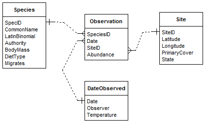
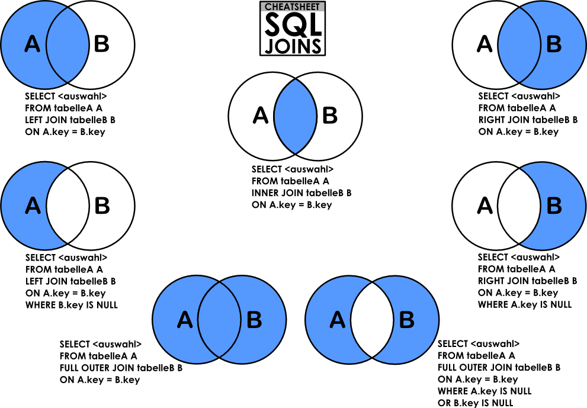

---
class: inverse

---
class: title-slide, middle

<style type="text/css">
  .title-slide {
    background-image: url('../assets/img/bg.jpg');
    background-color: #23373B;
    background-size: contain;
    border: 0px;
    background-position: 600px 0;
    line-height: 1;
  }
</style>

<div class="lab-logo"></div>

# Séance 3

<hr width="65%" align="left" size="0.3" color="orange"></hr>

## La gestion des données biologiques

<hr width="65%" align="left" size="0.3" color="orange" style="margin-bottom:40px;" alt="@Martin Sanchez"></hr>

.instructors[
  **BIO500** - Victor Cameron
]

---

# Évaluation formative #1

Était à remettre hier (10 mars)

## Vous avez jusqu'à lundi prochain (17 mars) pour compléter l'évaluation des scripts d'assemblage et de nettoyage d'une autre équipe.

- Tout se fait dans l'Atelier *Évaluation formative #1 : Atelier*
- Vous avez à noter le travail d'une autre équipe selon les critères :
  - Structure du programme
  - Fonctionnement du programme
  - Application des bonnes pratiques de programmation
- Tous les commentaires doivent être formulés comme une question

---
class: inverse, center, middle

# Retour rapide sur la <br> dernière séance

<hr width="65%" size="0.3" color="orange" style="margin-top:-20px;"></hr>

Chapitre 4 [*Bases de données*](https://econumuds.github.io/BIO500/bases_de_donnees.html)

Chapitre 5 [*SQL et RSQLite*](https://econumuds.github.io/BIO500/sql.html)

---

# Les grandes étapes

## Le modèle conceptuel
   1. Faire une liste des variables
   2. Regrouper les variables dans des tables
   3. Établir le type d'association entre les tables
   4. Établir les clés primaires et étrangères
   5. Assigner les types de données aux variables

## Le modèle informatique
   1. Créer et se connecter au fichier de base de données
   2. Créer les tables et spécifier les clés
   3. Injecter les données dans les tables
   4. Faire des requêtes pour extraire l'information

---

# Conceptualiser la base de données

.center[
  </img>
]

---

# Connexion au serveur

```R
# install.packages('RSQLite')
library(RSQLite)

con <- dbConnect(SQLite(), dbname="automobiles.db")
```

---

# Création de la table `automobiles`

```R
# install.packages('RSQLite')
library(RSQLite)

con <- dbConnect(SQLite(), dbname="automobiles.db")

creer_automobiles <- 
  "CREATE TABLE automobiles (
    id          INTEGER PRIMARY KEY AUTOINCREMENT,
    marque      VARCHAR(50),
    modele      VARCHAR(50),
    annee       INTEGER CHECK(annee >= 0)
  );"
dbSendQuery(con, creer_automobiles)
```

**Question:** Sur ce script, où sont les instructions SQL? Où sont les commandes R ?

---

# Création de la table `automobiles`

```R
# install.packages('RSQLite')
library(RSQLite)

con <- dbConnect(SQLite(), dbname="automobiles.db")

creer_automobiles <- 
  "CREATE TABLE automobiles (
    id          INTEGER PRIMARY KEY AUTOINCREMENT,
    marque      VARCHAR(50),
    modele      VARCHAR(50),
    annee       INTEGER CHECK(annee >= 0)
  );"
dbSendQuery(con, creer_automobiles)
```

**Question:** Sur ce script, où est 
1. la clef primaire ?

--

2. la clef étrangère ?

--

3. la contrainte ?

---

# Création de la table `proprios`

```R
creer_proprios <- 
  "CREATE TABLE proprios (
    automobile_id    INTEGER NOT NULL,
    prenom           VARCHAR(100) NOT NULL,
    nom              VARCHAR(100) NOT NULL,
    no_permis        VARCHAR(10),
    PRIMARY KEY (prenom, nom),
    FOREIGN KEY (automobile_id) REFERENCES automobiles(id)
  );"
dbSendQuery(con, creer_proprios)
```

**Question:** Que référence la clef étrangère ?

---

# Création de la table `proprios`

```R
creer_proprios <- 
  "CREATE TABLE proprios (
    automobile_id    INTEGER NOT NULL,
    prenom           VARCHAR(100) NOT NULL,
    nom              VARCHAR(100) NOT NULL,
    no_permis        VARCHAR(10),
    PRIMARY KEY (prenom, nom),
    FOREIGN KEY (automobile_id) REFERENCES automobiles(id)
  );"
dbSendQuery(con, creer_proprios)
```

**Question:** Que fait `NOT NULL` ?

---
class: inverse, center, middle

# Injecter les données dans les tables

<hr width="65%" size="0.3" color="orange" style="margin-top:-20px;"></hr>

---

# RSQLite - `dbWriteTable`

La librairie RSQLite peut nous aider plus facilement à accomplir cette tâche:

.font80[
```R
# Lecture des fichiers CSV
bd_automobiles <- read.csv(file = 'donnees/automobiles.csv')
bd_proprios <- read.csv(file = 'donnees/proprios.csv')

# Injection des enregistrements dans la BD
dbWriteTable(con, append = TRUE, name = "automobiles", value = bd_automobiles, row.names = FALSE)
dbWriteTable(con, append = TRUE, name = "proprios", value = bd_proprios, row.names = FALSE)
```
]

Les données doivent avoir le même **format** que la table dans laquelle elles sont insérées
- Les colonnes doivent être dans le même ordre
- Les noms des colonnes doivent être identiques
- Les types de données doivent être compatibles

---

# Fermer la connexion

Souvent oublié, il faut toujours fermer la connexion, se déconnecter de la base de données, avec la commande `dbDisconnect()` :

```R
dbDisconnect(con)
```

---

# Exercice 1

Vous le trouverez dans le chapitre 6 [*Exercices*](https://econumuds.github.io/BIO500/exercices_1.html) du livre

1. Créer la base de données `reseau` avec ses deux tables `auteurs` et `articles`
2. Insérer les données [auteurs.csv](https://raw.githubusercontent.com/EcoNumUdS/BIO500/master/bloc1/assets/data/db_reseau/authors.csv) et [articles.csv](https://raw.githubusercontent.com/EcoNumUdS/BIO500/master/bloc1/assets/data/db_reseau/articles.csv) dans les deux tables à l'aide de la commande R `dbWriteTable()`

**auteurs**
.font80[
```R
##                  auteur    statut                     institution      ville   pays
## 1 Pierre-Marc Brousseau      <NA> Universite du Quebec a Montreal   Montreal Canada
## 2      Dominique Gravel Professor        Universite de Sherbrooke Sherbrooke Canada
## 3        I. Tanya Handa      <NA> Universite du Quebec a Montreal   Montreal Canada
```
]

**articles**
.font80[
```R
##        articleID                               journal                             titre annee citations
## 1 Brousseau2018b                    Functional Ecology Trait matching and phylogeny as p  2018        21
## 2     Laigle2018                                 Oikos Species traits as drivers of food  2018        21 
## 3   grossman2018 Environmental and Experimental Botany Synthesis and future research dir  2018        30
```
]

---

# Exercice 1 (suite)

Ajouter une troisième table `collaborations` à la base de données `reseau` et insérer les données [collaboration.csv](https://raw.githubusercontent.com/EcoNumUdS/BIO500/master/bloc1/assets/data/db_reseau/collaboration.csv) dans cette table.

```R
collabTD <- '
CREATE TABLE collaborations (
    auteur1     VARCHAR(40),
    auteur2     VARCHAR(40),
    articleID   VARCHAR(20),
    PRIMARY KEY (auteur1, auteur2, articleID),
    FOREIGN KEY (auteur1) REFERENCES auteurs(author),
    FOREIGN KEY (auteur2) REFERENCES auteurs(author),
    FOREIGN KEY (articleID) REFERENCES articles(articleID)
);'

collaboration <- read.csv('collaboration.csv')
dbWriteTable(con, append = TRUE, name = "collaborations", value = collaboration, row.names = FALSE)
```

---
class: inverse, center, middle

# Les requêtes

<hr width="65%" size="0.3" color="orange" style="margin-top:-20px;"></hr>

---

# Structure d'une requête

.font70[
.pull-left[
```sql
SELECT colonnes/champs
FROM table1
JOIN table2 ON table1.foreignKey = table2.primaryKey
WHERE criteres
ORDER BY colonne1 ASC
LIMIT 10;
```
]]

.pull-right[
- Les requêtes SQL sont une suite d'opérations séquentielles.
- On ne peut pas filtrer (`WHERE`) avant que les opérations `SELECT`, `FROM` et `JOIN` soient complétées.
]

---

# Sélectionner des tables et des colonnes

## La connexion est ouverte et toujours accessible depuis l'objet `con`.

.pull-left[
.font90[
```R
sql_requete <- "
SELECT articleID, journal, annee
  FROM articles LIMIT 10
;"

articles <- dbGetQuery(con, sql_requete)
head(articles)
```
]
]

.pull-right[
- `SELECT` spécifie les colonnes.
- `FROM` spécifie la table.
- On peut également ajouter une `LIMIT`.
- [Documentation SQL Select](http://docs.postgresqlfr.org/9.5/sql-select.html).
]

```{r, echo = FALSE}
#| include: false

library(RSQLite)
con <- dbConnect(SQLite(), dbname="./assets/data/reseau.db")

  # create author table
  authorTB <- '
CREATE TABLE auteurs (
    auteur      VARCHAR(50),
    statut      VARCHAR(40),
    institution VARCHAR(200),
    ville       VARCHAR(40),
    pays        VARCHAR(40),
    PRIMARY KEY (auteur)
);'

  # create article table
  articleTB <- '
CREATE TABLE articles (
  articleID   VARCHAR(20) NOT NULL,
  titre       VARCHAR(200) NOT NULL,
  journal     VARCHAR(80),
  annee       DATE,
  citations   INTEGER CHECK(annee >= 0),
  PRIMARY KEY (articleID)
);'

  # create collaboration table
  collabTD <- '
CREATE TABLE collaborations (
    auteur1     VARCHAR(40),
    auteur2     VARCHAR(40),
    articleID   VARCHAR(20),
    PRIMARY KEY (auteur1, auteur2, articleID),
    FOREIGN KEY (auteur1) REFERENCES auteurs(author),
    FOREIGN KEY (auteur2) REFERENCES auteurs(author),
    FOREIGN KEY (articleID) REFERENCES articles(articleID)
);'


  dbSendQuery(con, authorTB)
  dbSendQuery(con, articleTB)
  dbSendQuery(con, collabTD)


  authors <- read.csv('./assets/data/db_reseau/authors.csv')
  dbWriteTable(con, append = TRUE, name = "auteurs", value = authors, row.names = FALSE)

  articles <- read.csv('./assets/data/db_reseau/articles.csv')
  dbWriteTable(con, append = TRUE, name = "articles", value = articles, row.names = FALSE)

  collaboration <- read.csv('./assets/data/db_reseau/collaboration.csv')
  dbWriteTable(con, append = TRUE, name = "collaborations", value = collaboration, row.names = FALSE)
```


```{r, echo = FALSE}
con <- dbConnect(SQLite(), dbname="./assets/data/reseau.db")

sql_requete <- "
  SELECT articleID, journal, annee
  FROM articles LIMIT 10
;"

articles <- dbGetQuery(con, sql_requete)
head(articles)
```

---

# Sélectionner des tables et des colonnes

.font90[
.pull-left[
```{r, eval = FALSE}
sql_requete <- "
  SELECT *
  FROM collaborations;"

articles <- dbGetQuery(con, sql_requete)
head(articles)
```
]]

.pull-right[
.font90[
- `*` permet de retourner toutes les colonnes
- Cette requête retournera toutes les colonnes de la table `collaborations`
]]

```{r, echo = FALSE}
sql_requete <- "SELECT * FROM collaborations;"

articles <- dbGetQuery(con, sql_requete)
head(articles)
```

---

# Exercice 2

Chaque équipe aura à expliquer l'action et le résultat d'une commande SQL parmi les suivantes :

1. `LIMIT`
2. `DISTINCT`
3. `ORDER BY` 
4. `WHERE` pour les valeurs numériques
5. `WHERE` pour les valeurs textuelles
6. `WHERE` pour effectuer des filtres multicritères
7. `WHERE` et `IS NOT NULL`

> Les scripts à expliquer sont dans le chapitre 6 [*Exercices*](https://econumuds.github.io/BIO500/exercices_1.html) du livre

---

# `LIMIT`

.font80[
.pull-left[
```{r}
sql_requete <- "
    SELECT *
    FROM collaborations
    LIMIT 10;"

req <- dbGetQuery(con, sql_requete)
head(req)
```
]
]

---

# `DISTINCT`


.font80[
.pull-left[
```{r}
sql_requete <- "
    SELECT DISTINCT auteur1
    FROM collaborations;"

req <- dbGetQuery(con, sql_requete)
head(req)
```
]
]

---

# `ORDER BY`

`ORDER BY` permet de trier par ordre croissant (`ASC`) ou décroissant (`DESC`).

.font80[
.pull-left[
```{r}
sql_requete <- "
    SELECT annee, citations, articleID
    FROM articles 
    ORDER BY citations DESC;"

derniers_articles <- dbGetQuery(con, sql_requete)
head(derniers_articles)
```
]
]


---

# `WHERE` pour les valeurs numériques

.font80[
.pull-left[
```{r}
sql_requete <- "
    SELECT articleID, annee
    FROM articles 
    WHERE annee >= 2018;"
  
derniers_articles <- dbGetQuery(con, sql_requete)
head(derniers_articles)
```
]
]

---

# `WHERE` pour les valeurs numériques

.font80[
.pull-left[
```{r}
sql_requete <- "
    SELECT articleID, annee
    FROM articles 
    WHERE annee >= 2018;"
  
derniers_articles <- dbGetQuery(con, sql_requete)
head(derniers_articles)
```
]
]

.pull-right[
- Multi-critères avec `AND` et `OR`
- Les parenthèses définissent les priorités d'opérations.
- Opérateurs de comparaison: `>=`,`<=`, `=` (Valeurs numériques)
- [Documentation sur les opérateurs de comparaisons](https://www.sqlite.org/lang_expr.html)
]

---

# `WHERE` pour les valeurs textuelles

.font80[
.pull-left[
```{r}
sql_requete <- "
    SELECT articleID, titre
    FROM articles 
    WHERE titre LIKE '%interactions%';"

articles <- dbGetQuery(con, sql_requete)
head(articles)
```
]
]

---

# `WHERE` pour les valeurs textuelles

.font80[
.pull-left[
```{r}
sql_requete <- "
    SELECT articleID, titre
    FROM articles 
    WHERE titre LIKE '%interactions%';"

articles <- dbGetQuery(con, sql_requete)
head(articles)
```
]
]

.pull-right[
- Rechercher dans le texte: `LIKE`
- `%`: n'importe quels caractères
- `_`: un seul caractère (exemple: `_1_` peut renvoyer `113` ou encore `A1C`)
- Le critère contraire est aussi possible avec `NOT` (exemple: `WHERE titre NOT LIKE '%interactions%'`)
]

---

# `WHERE` et `IS NOT NULL`

.font80[
.pull-left[
```{r}
sql_requete <- "
  SELECT auteur, statut, institution
  FROM auteurs
  WHERE statut IS NOT NULL;"

auteurs <- dbGetQuery(con, sql_requete)
head(auteurs)
```
]]

---

# `WHERE` pour filtres multicritères

.font80[
.pull-left[
```{r}
sql_requete <- "
    SELECT articleID, annee
    FROM articles 
    WHERE (annee >= 2018 AND annee < 2020)
      OR (annee >= 2012 AND annee <= 2014)"

articles <- dbGetQuery(con, sql_requete)
head(articles)
```
]
]

---

# Agréger l'information (1 ligne)

.font80[
.pull-left[
```{r}
sql_requete <- "
  SELECT avg(citations) AS moyenne,
    min(citations), max(citations)
  FROM articles;"

resume_articles <- dbGetQuery(con, sql_requete)
head(resume_articles)
```
]]

.pull-right[
- Pour faire une synthèse de l'information sur une seule ligne.
- Faire des opérations sur les champs numériques: `max`, `min`, `sum`, `avg`, `count`.
- Mais aussi les opérations classiques: `*`, `/`, `-` etc.
- Renommer les colonnes avec `AS`.
]

---

# Agréger l'information

## plusieurs lignes par groupe

.font80[
.pull-left[
```{r}
sql_requete <- "
  SELECT avg(citations) AS moyenne,
    count(articleID) AS nb_articles, annee
  FROM articles
  GROUP BY annee;"

resume_articles <- dbGetQuery(con, sql_requete)
head(resume_articles)
```
]]

.pull-right[
- `COUNT` permet de dénombrer le nombre de lignes.
- `GROUP BY` définit les champs sur lequel se fera l'agrégation des données.
]

---
class: inverse, center, middle

# Jointures entre tables

<hr width="65%" size="0.3" color="orange" style="margin-top:-20px;"></hr>

---

# Jointures entre tables

Le `INNER JOIN` est un type de jointure, renvoyant seulement les auteurs et les articles ayant un identifiant `articleID` commun.

```{r}
sql_requete <- "
  SELECT annee, auteur1, auteur2, journal, articles.articleID
  FROM articles
  INNER JOIN collaborations ON articles.articleID = collaborations.articleID;"

auteurs_articles <- dbGetQuery(con,sql_requete)
head(auteurs_articles,4)
```
---

# Les type de jointures

.center[
  </img>
]

---

# Exercice 3

## Quel article a le plus d'auteurs ?

---

# Requêtes par étapes

## Créer des tables temporaires dans une requête

```{r}
sql_requete <- "
WITH collaborations AS (
  SELECT auteur1, articleID, citations
  FROM articles
  INNER JOIN collaborations USING (articleID)
)
SELECT auteur1, avg(citations) AS moy_citations
FROM collaborations
GROUP BY auteur1;"
```

La requête est divisée en deux parties :
1. La première partie crée une table temporaire `collaborations` avec les colonnes `auteur1`, `articleID` et `citations`.
2. La deuxième partie fait une moyenne des citations par auteur.

---

# Exercice 4

## Est-ce que le nombre de citations est proportionnel au nombre de collaborateurs par article ?

---
class: inverse, center, middle

# Sauvegarder les requêtes

<hr width="65%" size="0.3" color="orange" style="margin-top:-20px;"></hr>

---

# Sauvegarder la table retournée par une requête

Afin de sauvegarder les données retournées par une requête obtenues dans R par `dbGetQuery()`, il est possible d'utiliser les fonctions d'écritures tels que `write.table()` ou encore `write.csv()`.

---
class: inverse, center, middle

# Manipuler les enregistrements

<hr width="65%" size="0.3" color="orange" style="margin-top:-20px;"></hr>

---

# Mettre à jour des enregistrements

On peut mettre à jour des enregistrements d'une table avec des critères spécifiques.

```sql
UPDATE auteurs SET institution = 'UdeS' WHERE institution = 'Universite de Sherbrooke';
```

**Note:** On ne peut pas faire de modifications d'enregistrements sur des requêtes, seulement sur les tables directement.

[Documentation sur la commande UPDATE](http://docs.postgresqlfr.org/8.3/sql-update.html)


---

# Supprimer des enregistrements

On peut supprimer des enregistrements d'une table avec des critères spécifiques.

```sql
DELETE FROM auteurs WHERE ville <> 'Montreal';
```

Ou sans critères, pour supprimer tous les enregistrements.

```sql
DELETE FROM auteurs;
```

[Documentation sur la commande DELETE](http://docs.postgresqlfr.org/8.3/sql-delete.html)

---
class: inverse, center, middle

# Travail de la semaine

<hr width="65%" size="0.3" color="orange" style="margin-top:-20px;"></hr>

---

# Travail de la semaine

À partir des données du jeu de données validé, formaté et assemblé :

1. Créer la base de données
2. Injecter les données dans les tables
3. Faire les requêtes qui serviront à vos analyses pour répondre à la question de recherche
4. Enregistrer le résultat des requêtes dans un fichier csv

Assurez vous que le script fonctionne sur les différents ordinateurs des membres de votre équipe.

---

# Travail de la semaine

En préparation au prochain cours, vous devrez :

- Créer un compte sur GitHub
- Mettre à jour R et RStudio
- Installer Git

Les instructions se trouvent dans le [chapitre 7, Section 7.2](https://econumuds.github.io/BIO500/git.html#d%C3%A9buter-avec-git)

---

# Évaluation formative #1

Chaque équipe doit évaluer les scripts d'assemblage et de nettoyage d'une autre équipe

- À compléter pour le **17 mars**
- La personne qui a remis le travail est responsable d'entrer l'évaluation
- Tous les commentaires doivent être formulés comme une question

```{r remove db file2, eval=TRUE, echo=FALSE}
system("rm -rf ./assets/data/reseau.db")
```

---

# Lectures

- [Biswas. 2023. ChatGPT for Research and Publication: A Step-by-Step Guide](https://www.doi.org/10.5863/1551-6776-28.6.576)
- [.2023. The AI writing on the wall.](https://github.com/EcoNumUdS/BIO500/blob/master/lectures/NatMaInt2023.pdf) 
- [Wilkinson et al. 2016. The FAIR Guiding Principles for scientific data management and stewardship.](https://github.com/EcoNumUdS/BIO500/blob/master/lectures/wilkinson2016.pdf)
