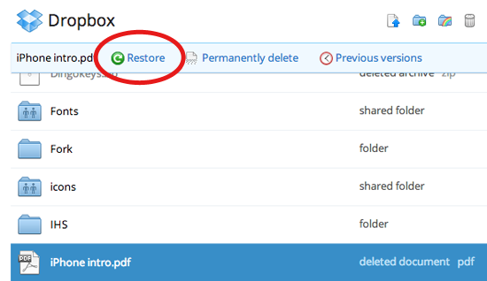
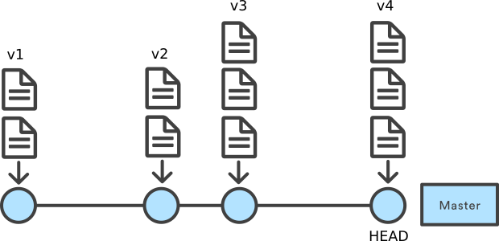
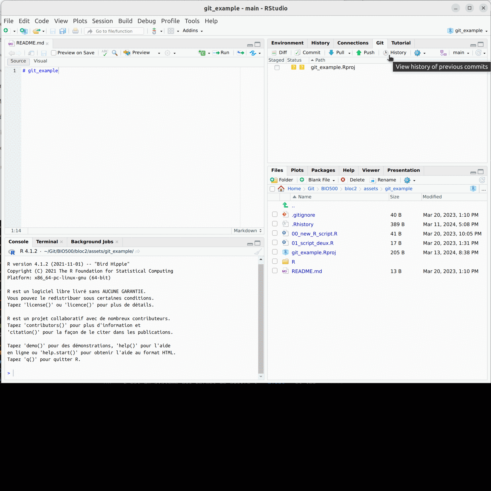
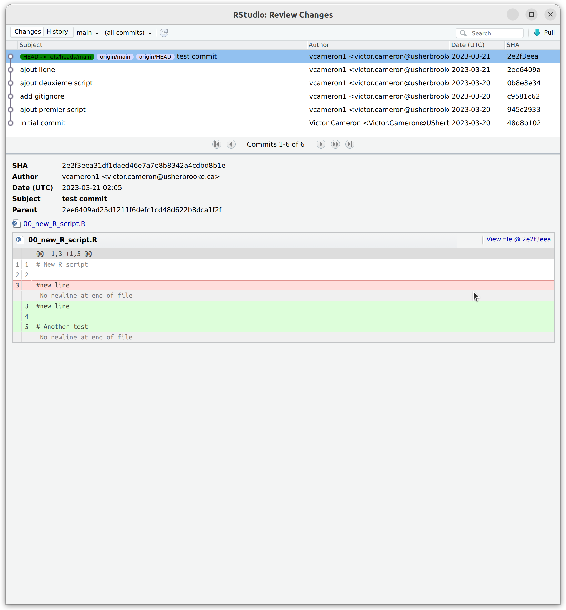
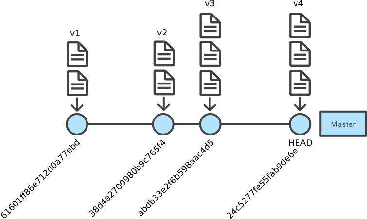
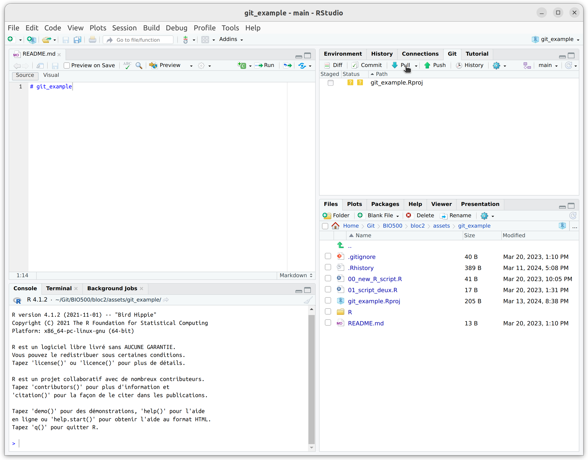
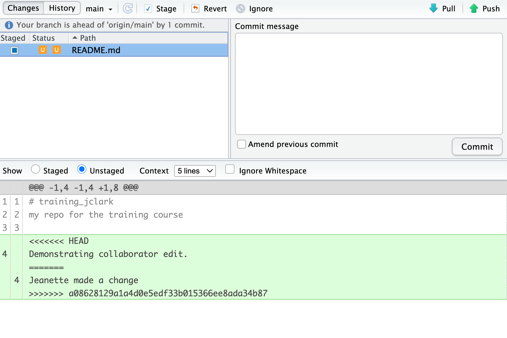

class: title-slide, middle

<style type="text/css">
  .title-slide {
    background-image: url('../assets/img/bg.jpg');
    background-color: #23373B;
    background-size: contain;
    border: 0px;
    background-position: 600px 0;
    line-height: 1;
  }
</style>

<div class="lab-logo"></div>

# Séance 4

<hr width="65%" align="left" size="0.3" color="orange"></hr>

## Les outils pour la reproductibilité

<hr width="65%" align="left" size="0.3" color="orange" style="margin-bottom:40px;" alt="@Martin Sanchez"></hr>

.instructors[
  **BIO500** - Victor Cameron
]

---

# Les étapes du travail d'un biologiste

.center[
  </img>
]

---

# Une situation courante

.pull-left[
## Une situation qui vous est familière:

.font90[
```bash
MonTravailSession/
  |___ data/
        |___ data_01122018.csv
        |___ data_011022018.csv
  |___ rapportVeg_jean_v1_01012018.docx
  |___ rapportVeg_juliette_v1_01012018.docx
  |___ rapportVeg_rémi_v1_04012018.docx
  |___ rapportVeg_rémi_v2_10012018.docx
  |___ rapportFinal_20012018.docx
```
]]

.pull-right[

## le travail d'équipe

Ses difficultées techniques:

- Multi-utilisateurs
- Garder une trace de l'historique de modifications **d'un ensemble de fichiers**
- Revenir aux versions précédentes
- Comparer des versions d'un fichier
]

---

# Systèmes de contrôle existants

## Un exemple avec Dropbox

.center[

]

---

# Systèmes de contrôle existants

## Un exemple MS Word

.center[

]

---
class: inverse, center, middle

# Git: Un système de controle de version pour programmeur

<hr width="65%" size="0.3" color="orange" style="margin-top:-20px;"></hr>

---

# Qu'est ce que Git?

.pull-left[

C'est un système qui permet de suivre l'**ajout** et les **modifications** pour un ensemble de fichier.

**C'est le cahier de lab du programmeur.**

- Logiciel libre soutenu par une large communauté (12 millions d'utilisateurs dans le monde)
- Par défault, Git est installé sur les systèmes d'exploitation Linux et Mac.
- Il peut être installé sur Windows: [https://git-scm.com/download/win](https://git-scm.com/download/win)
]

.pull-right[
  .center[
    </img>
    </img>

    Linus Torvalds
  ]
]

---

# Qu'est ce que Git?

Il présente l'avantage d'être extrêmement versatile.

1. Racontez l'histoire de votre projet
2. Voyager dans le temps
3. Expérimentez avec les changements
4. Backup votre travail
5. **Collaborer sur des projets**

--

Mais le désavantage de fonctionner seulement avec les fichiers "plain text"...

**Question**: Qu'est ce qu'un fichier "plain text"?

---
# Les grandes étapes de git

0. Explorer l'interface web de github
1. Créer un compte
2. Créer un dépôt 
3. Installer git 
4. Associer un dépôt à RStudio
5. Bien structurer un projet 
6. Enregistrer les modifications 
7. Revenir en arrière 
8. Récupérer les modifications de co-équipiers

Complétez les étapes en suivant les instructions données dans le [chapitre 7, Section 7.2](https://econumuds.github.io/BIO500/git.html#d%C3%A9buter-avec-git) (complétez les étapes 0 à 3)

---
class: inverse, center, middle

# L'histoire d'un projet

<hr width="65%" size="0.3" color="orange" style="margin-top:-20px;"></hr>

---
# L'histoire d'un projet

.pull-left[
## Une situation familière:

.font90[
```bash
MonTravailSession/
  |___ data/
        |___ data_01122018.csv
        |___ data_011022018.csv
  |___ rapportVeg_jean_v1_01012018.docx
  |___ rapportVeg_juliette_v1_01012018.docx
  |___ rapportVeg_rémi_v1_04012018.docx
  |___ rapportVeg_rémi_v2_10012018.docx
  |___ rapportVeg_rémi_v3_12012018.docx
  |___ rapportVeg_rémi_v4_02022018.docx
  |___ rapportFinal_03022018.docx
  |___ rapportFinalVRAIMENT_04022018.docx
```
]]

.pull-right[

## Vous à la fin de ce cours:
```bash
MonTravailSession/
  |___ .git/
  |___ data/
        |___ data_01122018.csv
        |___ data_011022018.csv
  |___ rapportVeg.tex
```
]

---

# Quelques notions de base

.pull-left[
  .center[
    </img>
  ]
]

.pull-right[

- Une branche (`master` par défault): c'est un série de commentaires (`commit`)
- Le dernier commentaire (`commit`) est ce que l'on appelle la tête de la branche (`HEAD`), elle contient la version la plus à jour des fichiers.
- À chaque commentaire d'édition (`commit`) est attachée une version des fichiers.
]

---

# Le journal de Git

## L'historique des modifications

.center[

]

---

# Le journal de Git

.pull-left[
```bash
git log
```
ou


]

.pull-right[
  .center[
    </img>
  ]
]

---

# Se déplacer sur la branche `master`

.pull-left[
```bash
git checkout 4abdb33e2f6b598aac4d5
```
ou


]

.pull-right[
  .center[
    </img>
  ]
]

---

# Se déplacer sur la branche `master`

.pull-left[

```bash
git checkout master
```
ou


]

Permet de se déplacer vers le `commit` le plus récent.

.pull-right[
  .center[
    </img>
  ]
]

---
# 7. Revenir en arrière dans le temps

Les commandes de git sont très efficaces et puissantes, elles peuvent néanmoins être fastidieuses et difficiles pour les débutants. 

RStudio facilite ce travail avec un simple onglet "history" et avec un navigateur qui vous permet de passer d'une version à l'autre et de mettre en valeur les modifications qui ont été enregistrées sous forme de commit.


---
# 8. Travailler en équipe 

- git a été spécifiquement créé pour travailler en équipe
- Plusieurs utilisateurs peuvent se connecter au même répertoire et y apporter des modifications 
- À chaque fois que l'on ouvre un projet il est approprié d'utiliser la commande "git pull" (un bouton sur l'interface git de Rstudio) afin de récupérer les modifications des autres membres de l'équipe
- Les restrictions d'utilisation et les invitations peuvent être gérées à partir du site web de github 




---
# La puissance de git

Les fonctionnalités de git sont immenses et RStudio permet de bien les utiliser. 

Un tutoriel complet est disponible ici[https://happygitwithr.com/rstudio-git-github.html]

---

# En résumé

.pull-left[
## Enregistrer l'histoire du projet
  - `git add`
  - `git commit`
  - `git status`

## Voyager dans le temps
  - `git checkout`

## Expérimenter les changements
  - `git branch`
  - `git merge`

]
.pull-right[

## Verser sur le serveur 
  - `git push`

## Collaborer sur des projets
  - `git pull`
  - `git clone`
]

---

# Exercice 

1. En équipe de 2, utiliser un dépôt créé par un des membres de l'équipe et le cloner sur l'ordinateur de l'autre membre
2. Chacun modifie un même fichier présent dans le dépôt et enregistre les modifications
3. Git commit et push

Qu'est-ce qui arrive ?

--

## Un merge conflict (conflit de fusion) !!

Vous avez chacun fait des modifications sur un même fichier. Git ne sait pas quelle version prioriser.

---

# Gestion des conflits

Le conflit de de fusion est le résultat de deux modifications concurrentes sur un même fichier. C'est le conflit le plus fréquent et survient lorsqu'on oublie de `git pull` avant de `git push`

Il est possible de résoudre le conflit directement dans RStudio. Essayez-vous !

Marche à suivre : [https://econumuds.github.io/BIO500/git.html#conflits](https://econumuds.github.io/BIO500/git.html#conflits)

---

# Gestion des conflits

[Chapitre 7.3 *Git, Conflits*](https://econumuds.github.io/BIO500/git.html#conflits)

- Ouvrir le fichier en conflit
- Résoudre le conflit
- Enregistrer les modifications
- `add` (*staging*) et `commit`, `push`



---

# Lectures

## Discussion sur l'utilisation de modèles de langage

- [Stokel-Walker & Van Noorden. 2023. What ChatGPT and generative AI mean for science.](https://github.com/EcoNumUdS/BIO500/blob/master/lectures/Stokel-Walker2023.pdf)
- [.2023. The AI writing on the wall.](https://github.com/EcoNumUdS/BIO500/blob/master/lectures/NatMaInt2023.pdf) 
- [Wilkinson et al. 2016. The FAIR Guiding Principles for scientific data management and stewardship.](https://github.com/EcoNumUdS/BIO500/blob/master/lectures/wilkinson2016.pdf)

---
class: inverse, center, middle

# Débat : Les LLM apportent ou pas à la science ?

<hr width="65%" size="0.3" color="orange" style="margin-top:-20px;"></hr>

<br>
## 15 minutes pour préparer ses arguments
## 2 minutes pour présenter ses arguments
## 20 minutes de débat

---

# Lecture de la semaine

Les enjeux de reproductibilité en science expérimentale

[Milcu et al. 2018. Genotypic variability enhances the reproducibility of an ecological study. Nature Ecology and Evolution](http://millsonia.free.fr/publications/milcu2018NEE.pdf)

---