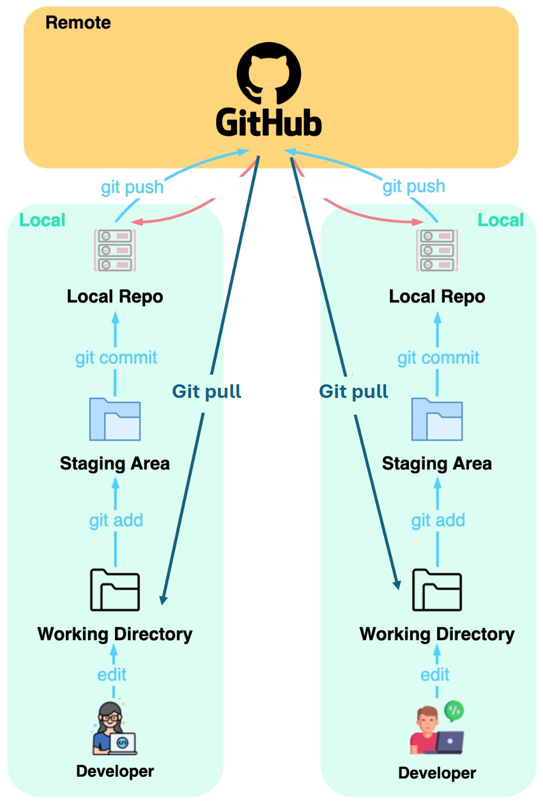

class: title-slide, middle

<style type="text/css">
  .title-slide {
    background-image: url('../assets/img/bg.jpg');
    background-color: #23373B;
    background-size: contain;
    border: 0px;
    background-position: 600px 0;
    line-height: 1;
  }
</style>

<div class="lab-logo"></div>

# Séance 4

<hr width="65%" align="left" size="0.3" color="orange"></hr>

## Les outils pour la reproductibilité

<hr width="65%" align="left" size="0.3" color="orange" style="margin-bottom:40px;" alt="@Martin Sanchez"></hr>

.instructors[
  **BIO500** - Victor Cameron
]

---

# Les étapes du travail d'un biologiste

.center[
  </img>
]

---

# Une situation courante

.pull-left[
## Une situation qui vous est familière:

.font90[
```bash
MonTravailSession/
  |___ data/
        |___ data_01122018.csv
        |___ data_011022018.csv
  |___ rapportVeg_jean_v1_01012018.docx
  |___ rapportVeg_juliette_v1_01012018.docx
  |___ rapportVeg_rémi_v1_04012018.docx
  |___ rapportVeg_rémi_v2_10012018.docx
  |___ rapportFinal_20012018.docx
```
]]

.pull-right[

## le travail d'équipe

Ses difficultées techniques:

- Multi-utilisateurs
- Garder une trace de l'historique de modifications **d'un ensemble de fichiers**
- Revenir aux versions précédentes
- Comparer des versions d'un fichier
]

---

# Systèmes de versionnage existants

## Un exemple avec Dropbox

.center[

]

---

# Systèmes de versionnage existants

## Un exemple MS Word

.center[

]

---
class: inverse, center, middle

# Git: Un système de controle de version pour programmeur

<hr width="65%" size="0.3" color="orange" style="margin-top:-20px;"></hr>

---

# Qu'est ce que Git?

.pull-left[

C'est un système qui permet de suivre l'**ajout** et les **modifications** pour un ensemble de fichiers.

**C'est le cahier de lab du programmeur.**

- Logiciel libre soutenu par une large communauté (12 millions d'utilisateurs dans le monde)
- Par défault, Git est installé sur les systèmes d'exploitation Linux et Mac.
- Il peut être installé sur Windows: [https://git-scm.com/download/win](https://git-scm.com/download/win)
]

.pull-right[
  .center[
    </img>
    </img>

    Linus Torvalds
  ]
]

---

# Qu'est ce que Git?

Il présente l'avantage d'être extrêmement versatile.

1. Racontez l'histoire de votre projet
2. Voyager dans le temps
3. Expérimentez avec les changements
4. Backup votre travail
5. **Collaborer sur des projets**

--

Mais le désavantage de fonctionner seulement avec les fichiers "plain text"...

**Question**: Qu'est ce qu'un fichier "plain text"?

---
# Les grandes étapes de git

0. Explorer l'interface web de github
1. Créer un compte
2. Créer un dépôt 
3. Installer git 
4. Associer un dépôt à RStudio
5. Bien structurer un projet 
6. Enregistrer les modifications 
7. Revenir en arrière 
8. Récupérer les modifications de co-équipiers

---
class: inverse, center, middle

# L'histoire d'un projet

<hr width="65%" size="0.3" color="orange" style="margin-top:-20px;"></hr>

---
# L'histoire d'un projet

.pull-left[
## Une situation familière:

.font90[
```bash
MonTravailSession/
  |___ data/
        |___ data_01122018.csv
        |___ data_011022018.csv
  |___ rapportVeg_jean_v1_01012018.docx
  |___ rapportVeg_juliette_v1_01012018.docx
  |___ rapportVeg_rémi_v1_04012018.docx
  |___ rapportVeg_rémi_v2_10012018.docx
  |___ rapportVeg_rémi_v3_12012018.docx
  |___ rapportVeg_rémi_v4_02022018.docx
  |___ rapportFinal_03022018.docx
  |___ rapportFinalVRAIMENT_04022018.docx
```
]]

--

.pull-right[

## Vous à la fin de ce cours:
```bash
MonTravailSession/
  |___ .git/
  |___ data/
        |___ data_01122018.csv
        |___ data_011022018.csv
  |___ rapportVeg.Rmd
```
]

---

# Quelques notions de base

.pull-left[
  .center[
    </img>
  ]
]

.pull-right[

- Une branche (`master` par défault): c'est un série de commentaires (`commit`)
- Le dernier commentaire (`commit`) est ce que l'on appelle la tête de la branche (`HEAD`), elle contient la version la plus à jour des fichiers.
- À chaque commentaire d'édition (`commit`) est attachée une version des fichiers.
]

---

# Le journal de Git

## L'historique des modifications

.center[

]

---

# Le journal de Git

.pull-left[
```bash
git log
```
ou


]

.pull-right[
  .center[
    </img>
  ]
]

---

# Se déplacer sur la branche `master`

.pull-left[
```bash
git checkout 4abdb33e2f6b598aac4d5
```
ou


]

.pull-right[
  .center[
    </img>
  ]
]

---

# Se déplacer sur la branche `master`

.pull-left[

```bash
git checkout master
```
ou


]

Permet de se déplacer vers le `commit` le plus récent.

.pull-right[
  .center[
    </img>
  ]
]

---
# Revenir en arrière dans le temps

Les commandes de git sont très efficaces et puissantes, elles peuvent néanmoins être fastidieuses et difficiles pour les débutants. 

RStudio facilite ce travail avec un simple onglet "history" et avec un navigateur qui vous permet de passer d'une version à l'autre et de mettre en valeur les modifications qui ont été enregistrées sous forme de commit.

---

# Exercice 

1. Créer un dépôt sur GitHub
2. Associer le dépôt à RStudio
3. Ajouter un nouveau fichier (`add` *staged* et `commit`)
4. Téléverser les modifications sur le serveur (`push`)
5. Observerver les modifications sur le répertoire GitHub

---
# Travailler en équipe 

- Git a été spécifiquement créé pour travailler en équipe.
- Plusieurs utilisateurs peuvent se connecter au même répertoire et y apporter des modifications.
- À chaque fois que l'on ouvre un projet il est approprié d'utiliser la commande `git pull` (un bouton sur l'interface git de Rstudio) afin de récupérer les modifications des autres membres de l'équipe.


---
# Travailler en équipe 

.center[
  </img>
]

---
# La puissance de git

Les fonctionnalités de git sont immenses et RStudio permet de bien les utiliser. 

Un tutoriel complet est disponible ici[https://happygitwithr.com/rstudio-git-github.html]

---

# En résumé

.pull-left[
## Enregistrer l'histoire du projet
  - `git add` ou `git stage`
  - `git commit`
  - `git status`

## Voyager dans le temps
  - `git checkout`
]
.pull-right[

## Verser sur le serveur 
  - `git push`

## Collaborer sur des projets
  - `git pull`
  - `git clone`
]

---

# Exercice 

Cet exercice se fait en équipe de 2.

1. Un membre ajoute à son répertoire GitHub un fichier `README.md` avec `# Titre` pour entête et enregistre les modifications (`commit` puis `push`).
2. Associer le dépôt GitHub à RStudio sur l'ordinateur du partenaire.
3. Chacun modifie l'entête du fichier `README.md` et enregistre les modifications.
4. Git `commit` puis `push`.

Qu'est-ce qui arrive ?

--

## Un merge conflict (conflit de fusion) !!

Vous avez chacun fait des modifications sur un même fichier. Git ne sait pas quelle version prioriser.

---

# Gestion des conflits

Le conflit de de fusion est le résultat de deux modifications concurrentes sur un même fichier. C'est le conflit le plus fréquent et survient lorsqu'on oublie de `git pull` avant de `git push`

Il est possible de résoudre le conflit directement dans RStudio. Essayez-vous !

Marche à suivre : [Chapitre 7.3 *Git, Conflits*](https://econumuds.github.io/BIO500/git.html#conflits)

---

# Gestion des conflits

[Chapitre 7.3 *Git, Conflits*](https://econumuds.github.io/BIO500/git.html#conflits)

1. `pull` pour récupérer les modifications
2. Inspecter le fichier en conflit
3. Résoudre le conflit
4. Enregistrer les modifications : `add` (*staged*), `commit` et `push`


---
class: inverse, center, middle

# Structurer un projet

<hr width="65%" size="0.3" color="orange" style="margin-top:-20px;"></hr>

<br>
- Organisation des fichiers
- Documentation

Un guide est disponible au [Chapitre 7. Git/Structurer son projet](https://econumuds.github.io/BIO500/git.html#Structurer-son-projet)

---

# Organisation des fichiers

.small[
```bash
monProjet/
│
├── .git/
│
├── data/
│   ├── raw/
│   └── processed/
│
├── scripts/
│   ├── data_cleaning.R
│   ├── data_analysis.R
│   └── data_visualisation.R
│
├── results/
│
├── reports/
│   ├── report.Rmd
│   └── report.pdf
│
├── .gitignore
│
└── README.md
```
]

---

# Documentation

- Le code : par des commentaires pour faciliter la compréhension.
- Le projet : le fichier `README.md` permet de documenter le projet avec une description, une structure, des instructions et des informations complémentaires.
---

# Documentation

## Le code

```r
#############################################
# Ce script permet de nettoyer les données
#
# Auteur: Victor Cameron
# Date: 2021-10-01
#############################################

# 1. Charger les données
data <- read.csv("data/raw/data.csv")

# 2. Nettoyer les données
clean_data <- clean_data(data)
```

---

# Documentation

## README.md

Quelques éléments à inclure dans un fichier `README.md` :

- Titre du projet : nom du projet.
- Description du projet : objectifs, contexte, données, méthodes, résultats. Ça peut être un résumé du projet.
- Structure du répertoire : organisation des fichiers, scripts et ressources.
- Description des fichiers : rôles et contenus des principaux fichiers.
- Instructions
    - Comment exécuter le projet.
    - Comment reproduire les résultats.
    - Comment accéder aux données et aux ressources.
- Auteurs et contributeurs : qui a travaillé sur le projet.

---

# .gitignore

## Ignorer certains fichiers de Git

Il existe des gabarits proposés pour [R](https://www.toptal.com/developers/gitignore/api/r).

```bash
# R
*.Rproj.user
*.Rhistory
.RData
```

---

# Exercice

## En équipe de projet de session

1. Chaque membre est ajouté à une équipe, ce qui donne accès à un répertoire GitHub pour le projet de session.
2. Chaque membres de l'équipe clone le répertoire sur son ordinateur.
3. Créer la structure de projet selon les bonnes pratiques et y ajouter les fichiers nécessaires.
4. Ajouter un fichier README.md
5. Ajouter un fichier .gitignore

<br>

> Voir le [Chapitre *Bonnes pratiques*](https://econumuds.github.io/BIO500/bonnes_pratiques.html) pour les détails sur la structuration d'un projet et la documentation.

---

class: inverse, center, middle

# Évaluation formative #2

<hr width="65%" size="0.3" color="orange" style="margin-top:-20px;"></hr>

## Structurer sa base de données

---

# Évaluation formative #2

**À remettre pour le 17 mars sur Moodle**

Vous avez à soumettre vos scripts qui servent à créer votre base de données. Vos scripts doivent contenir les commandes `R` et `SQL` pour créer la base de données, ses tables et injecter les données.

## La grille d'évaluation est diponible sur Moodle

[Grille d'évaluation](https://github.com/EcoNumUdS/BIO500/blob/master/ressources/bd_grille_de_correction.pdf)

---

# Évaluation formative #2

**Un membre par équipe** aura à remettre un dossier .zip contenant les scripts nécessaires pour créer la base de donnée et y injecter les données.

- Remise par un seul membre par équipe
- Spécifiez pour quel jeu de données la bd est conçue
- Commentez vos scripts pour que votre processus soit évident aux autres
- Diviser les tâches en fonctions distinctes
- Un script pour une fonction
- Un script principal qui décrit le processus et fait appel aux fonctions qui exécutent les tâches
- Vos scripts doivent produire une base de données avec les tables, le type de chacun des champs, les clés primaires et secondaires et les contraintes

---
class: inverse, center, middle

# Lectures et travaux à faire

<hr width="65%" size="0.3" color="orange" style="margin-top:-20px;"></hr>

---

# Lecture de la semaine

- [Biswas. 2023. ChatGPT for Research and Publication: A Step-by-Step Guide](https://www.doi.org/10.5863/1551-6776-28.6.576)
- [Nat. Mach. Intell. 2023. The AI writing on the wall.](https://github.com/EcoNumUdS/BIO500/blob/master/lectures/NatMaInt2023.pdf) 
- [Cooper. 2024. Harnessing language models for coding, teaching and inclusion to empoyer research in ecology and evolution.](https://doi.org/10.1111/2041-210X.14325)

---