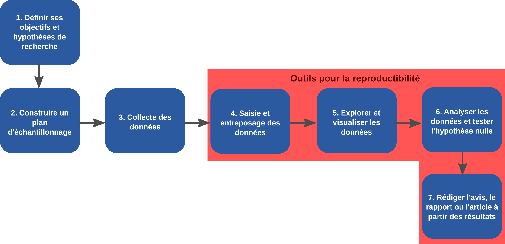
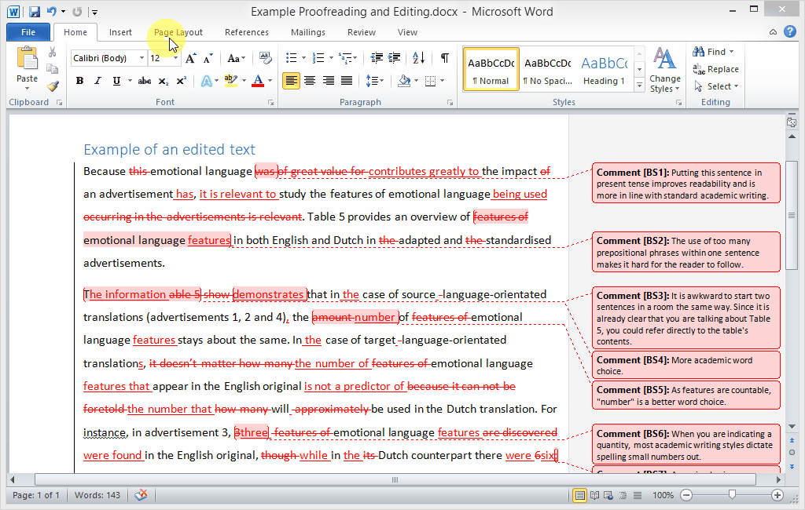

class: title-slide, middle

<style type="text/css">
  .title-slide {
    background-image: url('../assets/img/bg.jpg');
    background-color: #23373B;
    background-size: contain;
    border: 0px;
    background-position: 600px 0;
    line-height: 1;
  }
</style>

# Séance 4

<hr width="65%" align="left" size="0.3" color="orange"></hr>

## Les outils pour la reproductibilité

<hr width="65%" align="left" size="0.3" color="orange" style="margin-bottom:40px;" alt="@Martin Sanchez"></hr>

.instructors[
  **BIO500** - Dominique Gravel
]

</img>

---

# Séance 1

- Ces diapositives sont disponibles en [version web](https://econumuds.github.io/BIO500/cours1/) et en [PDF](./assets/pdf/S1-BIO500.pdf).
- L'ensemble du matériel de cours est disponible sur la page du portail [moodle](https://www.usherbrooke.ca/moodle2-cours/course/view.php?id=12188).


---
class: inverse, center, middle

# Les outils pour la reproductibilité

<hr width="65%" size="0.3" color="orange" style="margin-top:-20px;"></hr>

---

# Les étapes du travail d'un biologiste

.center[
  </img>
]

---

# Une situation courante

.pull-left[
## Une situation qui vous est familière:

.font90[
```bash
MonTravailSession/
  |___ data/
        |___ data_01122018.csv
        |___ data_011022018.csv
  |___ rapportVeg_jean_v1_01012018.docx
  |___ rapportVeg_juliette_v1_01012018.docx
  |___ rapportVeg_rémi_v1_04012018.docx
  |___ rapportVeg_rémi_v2_10012018.docx
  |___ rapportFinal_20012018.docx
```
]]

.pull-right[

## le travail d'équipe

Ses difficultées techniques:

- Multi-utilisateurs
- Garder une trace de l'historique de modifications **d'un ensemble de fichiers**
- Revenir aux versions précédentes
- Comparer des versions d'un fichier
]

---

# Systèmes de contrôle éxistants

## Un exemple avec Dropbox

.center[

]

---

# Systèmes de contrôle éxistants

## Un exemple MS Word

.center[

]

---
class: inverse, center, middle

# Git: Un système de controle de version pour programmeur

<hr width="65%" size="0.3" color="orange" style="margin-top:-20px;"></hr>

---

# Qu'est ce que Git?

.pull-left[

C'est un système qui permet de suivre l'ajout et les modifications pour un ensemble de fichier. **C'est le cahier de lab du programmeur.**

- Logiciel libre soutenu par une large communauté (12 millions d'utilisateurs dans le monde)
- Par défault, Git est installé sur les systèmes d'exploitation Linux et Mac.
- Il peut être installé sur Windows: [https://git-scm.com/download/win](https://git-scm.com/download/win)
]

.pull-right[
  .center[
    </img>
  ]
]

---

# Qu'est ce que Git?

Il présente l'avantage d'être extrêmement versatile mais le désavantage de fonctionner seulement avec les fichiers plein texte.

**Question**: Qu'est ce qu'un fichier plein texte?

<!-- TODO: Qu'est ce qu'un fichier plein texte? Est-ce que je peux faire du contrôle de version avec un document word -->

---

# Initialisation d'un dépôt Git

Git suit les modifications à l'intérieur d'un dossier que l'on appelle dépôt (`repository`).

Pour initialiser le suivi d'un répertoire (initialiser un dépôt), il vous suffit d'utiliser la commande `git init`.

.font90[
```bash
mkdir ~/Documents/travail_BIO500 # Créer un répertoire de travail dans le répertoire Documents.
cd  ~/Documents/travail_BIO500 # Se déplacer vers ce répertoire
git init # Initialiser le suivi de version de ce dossier.
ls -a # Lister tous le contenu du répertoire de travail.
```
]

Le dossier `.git` permet de garder une trace de l'ensemble des opérations que vous allez faire dans ce répertoire.

---

# Exercice 1 - Initialiser le répertoire avec git

**À l'aide de votre terminal:**

1. Créer un dossier (`mkdir`)
2. Créer un fichier (`touch`)
3. Initialiser votre dépot `git` (`git init`)
4. Vérifier que le dossier caché (`.git`) se trouve dans votre nouveau répertoire

---

# Git en 3 étapes

On modifie le ou les fichiers, on ajoute la modification à Git puis on met un commentaire sur la modification apportée.

**En 3 étapes:**

1. Modification d'un ou plusieurs fichiers sources (e.g. Ajout d'un paragraphe)
2. `git add monFichier1.txt monFichier2.txt`
3. `git commit -m "mon commentaire"`

On répète ces étapes à plusieurs reprises au cours de l'écriture d'un document et/ou de l'avancement d'un projet.

**Question**: Qu'est ce qu'un bon commentaire?

---

# Git status

Votre meilleur ami, `git status`, permet de prendre connaissance de l'état de votre dépôt Git.

```bash
Sur la branche master

Validation initiale

Fichiers non suivis:
  (utilisez "git add <fichier>..." pour inclure dans ce qui
  sera validé)


        monFichier1.txt

aucune modification ajoutée à la validation mais des
fichiers non suivis sont présents (utilisez "git add" pour
les suivre).
```

---

# Exercice 2 - Effectuer votre premier `commit`

## Première partie

1. Déplacer vous dans votre répertoire de travail
2. Ajouter un fichier intituler `travail_BIO500.txt` et remplisser le de faux texte
3. Effectuer un `git status`

## Deuxième partie

4. Ajouter ce fichier à votre dépot git (`git add`)
5. Effectuer un `git status`
6. Décrire la modification que vous venez d'apporter (`git commit`)

À chaque `git status`, prenez le temps de regarder la sortie (message)

---

# Exercice: Effectuer votre premier `commit`

## Troisième partie

7. Modifier le fichier `travail_BIO500.txt`
8. Ajouter la modification à votre dépot git (`git add`)
9. Effectuer un `git status`

À chaque `git status`, prenez le temps de regarder la sortie (message).

## Quatrième partie

10. Modifier à nouveau le fichier `travail_BIO500.txt`
11. Effectuer un `git diff` ou `git diff NomDuFichier`

---

# Quelques notions de base

.pull-left[
  .center[
    </img>
  ]
]

.pull-right[

- Une branche (`master` par défault): c'est un série de commentaires (`commit`)
- Le dernier commentaire (`commit`) est ce que l'on appelle la tête de la branche (`HEAD`), elle contient la version la plus à jour des fichiers.
- À chaque commentaire d'édition (`commit`) est attachée une version des fichiers.
]

---

# Le journal de Git

```bash
cd Documents/Git/BIO500 # Ceci est mon chemin d'accès
git log
```

```bash
commit 38d4a2700980b9c765f4abdb33e2f6b598aac4d5
Author: Steve Vissault <s.vissault@yahoo.fr>
Date:   Wed Feb 28 20:38:05 2018 -0500

    Modifs sur plan de match

commit 61601ff86e712d0a77ebd24c5277fe55fab9de6e
Author: Steve Vissault <s.vissault@yahoo.fr>
Date:   Wed Feb 28 20:33:20 2018 -0500

    Modifications au cours3 (retrait slides), ajout reponses
```

---

# Le journal de Git

.pull-left[

.font80[
```bash
commit 38d4a2700980b9c765f4abdb33e2f6b598aac4d5
Author: Steve Vissault <s.vissault@yahoo.fr>
Date:   Wed Feb 28 20:38:05 2018 -0500

    Modifs sur plan de match

commit 61601ff86e712d0a77ebd24c5277fe55fab9de6e
Author: Steve Vissault <s.vissault@yahoo.fr>
Date:   Wed Feb 28 20:33:20 2018 -0500

    Modifications au cours3 (retrait slides)
```
]]

.pull-right[
  .center[
    </img>
  ]
]


---

# Se déplacer sur la branche `master`

.pull-left[

```bash
git checkout 4abdb33e2f6b598aac4d5
```

Permet de se déplacer vers un `commit` précis.
]

.pull-right[
  .center[
    </img>
  ]
]

---

# Se déplacer sur la branche `master`

.pull-left[

```bash
git checkout master
```
]

Permet de se déplacer vers le `commit` le plus récent.

.pull-right[
  .center[
    </img>
  ]
]

---

# Exercice 3 - Se déplacer à travers l'historique

En reprenant votre dépot de travail `git` (Exercice 2), parcourez votre historique (`git log`) et remontez à votre premier commentaire (`commit`).

---
class: inverse, center, middle

# Les serveurs Git distants

<hr width="65%" size="0.3" color="orange" style="margin-top:-20px;"></hr>

---

# Les serveurs Git distants

Jusqu'à présent nous avons travaillé localement sur votre ordinateur. Il est cependant possible de synchroniser votre travail sur un serveur Git (dépots distants). Ce procédé présente deux avantages indéniables:

1. Sauvegarder votre travail (Back-up)
2. Permettre à un collègue de travailler avec vous sur votre dêpot.

---

# Les serveurs Git distants

Il existe plusieurs entreprises offrant des services gratuits pour héberger votre dépôt:

- [Gitlab](https://about.gitlab.com/): Serveur hébergeable dans votre infrastructure.
- [Bitbucket](https://bitbucket.org/): Gratuit avec dépot privé illimité.
- [Github](https://github.com/): Gratuit avec nombre de dépôt privé limité.

Nous travaillerons avec GitHub, la plateforme la plus populaire, une vitrine pour dévoiler vos compétences de programmeur.

---

# Exercice 4: Ouvrez un compte sur Github

1. Rendez-vous à l'adresse: https://github.com/
2. Ouvrez un compte / Inscrivez-vous
3. Créez un nouveau dépot sur GitHub intitulé: `monTravail_BIO500`

---

# Envoyer votre dépôt local sur le serveur Github

```bash
git remote add origin https://adresseVersVotreDepot.git
git remote -v
```

Votre dépot local vient de se transformer en dépôt distant. Cependant, rien n'a encore été envoyé sur le serveur encore.

---

# Envoyer votre dépôt local sur le serveur Github

On va maintenant envoyé les fichiers et l'historique de modifications de ces derniers sur le serveur.

```bash
git push origin master
# Le serveur va vous demander de vous authentifier avec vos accès GitHub
```

`origin` est le serveur distant (toujours par défault)
`master` est la branche sur laquelle vous placez vos fichiers

---

# Récupérer des modifications apporté par un collègue

Imaginez maintenant que l'un de vos collègues apporte des modifications à votre code ou travail et qu'il publie ses modifications (s'il dispose des droits) sur votre dépôt.

```bash
git pull origin master
# Le serveur va vous demander de vous authentifier avec vos accès GitHub
```

---

# Cloner un dépôt distant

Il est possible à tout moment de récupérer un dépôt distant pour le téléverser sur son ordinateur.

```bash
cd Documents
git clone https://github.com/EcoNumUdS/BIO500.git
```
