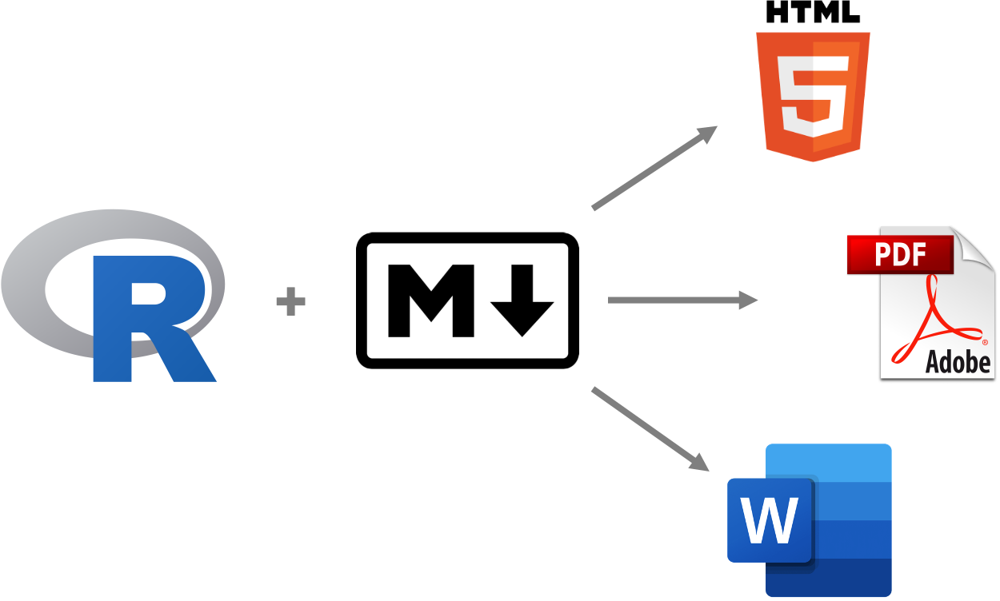
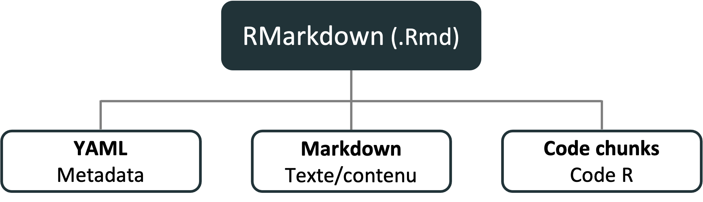
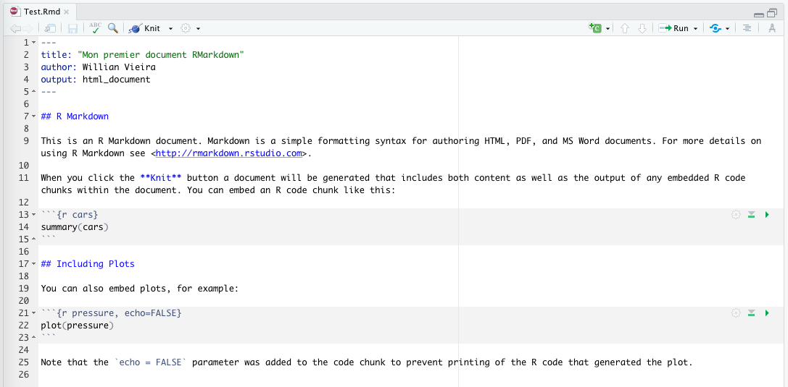
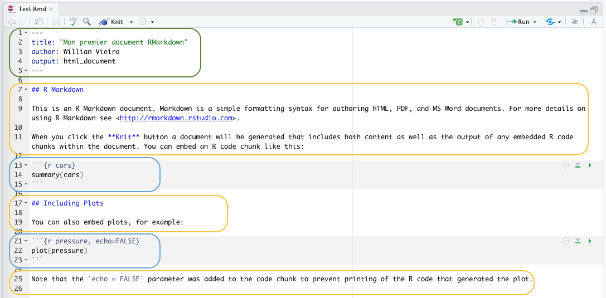
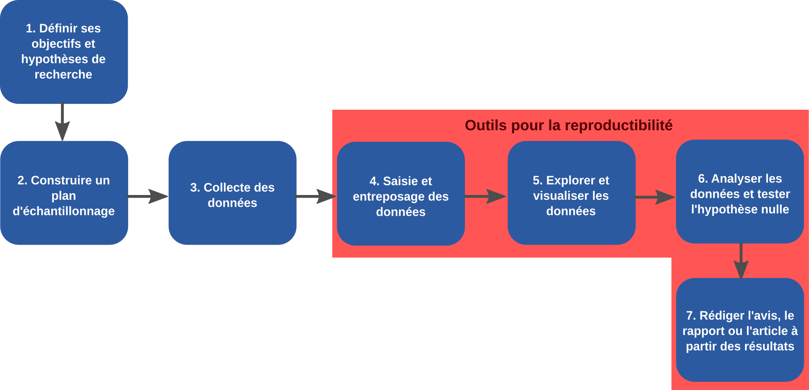
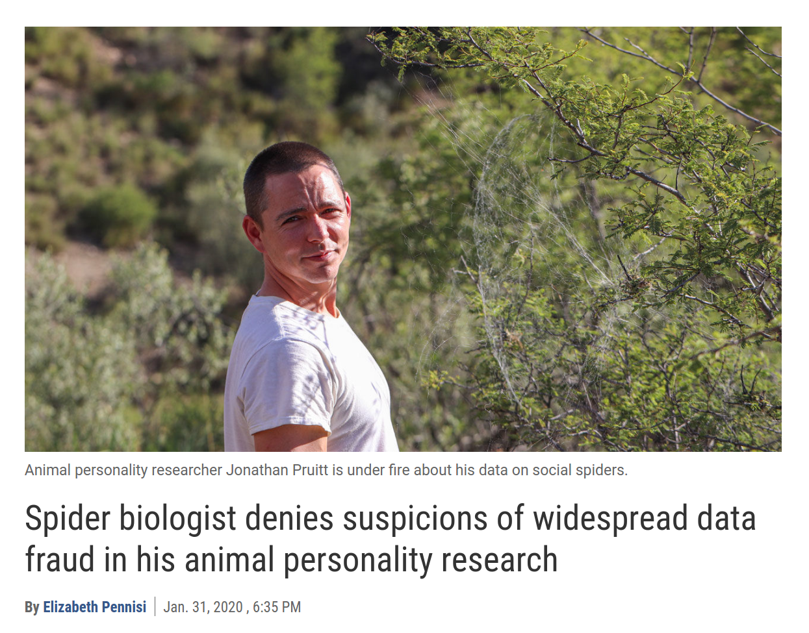

---
class: inverse, center, middle

# Le cahier de laboratoire RMarkdown

<hr width="65%" size="0.3" color="orange" style="margin-top:-20px;"></hr>

---

# C'est quoi le RMarkdown

.center[

]

- Un outil pour intégrer du texte, du code et des résultats
- Un format de fichier (`.Rmd`) pour créer des documents dynamiques avec R
- Un paquet R

---
# Pourquoi RMarkdown?

- Documentation (dynamique) des analyses
- Facilite la partage/communication des résultats
- Utilisable sur les système de controle de version (Git)
- Reproductible!

---
# L'anatomie du RMarkdown

<br>
.center[

]

---
# L'anatomie du RMarkdown

.center[

]

---
# L'anatomie du RMarkdown

.center[

]

<span style="color:rgb(101, 136, 71);">Metadata</span> + <span style="color:rgb(255, 199, 65);">Texte</span> + <span style="color:rgb(100, 164, 213);">Code chunk</span> = RMarkdown

---
# Exercice

1. Ouvrir Rstudio
2. Installer le paquet RMarkdown si necessaire (`install.packages('Rmarkdown')`)
3. Creer nouveau document RMarkdown (bouton vert en haut à gauche)
4. Identifier le YAML, texte, et code chunk du document `.Rmd`
5. Compiler le document en html (bouton 🧶 `knit`)

---
# Le YAML (metadata)

- les métadonnées et les options du document sont définies ici
- La syntaxe est `cle: value`
- Commence et se termine entre trois tirets `---`
- Toujours au début du document

```r
---
title: "Mon titre"
author: "Willian Vieira"
date: "10/03/2021"
output: html_document
    toc: true
---
```

Les options d'output dépendent de la sortie.

Voir `?html_document`, `?pdf_document`, `?word_document`


---
# Markdown (contenu)

Plein texte avec une syntaxe minimaliste pour la mise en forme du texte

.font90[
.pull-left[
```md
# Titre 1
## Titre 2
### Titre 3

Ce mot est en *italique* et celui-ci
en **gras**.
Ici nous avons du `code`.
```
<br><br><br><br><br><br>
]


.pull-right[

# Titre 1
## Titre 2
### Titre 3

Ce mot est en *italique* et celui-ci
en **gras**.
Ici nous avons du `code`.
]
]

---
# Markdown - listes

.font90[
.pull-left[
```md
Lorem ipsum dolor sit amet,
consectetur
adipiscing elit.
- Cras convallis purus.
- Nunc faucibus.
- Maecenas ipsum dolor.

Nulla vehicula metus vel tortor
venenatis luctus.
Etiam tempus sit amet ligula
nec pretium. Aenean ultrices
massa sed pulvinar pulvinar.
1. Duis aliquam commodo volutpat.
1. Mauris ultrices.
1. Aliquam eu erat.
```
]

.pull-right[
Lorem ipsum dolor sit amet,
consectetur
adipiscing elit.
- Cras convallis purus.
- Nunc faucibus.
- Maecenas ipsum dolor.

Nulla vehicula metus vel tortor
venenatis luctus.
Etiam tempus sit amet ligula
nec pretium. Aenean ultrices
massa sed pulvinar pulvinar.
1. Duis aliquam commodo volutpat.
1. Mauris ultrices.
1. Aliquam eu erat.
]
]

---
# Markdown - images

```md

```


---
# Markdown - liens

```md
Voici le [lien](https://github.com/EcoNumUdS/BIO500) pour le GitHub du cours BIO500.
```

Voici le [lien](https://github.com/EcoNumUdS/BIO500) pour le GitHub du cours BIO500.


---
# Markdown - tables

.font90[
.pull-left[
```md
| Time          | Session | Topic    |
|:--------------|:-------:|---------:|
| _left_        | _center_| _right_  |
| 01:00 - 01:50 | 1       | Anatomy  |
| 01:50 - 02:00 |         | *Break*  |
| 02:00 - 02:45 | 2       | Tables   |
| 02:45 - 03:00 |         | *Break*  |
```
]

.pull-right[

| Time          | Session | Topic    |
|:--------------|:-------:|---------:|
| _left_        | _center_| _right_  |
| 01:00 - 01:50 | 1       | Anatomy  |
| 01:50 - 02:00 |         | *Break*  |
| 02:00 - 02:45 | 2       | Tables   |
| 02:45 - 03:00 |         | *Break*  |

]]

<br><br><br><br><br><br><br><br><br>
- Le `:` spécifie l'alignement
- Possibilité d'utiliser des packages R spécialisés pour imprimer des tableaux automatiquement à partir de R


---
# Code chunk (script R)

### Code Rmarkdown:

.font80[
````md
Le code R doit être à l'intérieur d'un bloc de code (*code chunk*). Par example:

```{r}`r ''`
data(iris)
iris_setosa <- subset(iris, Species == 'setosa')
head(iris_setosa)
```
````
]

### Sortir Rmarkdown:

.font80[
Le code R doit être à l'intérieur d'un bloc de code (*code chunk*). Par example:

```{r}
data(iris)
iris_setosa <- subset(iris, Species == 'setosa')
head(iris_setosa)
```
]

---
# Code chunk (script R)

.pull-left[
### Code Rmarkdown:

.font80[
````md
```{r}`r ''`
data(iris)
plot(iris$Sepal.Length, iris$Sepal.Width)
```
````
]]

.pull-right[
### Sortir Rmarkdown:

.font80[
```{r}
data(iris)
plot(iris$Sepal.Length, iris$Sepal.Width)
```
]]

---
# Code R en ligne

### Code Rmarkdown:

```{r,eval=FALSE}
le jeu de données *iris* comprend `r length(unique(iris$Species))` espèces
avec un total de `r nrow(iris)` fleurs mesurées.
```

### Sortir Rmarkdown:

le jeu de données *iris* comprend `r length(unique(iris$Species))` espèces avec un total de `r nrow(iris)` fleurs mesurées.

---
# Configuration des code chunk

.font80[
Nomer le bloc de code (utile pour débogage)
````md
```{r plot_iris}`r ''`
plot(iris$Sepal.Length, iris$Sepal.Width)
```
````
`echo=FALSE`:  afficher les résultat, mais pas le code
````md
```{r plot_iris, echo=FALSE}`r ''`
plot(iris$Sepal.Length, iris$Sepal.Width)
```
````
`eval=FALSE`:  afficher le code, mais le code n'est pas évalué
````md
```{r plot_iris, eval=FALSE}`r ''`
plot(iris$Sepal.Length, iris$Sepal.Width)
```
````
`include=FALSE`: évaluer le code, mais rien n'est affiché
````md
```{r plot_iris, include=FALSE}`r ''`
plot(iris$Sepal.Length, iris$Sepal.Width)
```
````
]

---
# Configuration des code chunk

Ajuster la taille de la figure

````md
```{r plot_iris, fig.height = 3, fig.width = 5, fig.align = "center"}`r ''`
plot(iris$Sepal.Length, iris$Sepal.Width)
```
````

```{r plot_iris, echo=FALSE, fig.height = 4, fig.width = 6, fig.align = "center"}
plot(iris$Sepal.Length, iris$Sepal.Width)
```

---
# Configuration des code chunk

.font70[
```{r}
str(knitr::opts_chunk$get())
```
]


---
# L'univers RMarkdown


.font60[*Source: Ulrik Lyngs*]

---
# Autres ressources disponibles en ligne :

- R Markdown: The Definitive Guide [https://bookdown.org/yihui/rmarkdown/](https://bookdown.org/yihui/rmarkdown/)
- RMarkdown gallery [https://rmarkdown.rstudio.com/gallery.html](https://rmarkdown.rstudio.com/gallery.html)
- ResearchDown [https://insileco.github.io/ResearchDown/](https://insileco.github.io/ResearchDown/)

---
class: inverse, center, middle

# Travail pour la semaine

<hr width="65%" size="0.3" color="orange" style="margin-top:-20px;"></hr>

---

# Consignes

- Identifiez clairement vos questions de recherche
- Planifiez les requêtes à réaliser pour traiter les données

---

# Lectures

Est-ce que la science ouverte peut prévenir la fraude ?

.center[
  </img>
]

[Lien vers l'article dans Science](https://www.sciencemag.org/news/2020/01/spider-biologist-denies-suspicions-widespread-data-fraud-his-animal-personality)

[Et un lien vers un blog qui explique comment la triche a été réalisée](https://laskowskilab.faculty.ucdavis.edu/2020/01/29/retractions/)

---