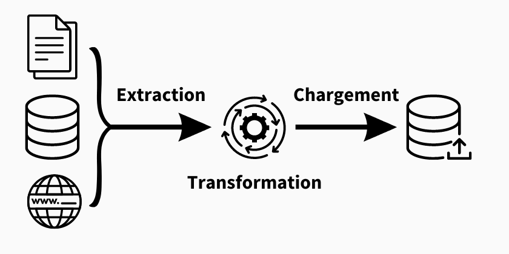
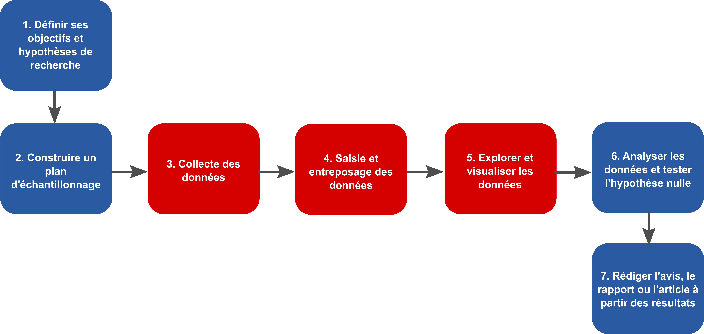

class: inverse, center, middle

# Principes clefs de la reproductibilité

---

# Principes clefs de la reproductibilité

1. Séparation des responsabilités
2. Flux de données
3. Scalabilité avant performance
4. Traçabilité et maintenance
5. Principes FAIR

---

# 1. Séparation des responsabilités 

Le concept de *Separation of Concerns* a été introduit par Edsger W. Dijkstra (1974) dans son article *On the Role of Scientific Thought*. Il s'agit d'une approche pour gérer la complexité des systèmes informatiques : **chaque partie du programme devrait s’occuper d’un seul aspect du problème**. En séparant les responsabilités, il devient plus facile de : comprendre le code, maintenir le programme et faire évoluer le système.

> Une fonction = une responsabilité

Une fonction devrait pouvoir être résumée en une seule phrase. Si la phrase contient “et”, la fonction fait probablement trop de choses.

❌ load_and_clean_data()

✔ load_data()

✔ clean_data()

---

# 2. Flux de données ETL

## *Extract – Transform – Load*

.center[

]

Un flux ETL décrit les étapes qui permettent de déplacer et préparer des données entre différentes sources et systèmes. Le concept a été popularisé dans les systèmes de gestion de données et constitue aujourd’hui une pratique centrale en ingénierie des données.

---

# 2. Flux de données ETL

## *Extract – Transform – Load*

**Extract**
Extraire les données depuis leur source
(ex. fichiers CSV, API, base de données, capteurs)

**Transform**
Nettoyer, filtrer, restructurer ou enrichir les données
(ex. corriger les valeurs manquantes, changer les formats, agréger)

**Load**
Charger les données dans le système cible
(ex. base de données, entrepôt de données, application)

---

# 3. Scalabilité avant performance

> “Premature optimization is the root of all evil.”
> — Donald Knuth

Ordre des priorités :
1. Le code **fonctionne**
2. Le code est **clair**
3. Le code est **rapide** (si nécessaire)

Un programme bien structuré est plus facile à faire évoluer et à adapter lorsque les données ou les besoins augmentent.

---

# 4. Traçabilité et maintenance

Objectif : **un programme reproductible et maintenable**

- **Paramètres explicites** : éviter les valeurs cachées dans le code. On peut expliciter les valeurs par défaut, les *paramètres*, en haut du script ou dans un fichier de configuration pour les rendre facilement modifiables
- **Logs** : garder une trace et suivre l'exécution du programme
- **Automatisation** : limiter les interventions manuelles : un fichier qui contient un ensemble de directives qui sont exécutées par l'ordinateur. Les instructions et leurs dépendances sont spécifiées
- **Tests** : vérifier que le code fonctionne toujours après des modifications

> Ces principes sont explorés dans un l'atelier qui suivra.

---

# 5. Principes FAIR

S'applique aux données, algorithmes et pipelines. Représentent un standard que tous peuvent suivre pour favoriser la reproductibilité et la transparence de leurs travaux.

.center[
</img>
]

---

# 5. Principes FAIR

## Findable

- (Trouvable) : Les données et scripts doivent être bien documentées et indexées pour être facilement retrouvées.
- DOI, métadonnées, catalogues de données.

---

# 5. Principes FAIR

## Findable

## Accessible
- (Accessible) : Les données doivent être accessibles avec des protocoles ouverts et, si elles sont restreintes, clairement expliquées.
- Dépôts de données ouverts, licences claires, accès via des API.

---

# 5. Principes FAIR

## Findable

## Accessible

## Interoperable

- (Interopérable) : Les données doivent être lisibles et utilisables par différents outils et logiciels.
- Formats ouverts, vocabulaire standardisé.

---

# 5. Principes FAIR

## Findable

## Accessible

## Interoperable

## Reusable

- (Réutilisable) : Les données et scripts doivent être suffisamment bien décrits et structurés pour être réutilisés dans d’autres contextes.
- Documentation détaillée, traçabilité des versions, attribution claire des auteurs.

---

# 5. Principes FAIR

Alors que l'adoption des principes FAIR sont centraux à la résolution de la crise de reproductibilité et sont à connaitre de tous les chercheurs, ils sont *de facto* appliqués à votre projet et ne requierent pas de travail supplémentaire :

- Utilisation d'un README et de commentaires pour documenter votre projet
- Utilisation de GitHub pour partager votre code et vos données
- Utilisation d'une base de données relationnelle pour stocker vos données
- Utilisation de R et RMarkdown pour concevoir et partager votre code et votre rapport

<!-- # Discussion

## Quels sont les liens concrets entre les principes FAIR et les étapes d'une étude scientifique ?

.center[
</img>
] -->

<!-- 
### **1. Contexte et importance des principes FAIR (5 min)**  
- **Problème actuel en science** : Difficulté à reproduire des études, accès limité aux données, méthodes peu documentées.  
- **Pourquoi les principes FAIR ?** : Créés pour améliorer la gestion, le partage et la réutilisation des données scientifiques.  
- **Objectif** : Assurer que les données soient facilement retrouvables, accessibles, compatibles avec différents systèmes et réutilisables par d’autres chercheurs.  

### **2. Présentation des quatre principes FAIR (10 min)**  

1. **Findable (Trouvable)**  
   - Définition : Les données doivent être bien documentées et indexées pour être facilement retrouvées.  
   - Exemples : Utilisation d’identifiants uniques (DOI), métadonnées complètes, catalogues de données.  

2. **Accessible (Accessible)**  
   - Définition : Les données doivent être accessibles avec des protocoles ouverts et, si elles sont restreintes, clairement expliquées.  
   - Exemples : Dépôts de données ouverts, licences claires (ex. Creative Commons), accès via des API.  

3. **Interoperable (Interopérable)**  
   - Définition : Les données doivent être lisibles et utilisables par différents outils et logiciels.  
   - Exemples : Formats ouverts (CSV, JSON), vocabulaire standardisé (ex. Darwin Core pour la biodiversité).  

4. **Reusable (Réutilisable)**  
   - Définition : Les données doivent être suffisamment bien décrites et structurées pour être réutilisées dans d’autres contextes.  
   - Exemples : Documentation détaillée, traçabilité des versions, attribution claire des auteurs.  

### **3. Lien avec la reproductibilité (5 min)**  
- Une étude reproductible nécessite que ses données soient bien organisées et accessibles.  
- Les principes FAIR réduisent les obstacles à la reproduction des résultats en rendant les données plus compréhensibles et exploitables.  
- **Question de transition pour la discussion** : Quels sont les liens concrets entre ces principes et les étapes d’une étude scientifique ?  
-->

---

# Mise en pratique

Complétez l'atelier `Séance 5 — Principes de reproductibilité` accessible sur Moodle > Bloc 2.

---

class: inverse, center, middle

# Travail pour la semaine

---

# Consignes

- Identifiez clairement vos questions de recherche
- Planifiez les requêtes à réaliser pour traiter les données
- Créez un dépôt github pour votre projet 
- Créez un cahier de laboratoire où sont notées toutes vos étapes
- Versez votre travail sur le dépôt en ligne
- Construire le `_targets.R` au fur et à mesure de vos progrès

---

# Fiche de lecture

Vous avez à lire "The FAIR Guiding Principles for scientific data management and stewardship" de Wilkinson (2016) et répondre aux questions suivante en une page maximum à remettre en PDF avant le cours du 31 mars :

- Quel est l'importance des données, des métadonnées et du code dans crise actuelle de la reproductibilité ?
- Pourquoi les principes FAIR ? Quelle est leur pertinence ?
- Quel est le lien entre les principes FAIR et la reproductibilité ?

[Wilkinson et al. 2016. The FAIR Guiding Principles for scientific data management and stewardship.](https://github.com/EcoNumUdS/BIO500/blob/master/lectures/wilkinson2016.pdf)

---

class: inverse, center, middle

# Débat : Intelligence artificielle et écologie, opportunité ou menace pour la rigueur scientifique ?

 
## 15 minutes pour préparer ses arguments
## 2 minutes pour présenter ses arguments
## 20 minutes de discussion dirigée
## 5 minutes vote et conclusion
<!-- 
    Sondage sur l’impact perçu des LLM.
    Conclusion sur les pistes pour une utilisation responsable.
-->

<!-- 
Points de réflexion :

  -  Fiabilité et biais : Les LLM peuvent-ils introduire des biais dans l'analyse des données écologiques ?
  -  Automatisation et créativité scientifique : Les LLM peuvent-ils renforcer la créativité ou risquent-ils de réduire l’esprit critique ?
  -  Accès aux données et reproductibilité : Les LLM facilitent-ils l’accès à des connaissances dispersées ou compliquent-ils la transparence des méthodes ?
  -  Éthique et impacts environnementaux : L'empreinte carbone des LLM est-elle compatible avec les objectifs de durabilité écologique ? 

Retour sur règles de l'université de Sherbrooke : 
- Responsabilité étudiants : https://www.usherbrooke.ca/intranet-education/fileadmin/sites/intranet-education/documents/Intranet/Reglements_facultaires/Informations_facultaires_VF_en_vigueur.pdf
- Lignes directrices : https://www.usherbrooke.ca/decouvrir/a-propos/priorites-institutionnelles/intelligence-artificielle/lignes-directrices-iag
- Biblio : https://libguides.biblio.usherbrooke.ca/IA
-->

---