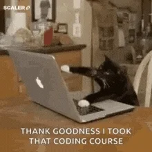

```{r setup, include=FALSE}
knitr::opts_chunk$set(echo = TRUE)
```

## Personnaliser le contenu

### Forme

Ce mot est en *italique* et celui-ci est en **gras**.

### Insérer du code

Ici nous avons du `code`.

### Insérer une liste

Le texte qui suit est une liste : 

- Premier item 
- Deuxième item 
- Troisième item

Pour faire une énumération : 

1. Item 1 
2. Item 2 
3. Item 3

## Insérer des images



## Insérer un lien

Voici le [lien](https://github.com/EcoNumUdS/BIO500) pour la page GitHub
du cours BIO500.

## Insérer une table

| Time          | Session  |   Topic |
|:--------------|:--------:|--------:|
| *left*        | *center* | *right* |
| 01:00 - 01:50 |    1     | Anatomy |
| 01:50 - 02:00 |          | *Break* |
| 02:00 - 02:45 |    2     |  Tables |
| 02:45 - 03:00 |          | *Break* |

## Insérer un bloc de code

```{r}
iris <- read.csv("./data/iris.csv")
iris_setosa <- subset(iris, Species == 'setosa')
head(iris_setosa)
```

### Présenter une figure

```{r}
plot(iris$Sepal.Length, iris$Sepal.Width)
```

## Inclure du code directement dans le texte

le jeu de données *iris* comprend `r length(unique(iris$Species))`
espèces avec un total de `r nrow(iris)` fleurs mesurées.

## Configurer les code chunk

### Nommer le bloc de code (utile pour débogage)

```{r plot_iris}
plot(iris$Sepal.Length, iris$Sepal.Width)
```

### `echo=FALSE`: afficher les résultats, mais pas le code

```{r echo_false, echo=FALSE}
plot(iris$Sepal.Length, iris$Sepal.Width)
```

### `eval=FALSE`: afficher le code, mais le code n'est pas évalué

```{r eval_false, eval=FALSE}
plot(iris$Sepal.Length, iris$Sepal.Width)
```

### `include=FALSE`: évaluer le code, mais rien n'est affiché

```{r include_false, include=FALSE}
plot(iris$Sepal.Length, iris$Sepal.Width)
```
