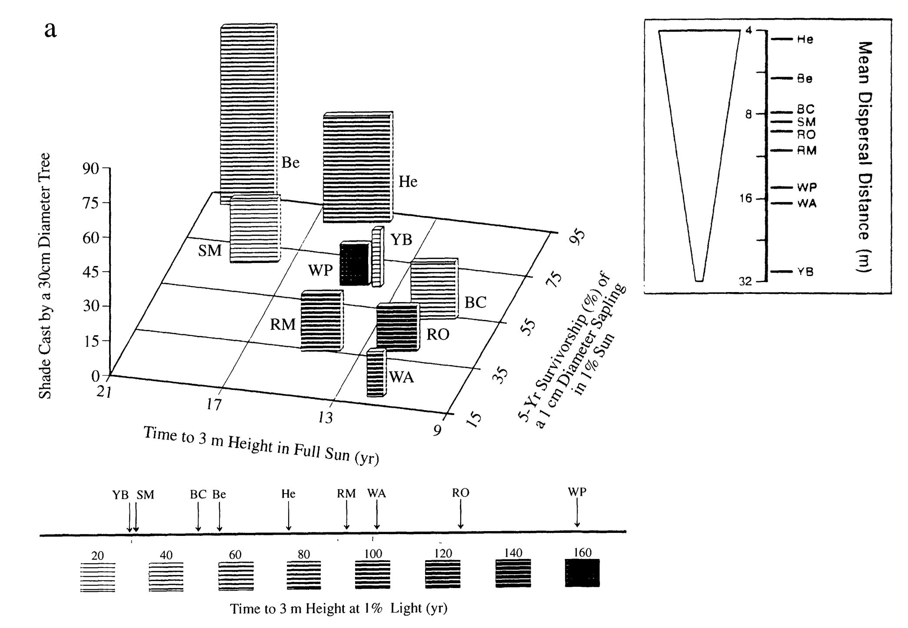
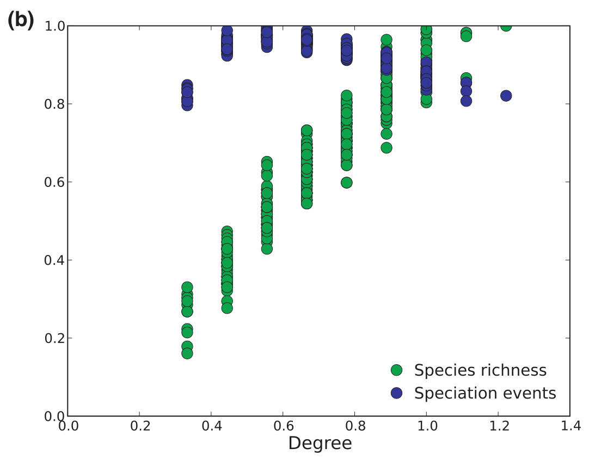
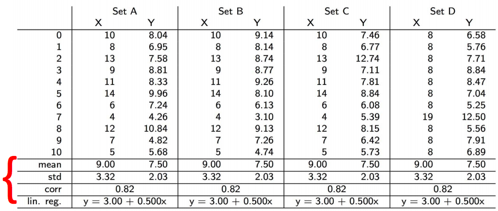
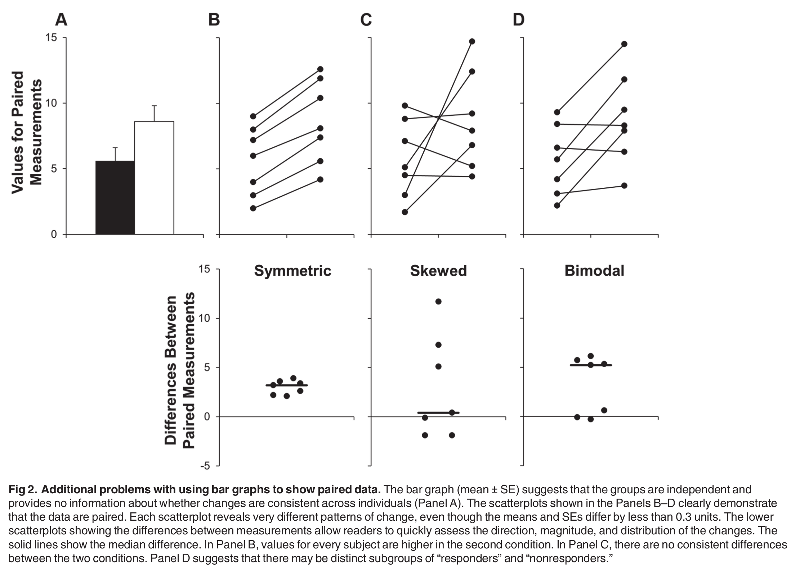
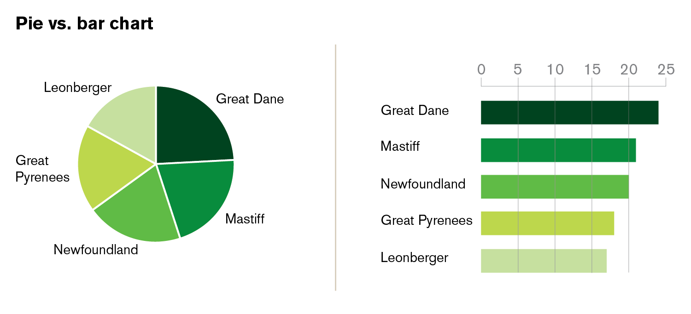
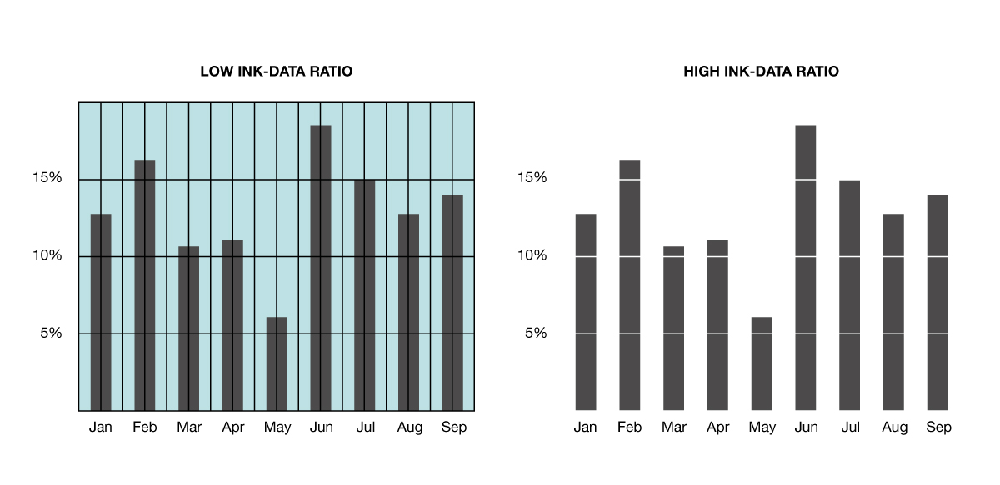

class: title-slide, middle

<style type="text/css">
  .title-slide {
    background-image: url('../assets/img/bg.jpg');
    background-color: #23373B;
    background-size: contain;
    border: 0px;
    background-position: 600px 0;
    line-height: 1;
  }
</style>

# Séance 5

<hr width="65%" align="left" size="0.3" color="orange"></hr>

## La visualisation des données

<hr width="65%" align="left" size="0.3" color="orange" style="margin-bottom:40px;" alt="@Martin Sanchez"></hr>

.instructors[
  **BIO500** - Dominique Gravel
]

</img>

---

# Séance 5

- Ces diapositives sont disponibles en [version web](https://econumuds.github.io/BIO500/cours1/) et en [PDF](./assets/pdf/S1-BIO500.pdf).
- L'ensemble du matériel de cours est disponible sur la page du portail [moodle](https://www.usherbrooke.ca/moodle2-cours/course/view.php?id=12188).

- Vous trouverez du matériel supplémentaire dans le [cours](http://kevincazelles.fr/talks/assets/QCBSGraphsR/Rgraphics.html#4) de [Kevin Cazelles](http://kevincazelles.fr/) et [Nicolas Casajus](http://www.cen.ulaval.ca/membre.aspx?id=3945098&membre=ncasajus) lors d'un atelier de communication visuelle du CSBQ.
- Certaines diapositives sont également extraites de la présentation de [David Taylor](http://dtdata.io/prm/intro_dataviz_csbq.pdf)


---
class: inverse, center, middle

# Qu'est-ce qui fait une bonne figure ?

<hr width="65%" size="0.3" color="orange" style="margin-top:-20px;"></hr>

---

# Trop d'information

.center[
  </img>
]

---

# Non respect des normes graphiques

.center[
  </img>
]

---
# Abus de symboles et de couleurs

<br><br>
.center[
  </img>
]


---
class: inverse, center, middle

# L'art graphique

<hr width="65%" size="0.3" color="orange" style="margin-top:-20px;"></hr>

---

# L'importance des graphiques

<!-- La représentation visuelle de nos données est un **outil de persuasion** permettant d'illustrer nos résultats auprès du public et de nos pairs. Cet outil permet également de mieux comprendre les relations à l'intérieur de nos données par la visualisation. -->

## La représentation visuelle des données permet de:

- Synthétiser l'information.
- Communiquer plus efficacement qu'un tableau.
- Explorer nos données par la visualisation.
- Présenter nos résultats et convaincre.

---

# Explorer nos données par la visualisation

## Voici un exemple illustrant l'importance de visualiser ses données:

.center[
  </img>
]

---

# Explorer nos données par la visualisation

## Voici un exemple illustrant l'importance de visualiser ses données:

.center[
  </img>
]

---

# Communiquer par les graphiques

.pull-left[

- Les graphiques sont généralement **plus efficaces à communiquer** un message/un résultat qu'un tableau.

- **Problème:** La représentation graphique peut parfois nous conduire à une **fausse interprétation**. L'idée est de transmettre une idée sans biaiser le lecteur.
]

---

# Communiquer par les graphiques

.center[
  </img>
]


<!-- - Problème: ratio 8/3 -->


---

# Communiquer par les graphiques

<br>
.center[
  </img>
]

---

# Communiquer par les graphiques

<br>
.center[
  </img>
]


---
class: inverse, center, middle

# Règles et composantes graphiques

<hr width="65%" size="0.3" color="orange" style="margin-top:-20px;"></hr>

---

# Les composantes graphiques

.pull-left[

- Les axes et échelles.
- Le titre de la figure.
- La légende
- Le [type de représentation des données](http://www.datavizcatalogue.com/).
]

.pull-right[
  .center[
    </img>
  ]
]

---

# Les règles graphiques

.pull-left[

- Une figure doit renvoyer un seul message/résultat.
- Chaque élément d'une figure doit **aider à comprendre** ce message.
- **Choisir le bon type de représentation** permet de mettre en valeur plus facilement ce qui doit être illustré.
- **Attention aux normes graphiques**: Choix des couleurs, taille des caractères, épaisseur de la ligne, disposition des marges, cadrage etc.
]

.pull-right[
  .center[
    </img>
  ]
]

---

# Quelques conseils

- Ne pas **JAMAIS** utiliser de diagramme en pointe de tarte

.center[
  </img>
]

---

# Quelques conseils

.pull-left[

- Éviter les figures 3D.
- Limiter le nombre de dimensions (3 ou 4 dimensions max).
- La multi-dimensionnalité peut être gérée en:
  - Modifiant la forme et la la taille des points
  - Ajoutant des couleurs
]

.pull-right[
  .center[
    </img>
  ]
]

---

# Quelques conseils

- Limiter le ratio encre/données afin de faciliter la lecture.

.center[
  </img>
]


---
class: inverse, center, middle

# Types de figures

<hr width="65%" size="0.3" color="orange" style="margin-top:-20px;"></hr>

---

# Diagramme de dispersion (Scatter plot)

```{r, echo=FALSE,out.height = '550px', dpi=300, fig.align="center"}
arbres  <- read.csv2("assets/data/arbres.csv")
densite <- table(arbres[,c(3,5)])
elevation <- as.numeric(row.names(densite))
plot(elevation, densite[,1], pch = 19, xlab = "Elevation", ylab = "Densité")
points(elevation, densite[,3])
```

---

# Diagrammes à bâtons (Bar plot)

```{r, echo=FALSE,out.height = '550px', dpi=300, fig.align="center"}
arbres  <- read.csv2("assets/data/arbres.csv")
n_tot <- table(arbres$esp)
barplot(n_tot)
```

---

# Histogrammes

```{r, echo=FALSE,out.height = '550px', dpi=300, fig.align="center"}
hist(densite[,3])
```

---

# Représentation 3-D

```{r, echo=FALSE,out.height = '550px', dpi=300, fig.align="center"}
x <- 10*(1:nrow(volcano))
y <- 10*(1:ncol(volcano))
image(x, y, volcano, col = terrain.colors(100), axes = FALSE)
axis(1, at = seq(100, 800, by = 100))
axis(2, at = seq(100, 600, by = 100))
box()
title(main = "Maunga Whau Volcano", font.main = 4)
```

---

# Lignes de contour

```{r, echo=FALSE,out.height = '550px', dpi=300, fig.align="center"}
x <- 10*(1:nrow(volcano))
y <- 10*(1:ncol(volcano))
image(x, y, volcano, col = terrain.colors(100), axes = FALSE)
axis(1, at = seq(100, 800, by = 100))
axis(2, at = seq(100, 600, by = 100))
box()
title(main = "Maunga Whau Volcano", font.main = 4)
contour(x, y, volcano, levels = seq(90, 200, by = 5),
add = TRUE, col = "black")
```

---
class: inverse, center, middle

# Faire une figure étape par étape avec R

<hr width="65%" size="0.3" color="orange" style="margin-top:-20px;"></hr>

---

# Préparer les données adéquatement

- Habituellement un `data.frame` ou `une matrice`
- Une observation par ligne (format long)

---

# Ouvrir une fenêtre graphique

```{r, eval = FALSE}
dev.new(width = 10, height = 7)
```

---

# Fixer certains paramètres

```{r, eval = FALSE}
# Fixer la largeur et la hauteur des marges
par(mar = c(5,6,2,1))

# Fixer le nombre de figures en colonnes et rangées
par(mfrow = c(1,1))
```

---

# Démarrer une figure avec `plot()`

.font90[
```{r, out.width = '55%', dpi=300, fig.align="center"}
arbres <- read.csv2("assets/data/arbres.csv")
densite <- table(arbres[,c(3,5)])
elevation <- as.numeric(row.names(densite))
plot(elevation, densite[,1], axes = FALSE,
      xlab = "Élévation", ylab = "Densité")
```
]

---

# Échelles logarithmiques

```{r, ,out.width = '55%', dpi=300, fig.align="center", warning=FALSE, message=FALSE}
plot(elevation, densite[,1], axes = FALSE,
      xlab = "Élévation", ylab = "Densité",
      log = "xy")
```

---

# Ajuster les tailles de caractères

## Arguments `cex`, `cex.lab` et `cex.axis`

```{r, out.width = '50%', dpi=300, fig.align="center", warning=FALSE, message=FALSE}
plot(elevation, densite[,1], axes = FALSE,
      xlab = "Élévation", ylab = "Densité",
      cex.lab = 1.5, cex.axis = 1.25, cex = 1.5)
```

---

# Modifier les axes

.font90[
```{r, eval = FALSE}
axis(1, seq(0,1000,100))
axis(2)
```
```{r, echo=FALSE, out.width = '55%', dpi=300, fig.align="center"}
plot(elevation, densite[,1], axes = FALSE,
      xlab = "Élévation", ylab = "Densité",
      cex.lab = 1.5, cex.axis = 1.25, cex = 1.5)
axis(1, seq(0,1000,100))
axis(2)
```
]

---

# Ajouter un titre

```{r, eval = FALSE}
title(main = "Densité au long du gradient d'élévation")
```

```{r, echo=FALSE,out.width = '55%', dpi=300, fig.align="center"}
plot(elevation, densite[,1], axes = FALSE,
      xlab = "Élévation", ylab = "Densité",
      cex.lab = 1.5, cex.axis = 1.25, cex = 1.5)
axis(1, seq(0,1000,100))
axis(2)
title(main = "Densité au long du gradient d'élévation")
```

---

# Superposer des points d'autre données

```{r, eval = FALSE}
points(elevation, densite[,3], pch = 19, cex = 1.5)
```

```{r, echo=FALSE,out.width = '55%', dpi=300, fig.align="center"}
plot(elevation, densite[,1], axes = FALSE,
      xlab = "Élévation", ylab = "Densité",
      cex.lab = 1.5, cex.axis = 1.25, cex = 1.5)
axis(1, seq(0,1000,100))
axis(2)
title(main = "Densité au long du gradient d'élévation")
points(elevation, densite[,3], pch = 19, cex = 1.5)
```

---

# Superposer des lignes

```{r, eval = FALSE}
lines(elevation, densite[,1],lty = 1, lwd = 1.5)
lines(elevation, densite[,3], lty  = 3, lwd = 1.5)
```

```{r, echo=FALSE,out.width = '55%', dpi=300, fig.align="center"}
plot(elevation, densite[,1], axes = FALSE,
      xlab = "Élévation", ylab = "Densité",
      cex.lab = 1.5, cex.axis = 1.25, cex = 1.5)
axis(1, seq(0,1000,100))
axis(2)
title(main = "Densité au long du gradient d'élévation")
points(elevation, densite[,3], pch = 19, cex = 1.5)
lines(elevation, densite[,1], lty = 1, lwd = 1.5)
lines(elevation, densite[,3], lty = 3, lwd = 1.5)
```

---

# Ajouter une ligne de tendance

```{r, eval = FALSE}
model = lm(densite[,3]~elevation)
summary(model)
abline(model, col = "darkred")
```

```{r, echo=FALSE,out.width = '55%', dpi=300, fig.align="center"}
model = lm(densite[,3]~elevation)
summary(model)
```

---

# Ajouter une ligne de tendance

```{r, eval = FALSE}
model = lm(densite[,3]~elevation)
abline(model, col = "darkred")
```

```{r, echo=FALSE,out.width = '55%', dpi=300, fig.align="center"}
plot(elevation, densite[,1], axes = FALSE,
      xlab = "Élévation", ylab = "Densité",
      cex.lab = 1.5, cex.axis = 1.25, cex = 1.5)
axis(1, seq(0,1000,100))
axis(2)
title(main = "Densité au long du gradient d'élévation")
points(elevation, densite[,3], pch = 19, cex = 1.5)
lines(elevation, densite[,1], lty = 1, lwd = 1.5)
lines(elevation, densite[,3], lty = 3, lwd = 1.5)
model = lm(densite[,3]~elevation)
abline(model, col = "darkred")
```


---

# Ajouter une légende

```{r, eval = FALSE}
legend("top", bty = "n", pch = c(19,1), lty = 1,
    legend = c("Érable à sucre", "Sapin baumier"),
    cex = 1.5)
```

```{r, echo=FALSE,out.width = '55%', dpi=300, fig.align="center"}
plot(elevation, densite[,1], axes = FALSE,
      xlab = "Élévation", ylab = "Densité",
      cex.lab = 1.5, cex.axis = 1.25, cex = 1.5)
axis(1, seq(0,1000,100))
axis(2)
title(main = "Densité au long du gradient d'élévation")
points(elevation, densite[,3], pch = 19, cex = 1.5)
lines(elevation, densite[,1], lty = 1, lwd = 1.5)
lines(elevation, densite[,3], lty = 3, lwd = 1.5)
legend("top", bty = "n", pch = c(19,1), lty = 1, legend = c("Érable à sucre", "Sapin baumier"), cex = 1.5)
```

---

# Ajouter du texte

```{r, eval = FALSE}
r2 <- round(summary(model)$r.squared, 2)
text(x = 850, y = 25, paste("R2=",r2),
    cex = 21.5)

```

```{r, echo=FALSE,out.width = '55%', dpi=300, fig.align="center"}
plot(elevation, densite[,1], axes = FALSE,
      xlab = "Élévation", ylab = "Densité",
      cex.lab = 1.5, cex.axis = 1.25, cex = 1.5)
axis(1, seq(0,1000,100))
axis(2)
title(main = "Densité au long du gradient d'élévation")
points(elevation, densite[,3], pch = 19, cex = 1.5)
lines(elevation, densite[,1], lty = 1, lwd = 1.5)
lines(elevation, densite[,3], lty = 3, lwd = 1.5)
legend("top", bty = "n", pch = c(19,1), lty = 1, legend = c("Érable à sucre", "Sapin baumier"), cex = 1.5)
r2 <- round(summary(model)$r.squared, 2)
text(x = 875, y = 25, paste("R2=",r2), cex = 1.5)
```

---

# Pour plus d'information

- `?plot`
- `?par`
- `?axis`
- `?mtext`

---
class: inverse, center, middle

# Créer d'autres types de figure

<hr width="65%" size="0.3" color="orange" style="margin-top:-20px;"></hr>

---

# Diagramme de dispersion (Scatter plot)

.font80[
```{r, eval = FALSE}
arbres  <- read.csv2("assets/data/arbres.csv")
densite <- table(arbres[,c(3,5)])
elevation <- as.numeric(row.names(densite))
plot(elevation, densite[,1], pch = 19,
  xlab = "Elevation", ylab = "Densité")
points(elevation, densite[,3])
```
]

```{r, echo=FALSE, out.width = '52%', dpi=300, fig.align="center"}
arbres  <- read.csv2("assets/data/arbres.csv")
densite <- table(arbres[,c(3,5)])
elevation <- as.numeric(row.names(densite))
plot(elevation, densite[,1], pch = 19,
  xlab = "Elevation", ylab = "Densité")
points(elevation, densite[,3])
```

---

# Diagrammes à bâtons (Bar plot)

```{r, eval = FALSE}
arbres  <- read.csv2("assets/data/arbres.csv")
n_tot <- table(arbres$esp)
barplot(n_tot)
```

```{r, echo=FALSE, out.width = '55%', dpi=300, fig.align="center"}
arbres  <- read.csv2("assets/data/arbres.csv")
n_tot <- table(arbres$esp)
barplot(n_tot)
```

---

# Histogrammes

```{r, eval = FALSE}
hist(densite[,3])
```

```{r, echo=FALSE,out.width = '55%', dpi=300, fig.align="center"}
hist(densite[,3])
```

---

# Représentation 3-D

.font70[
```{r, eval = FALSE}
x <- 10*(1:nrow(volcano))
y <- 10*(1:ncol(volcano))

image(x, y, volcano,
  col = terrain.colors(100), axes = FALSE)

axis(1, at = seq(100, 800, by = 100))
axis(2, at = seq(100, 600, by = 100))
box()

title(main = "Maunga Whau Volcano", font.main = 4)
```
]

```{r, echo=FALSE,out.width = '45%', dpi=300, fig.align="center"}
x <- 10*(1:nrow(volcano))
y <- 10*(1:ncol(volcano))

image(x, y, volcano,
  col = terrain.colors(100), axes = FALSE)

axis(1, at = seq(100, 800, by = 100))
axis(2, at = seq(100, 600, by = 100))
box()

title(main = "Maunga Whau Volcano", font.main = 4)
```

---

# Lignes de contour

.font70[
```{r, eval = FALSE}
x <- 10*(1:nrow(volcano))
y <- 10*(1:ncol(volcano))

image(x, y, volcano,
  col = terrain.colors(100), axes = FALSE)

axis(1, at = seq(100, 800, by = 100))
axis(2, at = seq(100, 600, by = 100))
box()

title(main = "Maunga Whau Volcano", font.main = 4)

contour(x, y, volcano,
  levels = seq(90, 200, by = 5),
  add = TRUE, col = "black")
```
]

```{r, echo=FALSE,out.width = '45%', dpi=300, fig.align="center"}
x <- 10*(1:nrow(volcano))
y <- 10*(1:ncol(volcano))

image(x, y, volcano,
  col = terrain.colors(100), axes = FALSE)

axis(1, at = seq(100, 800, by = 100))
axis(2, at = seq(100, 600, by = 100))
box()

title(main = "Maunga Whau Volcano", font.main = 4)

contour(x, y, volcano,
  levels = seq(90, 200, by = 5),
  add = TRUE, col = "black")
```

---

# Enregistrer une figure


```{r, eval=FALSE}
dev.copy2pdf(file = "test.pdf")
dev.copy2png(file = "test.png")
dev.copy2eps(file = "test.eps")
```

---

# Exercice

<br>
## faire une représentation visuelle de la distribution de degrés

---
class: inverse, center, middle

# La visualisation de réseau avec igraph

<hr width="65%" size="0.3" color="orange" style="margin-top:-20px;"></hr>

---

# Installation

```{r eval=FALSE}
install.packages("igraph")
library(igraph)
```

---

# Transformer une matrice d'adjacence en objet `igraph`

```{r,warning=FALSE,message=FALSE}
library(igraph)
C <- 0.1
S <- 15
L <- matrix(0, nr = S, nc = S)
L[runif(S*S) < C] = 1
sum(L)
g <- graph.adjacency(L)
```

---

# Utiliser la fonction `plot`

```{r, out.width = '60%', dpi=300, fig.align="center",warning=FALSE,message=FALSE}
plot(g)
```

---

# Utiliser la fonction `plot`

Version plus esthétique sans les paramètres par défaut

.font90[
```{r,out.width = '55%', dpi=300, fig.align="center",warning=FALSE,message=FALSE}
plot(g, vertex.label = NA, edge.arrow.mode = 0,
     vertex.frame.color = NA)
```
]

---

# Exercice

<br>
## Compiler la matrice d'adjacence et faire une première représentation du réseau avec `igraph`

---

# Changer la couleur des noeuds

.pull-left[
```{r, echo=FALSE, out.width = '100%', dpi=300, fig.align="center",warning=FALSE,message=FALSE}
# Calculer le degré
deg <- apply(L, 2, sum) + apply(L, 1, sum)

# Le rang pour chaque noeud
rk <- rank(deg)

# Faire un code de couleur
col.vec <- heat.colors(S)

# Attribuer aux noeuds la couleur
V(g)$color = col.vec[rk]

# Refaire la figure
plot(g, vertex.label=NA, edge.arrow.mode = 0,
    vertex.frame.color = NA)
```
]

.pull-right[
.font80[
```{r, eval=FALSE}
# Calculer le degré
deg <- apply(L, 2, sum) + apply(L, 1, sum)

# Le rang pour chaque noeud
rk <- rank(deg)

# Faire un code de couleur
col.vec <- heat.colors(S)

# Attribuer aux noeuds la couleur
V(g)$color = col.vec[rk]

# Refaire la figure
plot(g, vertex.label=NA, edge.arrow.mode = 0,
    vertex.frame.color = NA)
```
]]

---

# Changer la taille des noeuds

.pull-left[
```{r, echo=FALSE,out.width = '100%', dpi=300, fig.align="center",warning=FALSE,message=FALSE}
# Faire un code de ctaille
col.vec <- seq(10, 25, length.out = S)

# Attribuer aux noeuds la couleur
V(g)$size = col.vec[rk]

# Refaire la figure
plot(g, vertex.label=NA, edge.arrow.mode = 0, vertex.frame.color = NA)
```
]

.pull-right[
.font80[
```{r, eval = FALSE}
# Faire un code de ctaille
col.vec <- seq(10, 25, length.out = S)

# Attribuer aux noeuds la couleur
V(g)$size = col.vec[rk]

# Refaire la figure
plot(g, vertex.label=NA, edge.arrow.mode = 0,
    vertex.frame.color = NA)
```
]]

---

# Changer la disposition des noeuds

.pull-left[
```{r, echo=FALSE,out.width = '100%', dpi=300, fig.align="center",warning=FALSE,message=FALSE}
plot(g, vertex.label=NA, edge.arrow.mode = 0, vertex.frame.color = NA, layout = layout.circle(g))
```
]

.pull-right[
.font80[
```{r, eval = FALSE}
plot(g, vertex.label=NA, edge.arrow.mode = 0,
    vertex.frame.color = NA,
    layout = layout.circle(g))
```
]]

---

# Changer la disposition des noeuds

.pull-left[
```{r, echo=FALSE,out.width = '100%', dpi=300, fig.align="center",warning=FALSE,message=FALSE}
plot(g, vertex.label=NA, edge.arrow.mode = 0, vertex.frame.color = NA, layout = layout.kamada.kawai(g))
```
]

.pull-right[
.font80[
```{r, eval = FALSE}
plot(g, vertex.label=NA, edge.arrow.mode = 0,
    vertex.frame.color = NA,
    layout = layout.kamada.kawai(g))
```
]]

---

# Calcul de propriétés

## La modularité

```{r}
wtc = walktrap.community(g)
modularity(wtc)
```

---

# Calcul de propriétés

## La distance entre les noeuds

.font90[
```{r}
distances(g)
```
]

---

# Calcul de propriétés

## La centralité des noeuds

```{r}
eigen_centrality(g)$vector
```

---
class: inverse, center, middle

# Exporter des tableaux

<hr width="65%" size="0.3" color="orange" style="margin-top:-20px;"></hr>

---

# Exporter des tableaux

Exporter des tableaux depuis R vers son document de travail peut être difficile.

## La procédure habituelle serait:

1. Enregistrer le `data.frame` dans un fichier avec la fonction `write.table()` ou `write.csv()`
2. Éditer et faire la mise en page dans MS Excel ou MS Word.

Le package `knitr` permet de faciliter cette procédure en exportant le `data.frame` directement dans son document de travail LaTeX.

---

# Exporter des tableaux

Prenons le jeu de données `iris` directement disponible sous R.

```{r}
data(iris)
class(iris)
head(iris)
```

---

# Exporter des tableaux

Je souhaite maintenant exporter ce `data.frame` en LateX (un format que nous verrons lors de la prochaine séance):

```{r}
library(knitr)
iris_tex <- kable(iris,format="latex")
writeLines(iris_tex, con = "./assets/data/iris.tex", sep = "\n", useBytes = FALSE)
```

---
class: inverse, center, middle

# Travail de la semaine

<hr width="65%" size="0.3" color="orange" style="margin-top:-20px;"></hr>

---

# Consignes

- Identifier clairement vos questions de recherche
- Illustrer le réseau de collaborations
- Compléter votre analyse au moyen de 3 figures et 1 tableau
- Mettre à jour le makefile

---

# Évaluation

- Clareté des questions et adéquation des figures et du tableau
- Efficacité de la présentation
- Respect de normes graphiques
- Originalité

---

# Objectifs

L'objectif d'un essai est de présenter une perspective sur un enjeu scientifique, appuyé par une argumentation logique et une lecture critique de la littérature. L'objectif spécifique de ce travail est de formuler et défendre une opinion sur les enjeux de reproductibilité en écologie.

---

# Mise en situation

Vous êtes invités à préparer un article pour le journal Québec Science, où on vous a demandé de rédiger l'éditorial du mois sur cet enjeu.  Vous devez défendre par quels moyens vous pourriez améliorer la reproductibilité de la science si vous étiez en charge d'un laboratoire dans une institution universitaire. Vous êtes invités à faire une lecture critique de la situation actuelle et à proposer des mesures qui permettront de répondre aux enjeux identifiés.

---

# Attentes

Québec Science est un journal destiné à un grand public, alors je vous invite à personnaliser votre argumentation et à rendre original sa présentation. Vous pouvez utiliser des tableaux, des figures ou encore des encadrés pour étayer vos propos. Essayez de faire plus que de rapporter les arguments présentés en classe, n'hésitez pas à personnaliser votre essai.

---

# Consignes

- Le texte doit faire au maximum 1500 mots et doit être accompagné d'un résumé court, provocateur de 100 mots. Le document peut être supporté par une figure et/ou un tableau.
- Le texte peut être structuré en sections afin de permettre au lecteur de suivre le développement de l'argumentaire.
- La section finale doit résumer les points principaux.
- Utiliser LaTeX pour la mise en forme du document.
- L'argumentaire doit être supporté de littérature scientifique appropriée. Vous pouvez certes utiliser les articles discutés en classe, mais essayez d'aller puis au-delà de ces références pour alimenter vos arguments.

---

# Évaluation

- Respect des consignes
- Titre et résumé
- Formulation de la proposition
- Qualité de l'argumentation
    + Identification des problèmes
    + Proposition de solutions
- Originalité
- Mise en page
- Bibliographie
- Qualité de la langue

---
