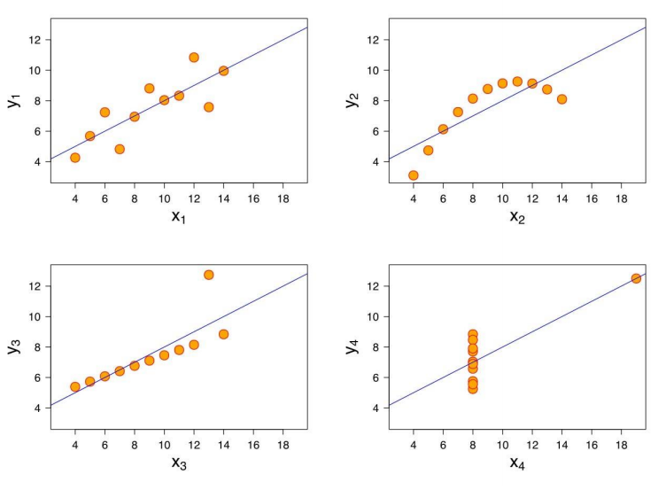
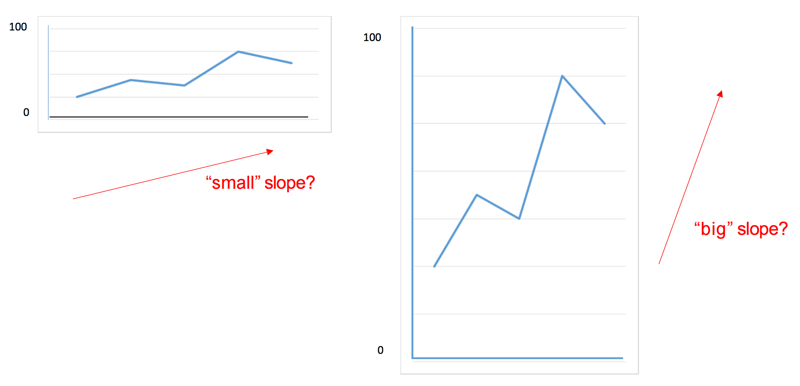
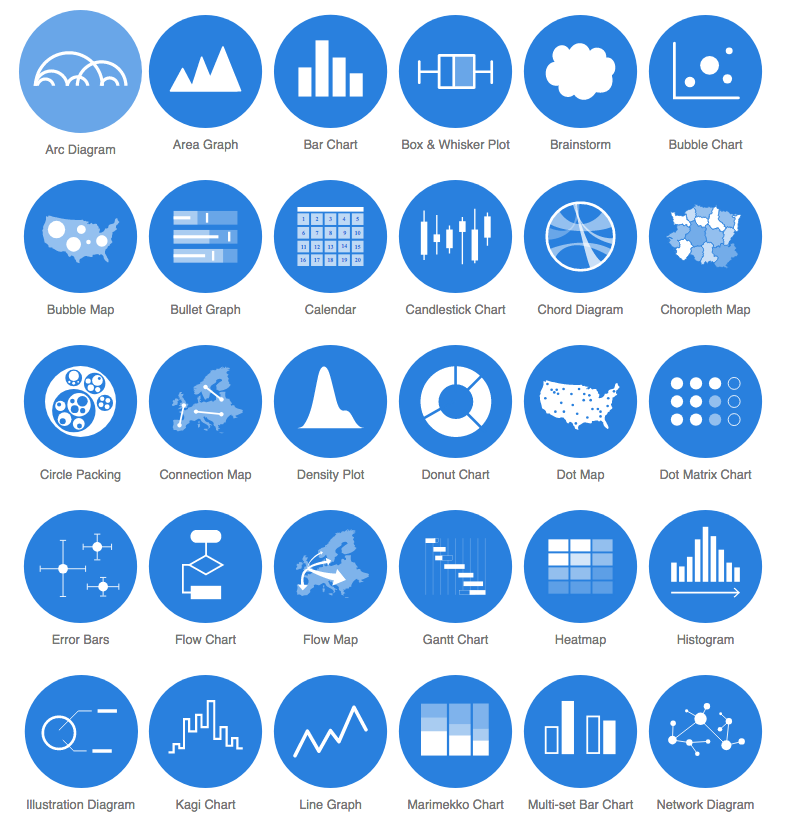

class: title-slide, middle

<style type="text/css">
  .title-slide {
    background-image: url('../assets/img/bg.jpg');
    background-color: #23373B;
    background-size: contain;
    border: 0px;
    background-position: 600px 0;
    line-height: 1;
  }
</style>

<div class="lab-logo"></div>

# Bloc 3

<hr width="65%" align="left" size="0.3" color="orange"></hr>

## La visualisation des données

<hr width="65%" align="left" size="0.3" color="orange" style="margin-bottom:40px;" alt="@Martin Sanchez"></hr>

.instructors[
  **BIO500** - Victor Cameron
]

---

# Bloc 3

- Les notions sont abordés dans les chapitres [10](https://econumuds.github.io/BIO500/figures.html) et [11](https://econumuds.github.io/BIO500/composantes_graphiques.html) du livre.

- Un guide des fonctionalités de R pour la visualisation des données vous est accessible [ici](https://github.com/EcoNumUdS/BIO500/blob/master/references/graphsonr.pdf).

- Vous trouverez du matériel supplémentaire dans le [cours](https://r.qcbs.ca/workshop03/book-fr/index.html) du [CSBQ](https://qcbs.ca/).

---
class: inverse, center, middle

# Pourquoi la visualisation de données est importante ?

<hr width="65%" size="0.3" color="orange" style="margin-top:-20px;"></hr>

---

# La visualisation de données

.center[<blockquote class="twitter-tweet"><p lang="en" dir="ltr" href="https://twitter.com/hashtag/rstats?src=hash&amp;ref_src=twsrc%5Etfw">#rstats</a> <a href="https://twitter.com/hashtag/tidyverse?src=hash&amp;ref_src=twsrc%5Etfw">#tidyverse</a> <a href="https://twitter.com/hashtag/datajournalism?src=hash&amp;ref_src=twsrc%5Etfw">#datajournalism</a> <a href="https://twitter.com/hashtag/dataviz?src=hash&amp;ref_src=twsrc%5Etfw">#dataviz</a> <a href="https://twitter.com/hashtag/Penguins?src=hash&amp;ref_src=twsrc%5Etfw">#Penguins</a> <a href="https://t.co/u2rXkBehxS">pic.twitter.com/u2rXkBehxS</a></p>&mdash; Laura Navarro (@LauraNavarroSol) <a href="https://twitter.com/LauraNavarroSol/status/1289216490307063814?ref_src=twsrc%5Etfw">July 31, 2020</a></blockquote> <script async src="https://platform.twitter.com/widgets.js" charset="utf-8"></script>]

---

# La visualisation de données

Les données sont essentielles pour supporter ses arguments et convaincre un auditoire. Toutefois, les données brutes endorment les auditeurs, ou pire, les font fuir. 

## La visualisation de données permet de présenter les données de manière plus attrayante et plus facile à comprendre.

Voyons comment tirer avantage de la visualisation de données.

---

# La visualisation de données

## Quel est le message ?

.center[
  </img>
]

---

# La visualisation de données

## Et maintenant ?

.center[
  </img>
]

---

# La visualisation de données

## Une courbe de tendance seule ne suffit pas !

.center[
  </img>
]

---

# La visualisation de données

## Les données sont utiles uniquement si elles peuvent être comprises

.center[
  </img>
]

---
class: inverse, center, middle

# Qu'est-ce qui fait une bonne figure ?

<hr width="65%" size="0.3" color="orange" style="margin-top:-20px;"></hr>

---

# Qu'est-ce qui fait une bonne figure ?

## Quelques questions à se poser :

- Quel est le message à communiquer ?
- Qui est le public
- Quelle est la meilleure façon de visualiser le message

Règle générale : **restez simple, utilisez moins d'encre**

---

# Qu'est-ce qui fait une bonne figure ?

## Quel est le message de cette figure ?

.center[
  </img>
]

---

# Qu'est-ce qui fait une bonne figure ?

## Trop d'information !

.center[
  </img>
]

---

# Qu'est-ce qui fait une bonne figure ?

## Comment cette figure pourrait être améliorée ?

<br><br>
.center[
  </img>
]

---

# Qu'est-ce qui fait une bonne figure ?

## Abus de symboles et de couleurs !

<br><br>
.center[
  </img>
]

---

# Qu'est-ce qui fait une bonne figure ?

## Que remarquez-vous en premier ?

.center[
  </img>
]

---

# Qu'est-ce qui fait une bonne figure ?

## Non respect des normes graphiques

.center[
  </img>
]


---
class: inverse, center, middle

# La première étape : bien identifier le message à communiquer

<hr width="65%" size="0.3" color="orange" style="margin-top:-20px;"></hr>

---

# Identifier le message

## Voici un exemple illustrant l'importance de visualiser ses données:

.center[
  </img>
]

---

# Identifier le message

## Voici un exemple illustrant l'importance de visualiser ses données:

.center[
  </img>
]

---

# Communiquer par les graphiques

- Les graphiques sont généralement **plus efficaces à communiquer** un message/un résultat qu'un tableau.

- **Problème:** La représentation graphique peut parfois nous conduire à une **fausse interprétation**. L'idée est de transmettre une idée sans biaiser le lecteur.

---

# Communiquer par les graphiques

.center[
  </img>
]


<!-- - Problème: ratio 8/3 -->

---
class: inverse, center, middle

# Règles et composantes graphiques

<hr width="65%" size="0.3" color="orange" style="margin-top:-20px;"></hr>

---

# Les composantes graphiques

.pull-left[

- Les axes et échelles.
- Le titre de la figure.
- La légende
- Le [type de représentation des données](http://www.datavizcatalogue.com/).
]

.pull-right[
  .center[
    </img>
  ]
]

---

# Les règles graphiques

.pull-left[

- Une figure doit renvoyer un seul message/résultat.
- Chaque élément d'une figure doit **aider à comprendre** ce message.
- **Choisir le bon type de représentation** permet de mettre en valeur plus facilement ce qui doit être illustré.
- **Attention aux normes graphiques**: Choix des couleurs, taille des caractères, épaisseur de la ligne, disposition des marges, cadrage etc.
]

.pull-right[
  .center[
    </img>
  ]
]

---

# Quelques conseils

- Ne pas **JAMAIS** utiliser de diagramme en pointe de tarte

.center[
  </img>
]

---

# Quelques conseils

.pull-left[

- Éviter les figures 3D.
- Limiter le nombre de dimensions (3 ou 4 dimensions max).
- La multi-dimensionnalité peut être gérée en:
  - Modifiant la forme et la la taille des points
  - Ajoutant des couleurs
]

.pull-right[
  .center[
    </img>
  ]
]

---

# Choisir une visualisation

## Présenter une distribution

.center[
  </img>
]

## Montrer une tendance

.center[
  </img>
]

---

# Choisir une visualisation

## Comparer ou contraster

.center[
  </img>
]

## Établir une relation

.center[
  </img>
]

---

# Choisir une visualisation

## Flux

.center[
  </img>
]

---
class: inverse, center, middle

# Deuxième étape : dessiner sa figure à la main

<hr width="65%" size="0.3" color="orange" style="margin-top:-20px;"></hr>

---

# Exercice

## 10 minutes

Dessinez à la main une proposition de figure pour la phénologie des différentes espèces de chauve-souris du Québec.

Message : Les dates de présence des chauve-souris varie selon les espèces.

```{r, echo = FALSE}
pheno <- read.csv("assets/data/phenologie.csv")
head(pheno)
```

---

# Préparer les données adéquatement

- Habituellement un `data.frame` ou `une matrice`
- Une observation par ligne (format long)

---

# Ouvrir une fenêtre graphique

```{r, eval = FALSE}
dev.new(width = 10, height = 7)
```

---

# Fixer certains paramètres

```{r, eval = FALSE}
# Fixer la largeur et la hauteur des marges
par(mar = c(5,6,2,1))

# Fixer le nombre de figures en colonnes et rangées
par(mfrow = c(1,1))
```

---

# Démarrer une figure avec `plot()`

.font90[
```{r, out.width = '55%', dpi=300, fig.align="center"}
arbres <- read.csv2("assets/data/arbres.csv")
densite <- table(arbres[,c(3,5)])
elevation <- as.numeric(row.names(densite))
plot(elevation, densite[,1], axes = TRUE,
      xlab = "Élévation", ylab = "Densité")
```
]

---

# Échelles logarithmiques

```{r, out.width = '55%', dpi=300, fig.align="center", warning=FALSE, message=FALSE}
plot(elevation, densite[,1], axes = TRUE,
      xlab = "Élévation", ylab = "Densité",
      log = "xy")
```

---

# Ajuster les tailles de caractères

## Arguments `cex`, `cex.lab` et `cex.axis`

```{r, out.width = '50%', dpi=300, fig.align="center", warning=FALSE, message=FALSE}
plot(elevation, densite[,1], axes = TRUE,
      xlab = "Élévation", ylab = "Densité",
      cex.lab = 1.5, cex.axis = 1.25, cex = 1.5)
```

---

# Modifier les axes

.font90[
```{r, eval = FALSE}
axis(1, seq(0,1000,100))
axis(2)
```
```{r, echo=FALSE, out.width = '55%', dpi=300, fig.align="center"}
plot(elevation, densite[,1], axes = FALSE,
      xlab = "Élévation", ylab = "Densité",
      cex.lab = 1.5, cex.axis = 1.25, cex = 1.5)
axis(1, seq(0,1000,100))
axis(2)
```
]

---

# Ajouter un titre

```{r, eval = FALSE}
title(main = "Densité au long du gradient d'élévation")
```

```{r, echo=FALSE,out.width = '55%', dpi=300, fig.align="center"}
plot(elevation, densite[,1], axes = FALSE,
      xlab = "Élévation", ylab = "Densité",
      cex.lab = 1.5, cex.axis = 1.25, cex = 1.5)
axis(1, seq(0,1000,100))
axis(2)
title(main = "Densité au long du gradient d'élévation")
```

---

# Superposer des points d'autres données

```{r, eval = FALSE}
points(elevation, densite[,3], pch = 19, cex = 1.5)
```

```{r, echo=FALSE,out.width = '55%', dpi=300, fig.align="center"}
plot(elevation, densite[,1], axes = FALSE,
      xlab = "Élévation", ylab = "Densité",
      cex.lab = 1.5, cex.axis = 1.25, cex = 1.5)
axis(1, seq(0,1000,100))
axis(2)
title(main = "Densité au long du gradient d'élévation")
points(elevation, densite[,3], pch = 19, cex = 1.5)
```

---

# Superposer des lignes

```{r, eval = FALSE}
lines(elevation, densite[,1],lty = 1, lwd = 1.5)
lines(elevation, densite[,3], lty  = 3, lwd = 1.5)
```

```{r, echo=FALSE,out.width = '55%', dpi=300, fig.align="center"}
plot(elevation, densite[,1], axes = FALSE,
      xlab = "Élévation", ylab = "Densité",
      cex.lab = 1.5, cex.axis = 1.25, cex = 1.5)
axis(1, seq(0,1000,100))
axis(2)
title(main = "Densité au long du gradient d'élévation")
points(elevation, densite[,3], pch = 19, cex = 1.5)
lines(elevation, densite[,1], lty = 1, lwd = 1.5)
lines(elevation, densite[,3], lty = 3, lwd = 1.5)
```

---

# Ajouter une ligne de tendance

```{r, eval = FALSE}
model = lm(densite[,3]~elevation)
summary(model)
abline(model, col = "darkred")
```

```{r, echo=FALSE,out.width = '55%', dpi=300, fig.align="center"}
model = lm(densite[,3]~elevation)
summary(model)
```

---

# Ajouter une ligne de tendance

```{r, eval = FALSE}
model = lm(densite[,3]~elevation)
abline(model, col = "darkred")
```

```{r, echo=FALSE,out.width = '55%', dpi=300, fig.align="center"}
plot(elevation, densite[,1], axes = FALSE,
      xlab = "Élévation", ylab = "Densité",
      cex.lab = 1.5, cex.axis = 1.25, cex = 1.5)
axis(1, seq(0,1000,100))
axis(2)
title(main = "Densité au long du gradient d'élévation")
points(elevation, densite[,3], pch = 19, cex = 1.5)
lines(elevation, densite[,1], lty = 1, lwd = 1.5)
lines(elevation, densite[,3], lty = 3, lwd = 1.5)
model = lm(densite[,3]~elevation)
abline(model, col = "darkred")
```


---

# Ajouter une légende

```{r, eval = FALSE}
legend("top", bty = "n", pch = c(19,1), lty = 1,
    legend = c("Érable à sucre", "Sapin baumier"),
    cex = 1.5)
```

```{r, echo=FALSE,out.width = '55%', dpi=300, fig.align="center"}
plot(elevation, densite[,1], axes = FALSE,
      xlab = "Élévation", ylab = "Densité",
      cex.lab = 1.5, cex.axis = 1.25, cex = 1.5)
axis(1, seq(0,1000,100))
axis(2)
title(main = "Densité au long du gradient d'élévation")
points(elevation, densite[,3], pch = 19, cex = 1.5)
lines(elevation, densite[,1], lty = 1, lwd = 1.5)
lines(elevation, densite[,3], lty = 3, lwd = 1.5)
legend("top", bty = "n", pch = c(19,1), lty = 1, legend = c("Érable à sucre", "Sapin baumier"), cex = 1.5)
```

---

# Ajouter du texte

```{r, eval = FALSE}
r2 <- round(summary(model)$r.squared, 2)
text(x = 850, y = 25, paste("R2=",r2),
    cex = 21.5)

```

```{r, echo=FALSE,out.width = '55%', dpi=300, fig.align="center"}
plot(elevation, densite[,1], axes = FALSE,
      xlab = "Élévation", ylab = "Densité",
      cex.lab = 1.5, cex.axis = 1.25, cex = 1.5)
axis(1, seq(0,1000,100))
axis(2)
title(main = "Densité au long du gradient d'élévation")
points(elevation, densite[,3], pch = 19, cex = 1.5)
lines(elevation, densite[,1], lty = 1, lwd = 1.5)
lines(elevation, densite[,3], lty = 3, lwd = 1.5)
legend("top", bty = "n", pch = c(19,1), lty = 1, legend = c("Érable à sucre", "Sapin baumier"), cex = 1.5)
r2 <- round(summary(model)$r.squared, 2)
text(x = 875, y = 25, paste("R2=",r2), cex = 1.5)
```

---

# Pour plus d'information

- `?plot`
- `?par`
- `?axis`
- `?mtext`

---
class: inverse, center, middle

# Créer d'autres types de figure

<hr width="65%" size="0.3" color="orange" style="margin-top:-20px;"></hr>

---

# Diagramme de dispersion (Scatter plot)

.font80[
```{r, eval = FALSE}
arbres  <- read.csv2("assets/data/arbres.csv")
densite <- table(arbres[,c(3,5)])
elevation <- as.numeric(row.names(densite))
plot(elevation, densite[,1], pch = 19,
  xlab = "Elevation", ylab = "Densité")
points(elevation, densite[,3])
```
]

```{r, echo=FALSE, out.width = '52%', dpi=300, fig.align="center"}
arbres  <- read.csv2("assets/data/arbres.csv")
densite <- table(arbres[,c(3,5)])
elevation <- as.numeric(row.names(densite))
plot(elevation, densite[,1], pch = 19,
  xlab = "Elevation", ylab = "Densité")
points(elevation, densite[,3])
```

---

# Diagrammes à bâtons (Bar plot)

```{r, eval = FALSE}
arbres  <- read.csv2("assets/data/arbres.csv")
n_tot <- table(arbres$esp)
barplot(n_tot)
```

```{r, echo=FALSE, out.width = '55%', dpi=300, fig.align="center"}
arbres  <- read.csv2("assets/data/arbres.csv")
n_tot <- table(arbres$esp)
barplot(n_tot)
```

---

# Histogrammes

```{r, eval = FALSE}
hist(densite[,3])
```

```{r, echo=FALSE,out.width = '55%', dpi=300, fig.align="center"}
hist(densite[,3])
```

---

# Représentation 3-D

.font70[
```{r, eval = FALSE}
x <- 10*(1:nrow(volcano))
y <- 10*(1:ncol(volcano))

image(x, y, volcano,
  col = terrain.colors(100), axes = FALSE)

axis(1, at = seq(100, 800, by = 100))
axis(2, at = seq(100, 600, by = 100))
box()

title(main = "Maunga Whau Volcano", font.main = 4)
```
]

```{r, echo=FALSE,out.width = '45%', dpi=300, fig.align="center"}
x <- 10*(1:nrow(volcano))
y <- 10*(1:ncol(volcano))

image(x, y, volcano,
  col = terrain.colors(100), axes = FALSE)

axis(1, at = seq(100, 800, by = 100))
axis(2, at = seq(100, 600, by = 100))
box()

title(main = "Maunga Whau Volcano", font.main = 4)
```

---

# Lignes de contour

.font70[
```{r, eval = FALSE}
x <- 10*(1:nrow(volcano))
y <- 10*(1:ncol(volcano))

image(x, y, volcano,
  col = terrain.colors(100), axes = FALSE)

axis(1, at = seq(100, 800, by = 100))
axis(2, at = seq(100, 600, by = 100))
box()

title(main = "Maunga Whau Volcano", font.main = 4)

contour(x, y, volcano,
  levels = seq(90, 200, by = 5),
  add = TRUE, col = "black")
```
]

```{r, echo=FALSE,out.width = '45%', dpi=300, fig.align="center"}
x <- 10*(1:nrow(volcano))
y <- 10*(1:ncol(volcano))

image(x, y, volcano,
  col = terrain.colors(100), axes = FALSE)

axis(1, at = seq(100, 800, by = 100))
axis(2, at = seq(100, 600, by = 100))
box()

title(main = "Maunga Whau Volcano", font.main = 4)

contour(x, y, volcano,
  levels = seq(90, 200, by = 5),
  add = TRUE, col = "black")
```

---

# Enregistrer une figure


```{r, eval=FALSE}
dev.copy(pdf, file = "test.pdf")
dev.copy(png, file = "test.png")
dev.copy(svg, file = "test.eps")
```

---

# Exercice

## 15 minutes

Scripter votre figure sur R à l'aide des [données](./assets/data/phenologie.csv)

Si elle est trop élaborée, vous pouvez la simplifier pour la rendre plus facile à réaliser

---

# Exercice

.center[
  </img>
]

---

# Exercice

.center[
  </img>
]

---
class: inverse, center, middle

# Troisième étape : être créatif !

<hr width="65%" size="0.3" color="orange" style="margin-top:-20px;"></hr>

---

# Créativité

## Créer d'autres types de figures

[Animation](https://quebio.ca/connect/?lang=fr#9/46.2359/-72.3120)

[Interactivité](https://biodiversite-quebec.ca/fr/inventaires/site/268)

[Infographies](https://www.visualcapitalist.com/history-of-pandemics-deadliest/)

---

# Les cartes

- Les cartes sont un outil de visualisation très puissant.
- Elles permettent de représenter des données géographiques.

Deux types de données géographiques :

- Les données raster
- Les données vectorielles

---

# Les cartes

## Données raster

- Les données raster sont des données qui sont stockées sous forme de grilles régulières.

```{r, eval=TRUE, echo=FALSE}
library(terra)

# Créer une matrice de valeurs aléatoires
mat <- matrix(data = runif(n = 100, min = 1, max = 10), nrow = 10, ncol = 10)

# Créer un objet raster à partir de la matrice
r <- rast(mat)

# Afficher l'objet raster
plot(r)
```

---

# Les cartes

## Données raster


```{r, eval=FALSE, echo=TRUE}
library(terra)

# Créer une matrice de valeurs aléatoires
mat <- matrix(data = runif(n = 100, min = 1, max = 10), nrow = 10, ncol = 10)

# Créer un objet raster à partir de la matrice
r <- rast(mat)

# Afficher l'objet raster
r
```


---

# Les cartes

## Données vectorielles

- Les données vectorielles sont des données qui sont associées à des coordonnées géographiques et qui sont stockées sous forme de points, de lignes ou de polygones.
- Les données vectorielles sont souvent utilisées pour représenter des données discrètes, telles que les limites administratives ou les points d'intérêt.

```{r, eval=TRUE, echo=FALSE}
library(sf)

# Créer des données vectorielles
pts <- st_sfc(st_point(c(1, 1)), st_point(c(1, 2)), st_point(c(2, 2)), st_point(c(2, 1)))
shp <- st_sf(data.frame(id = 1:4), geometry = pts)

# Faire une figure avec les données vectorielles
plot(shp)

## Ajouter la position des points
text(x = 1:4, y = 1:4, labels = c("POINT (1,1)", "POINT (1,2)", "POINT (2,2)", "(2,1)"))
```

---

# Les cartes

## Données vectorielles

```{r, eval=FALSE}
library(sf)

# Créer des données vectorielles
pts <- st_sfc(st_point(c(1, 1)), st_point(c(2, 2)), st_point(c(3, 3)), st_point(c(4, 4)))
shp <- st_sf(data.frame(id = 1:4), geometry = pts)

# Donner un nom aux points
shp$nom <- c("A", "B", "C", "D")

# Sauver les données
st_write(obj = shp, dsn = "assets/points.shp")

# Lire des données vectorielles à partir d'un fichier shapefile
nc <- st_read(dsn = "assets/points.shp")

# Afficher les données vectorielles
nc
```

---

# Cartes interactives avec `leaflet`

ATTENTION !! Cette fonctionnalité requiert plus de ressources et ne fonctionne pas sur tous les appareils.

```{r, eval=FALSE}
library(leaflet)

# Créer une carte interactive
m <- leaflet() |>
  addTiles() |>
  setView(lng = -72.3120, lat = 46.2359, zoom = 9)

# Ajouter un marqueur
m <- m |> addMarkers(lng = -72.3120, lat = 46.2359, popup = "UdS")

m
```

---

# Exercice

## 15 minutes

Gnénérez une carte de couverture du sol pour le mont Bellevue.

Couverture du sol : <https://www.donneesquebec.ca/recherche/dataset/utilisation-du-territoire>

Mont Bellevue : [en format geopackage](./assets/data/mont_bellevue.geojson)

---
class: inverse, center, middle

# Travail de la semaine

<hr width="65%" size="0.3" color="orange" style="margin-top:-20px;"></hr>

---

# Consignes

- Identifier clairement vos questions de recherche
- Compléter votre analyse au moyen de 3 figures et 1 tableau

---

# Attentes pour le travail de session

- Clareté des questions et adéquation des figures et du tableau
- Efficacité de la présentation
- Respect de normes graphiques
- Originalité

---

# Lectures

Est-ce que la science ouverte peut prévenir la fraude ?

.center[
  </img>
]

[Lien vers l'article dans Science](https://www.sciencemag.org/news/2020/01/spider-biologist-denies-suspicions-widespread-data-fraud-his-animal-personality)

[Et un lien vers un blog qui explique comment la triche a été réalisée](https://laskowskilab.faculty.ucdavis.edu/2020/01/29/retractions/)

---
class: inverse, center, middle

# Évaluation formative #2

<hr width="65%" size="0.3" color="orange" style="margin-top:-20px;"></hr>

## Structurer sa base de données

---

## Évaluation formative #2

Chaque équipe doit évaluer les scripts d'une autre équipe

- À compléter pour le **8 avril**
- La personne qui a remis le travail est responsable d'entrer l'évaluation
- Tous les commentaires doivent être formulés comme une question

---
