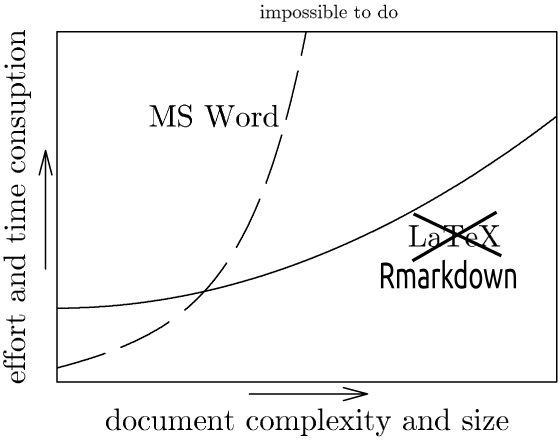
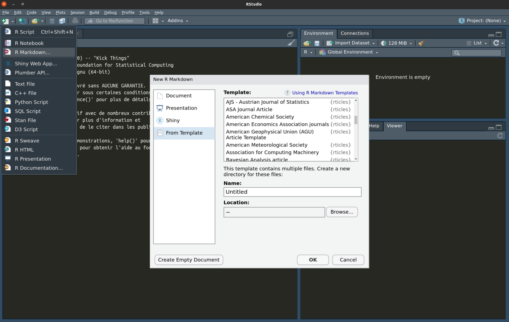
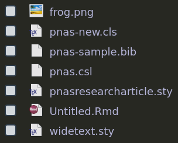
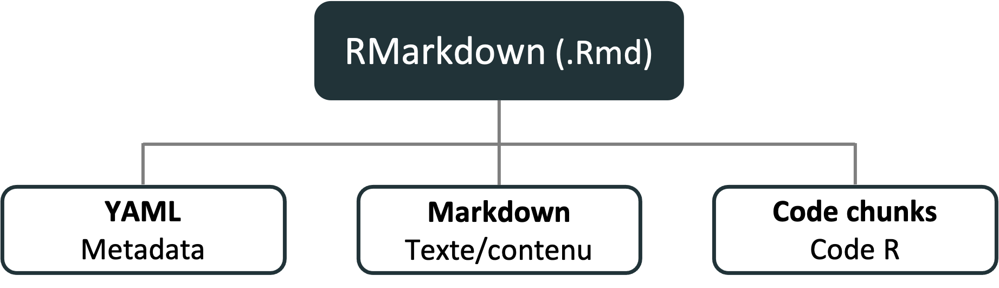
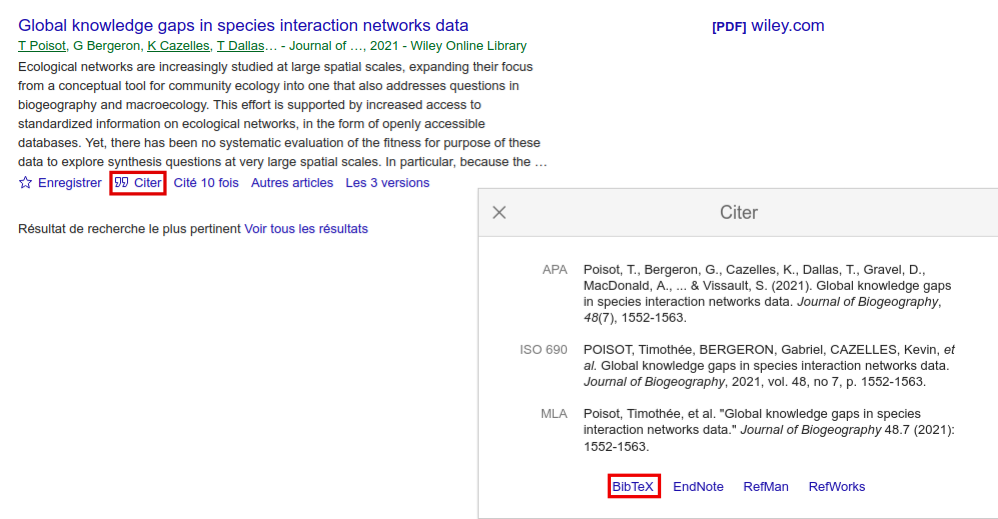

class: title-slide, middle

<style type="text/css">
  .title-slide {
    background-image: url('../assets/img/bg.jpg');
    background-color: #23373B;
    background-size: contain;
    border: 0px;
    background-position: 600px 0;
    line-height: 1;
  }
</style>

<div class="lab-logo"></div>

# Bloc 4

<hr width="65%" align="left" size="0.3" color="orange"></hr>

## Documents dynamiques <br> avec Rmarkdown

<hr width="65%" align="left" size="0.3" color="orange" style="margin-bottom:40px;" alt="@Martin Sanchez"></hr>

.instructors[
  **BIO500** - Victor Cameron
]

---

# Bloc 4

- Ces diapositives sont disponibles en [version web](https://econumuds.github.io/BIO500/bloc4/).


---
class: inverse, center, middle

# Introduction

<hr width="65%" size="0.3" color="orange" style="margin-top:-20px;"></hr>

---

# Bases de Rmarkdown

Voir les [diapositives du cours 2](https://econumuds.github.io/BIO500/bloc2/#33) pour un rappel approfondi

---

# Pourquoi Rmarkdown?

<br>
.center[
  </img>
]

---

# Pourquoi Rmarkdown?

- Documentation (dynamique) des analyses
- Facilite la partage/communication des résultats
- Utilisable sur les systèmes de controle de version (Git)
- Reproductible!
- Dans un environnement avec lequel vous êtes familier.ères

---

# Librairie `rticles`

```r
install.packages("rticles")
```

- Fournit une multitude de gabarits `Rmarkdown` (.Rmd)
- Différents types (articles/rapports)

---

# Via Rstudio

.center[
    
]

---

# Exemple `rticles`

Un exemple complet, dans un répertoire type, est disponible sur [GitHub](https://github.com/EcoNumUdS/BIO500/tree/master/bloc4/exemple_targets)

---

# Exemple `rticles`

.left[
- Template `PNAS Journal Article`
- Principaux fichiers: .Rmd, .bib, .csl
]

.right[

]

---

# Anatomie du gabarit .Rmd

Même anatomie que présentée dans le bloc2, mais générée automatiquement.

<br>
.center[

]


---

# Le YAML - Rappel

- Les métadonnées et les options du document sont définies ici
- La syntaxe est `cle: value`
- Commence et se termine entre trois tirets `---`
- Toujours au début du document

---
# Le YAML

.font70[
```r
---
title: "Exemple de rapport `Rmarkdown` en sortie d'un pipeline `targets`"

# Use letters for affiliations, numbers to show equal authorship (if applicable) and to indicate the corresponding author
author:
  - name: "Benjamin Mercier"
    affiliation: "a"

address:
  - code: "a"
    address: "Université de Sherbrooke, Départment de biologie, 2500 Boulevard de l'Université, Sherbrooke, Québec, J1K 2R1"

abstract: |
  Eurytus auris. Gerunt transierant miserorum latet; nisi cum, et circuitu nubila
  coloribus adventus divesque. Loca partibus breve et unum maior stellis inpia et
  luporum. 

keywords:
  - Mot-clé
  - Mot-clé
  - Optionel
  - Optionel
  - Optionel

## must be one of: pnasresearcharticle (usual two-column layout), pnasmathematics (one column layout), or pnasinvited (invited submissions only)
pnas_type: pnasresearcharticle

bibliography: pnas-sample.bib
csl: pnas.csl

## change to true to add optional line numbering
lineno: false

output: rticles::pnas_article
---
```
]

---

# Le YAML

D'un gabarit à l'autre, les champs du YAML vont changer.

Ce qui fait que chaque gabarit sera différent:
- Le champ `csl`
- Le champ `output`

---

# Gabarits "génériques"

**Deux colonnes:**<br>
Le gabarit 'PNAS Journal Article' est pratique.
<br><br>
**Une colonne:**<br>
Le gabarit 'Elsevier Journal Article' est pratique.
(Vous pourriez essayer le gabarit PNAS Journal Article avec la clé `pnas_type:` = `pnasmathematics`)

---

# Accéder aux données

Lire les données produites dans les targets précédentes avec `tar_read` et `tar_load`

Portion du fichier `_targets.R`
```r
list(
  tar_target(name = data,            command = read.csv("./data.csv")),
  tar_target(name = data_prep,       command = prep_donnees(data)),
  tar_target(name = resultat_modele, command = mon_modele(data)),
  tar_render(name = rapport,         path = "rapport/rapport.Rmd")
)
```

Présenter une figure à partir des données produites au target `resultat_modele` Dans le rapport `RMarkdown`

```r
data_2_plot <- tar_read(resultat_modele)
plot(data_2_plot)
```

---

# Présenter une figure

Structure du bloc de code : 
- `fig.cap` : Légende
- `\\label{fig:plot1}` : Label pour référencer dans le texte
- `fig.width` : Commandes pour ajuster les dimensions

```r
'''{r figs, fig.cap="\\label{fig:plot1}Légende figure.", fig.width=7, fig.height=6}
# tar_read() permet de lire l'objet créé par la target
resultat_modele <- tar_read(resultat_modele)
data <- tar_read(data)

# Créer la figure
plot(data$X, data$Y)
abline(resultat_modele)
'''
```

---

# Insertion de figures

Insertion de figures préalablement générées via un script R.

Structure: 
- Légende
- Label pour référencer dans le texte
- Chemin pour accéder à la figure dans l'ordinateur
- Commandes pour ajuster les dimensions

.font90[
```r
{width=50% height=40%}
```
]

Attention ! De cette façon, le rapport ne se met pas à jour s'il y a un changement dans la figure.

---

# Référencer une figure

Utiliser la même balise que lorsque la figure a été créée et que son `\label` a été généré:

```r
Je fais référence à la Figure \ref{fig:plot1}.
```
.center[&darr;]

```r
Je fais référence à la Figure 1
```

---

# Bibliographie et références

Les références se font à l'aide du fichier .bib, lequel contient les références.

Le fichier .bib est spécifié dans le YAML du document .Rmd à la clé:

`bibliography: pnas-sample.bib`

.font70[
```bib
@inproceedings{belkin2002using,
  title={Using manifold stucture for partially labeled classification},
  author={Belkin, Mikhail and Niyogi, Partha},
  booktitle={Advances in neural information processing systems},
  pages={929--936},
  year={2002}
}

@article{berard1994embedding,
  title={Embedding Riemannian manifolds by their heat kernel},
  author={B{\'e}rard, Pierre and Besson, G{\'e}rard and Gallot, Sylvain},
  journal={Geometric \& Functional Analysis GAFA},
  volume={4},
  number={4},
  pages={373--398},
  year={1994},
  publisher={Springer}
}
```
]

---

# Bibliographie et références

Pour utiliser une référence dans le texte il suffit d'utiliser sa clé unique:

```r
Je fais référence à la première entrée du fichier.bib @belkin2002using.
```

Pour référencer plusieurs références:

```r
Je fais référence à plusieurs référence [@belkin2002using;@berard1994embedding]
```

---

# Générer le fichier .bib

**Optimal et rapide**:<br>
- Logiciel de gestion des références comme Zotero, Mendeley, EndNote etc.
- Générer le fichier .bib selon votre liste d'articles

**Alternative**:<br>
- Générer le fichier manuellement via un fichier `plain text`
- Copier-coller les références bib de chacun des articles via par exemple GoogleScholar

---

# Fichier .bib manuellement

.center[

]

---

class: inverse, center, middle

# Exemple target et Rmarkdown

<hr width="65%" size="0.3" color="orange" style="margin-top:-20px;"></hr>

---

# `targets` + rapport `rmarkdown`

Structure du dossier principal :

.left[
```

├── data                            # Dossier de données
│   ├── data.txt                    # Jeu de données 1
│   ├── data_2.txt                  # Jeu de données 2


├── R                               # Dossier de scripts R
│   ├── prep_donnees.R              # Fonction utilisér comme targets
│   ├── analyse.R                   # Fonction utilisée comme targets
│   ├── figure.R                    # Fonction utilisée comme targets


├── resultats                       # Contient les résultats 
│   ├── resultats_modele.csv        # Résultats

├── rapport                         # Contient le rapport et fichiers associés
│   ├── rapport.Rmd                 # Rapport
│   ├── pnas-sample.bib             # Fichier de bibliographie

├── _targets.R                      # Fichier targets qui définie le pipeline


```
]

---

# Fichier _targets.R

.font80[
```r
# Version bonnifiée du bloc 2
library(targets)
library(tarchetypes)
source("R/analyse.R")
tar_option_set(packages = c("rmarkdown","knitr"))
list(
  tar_target(
    name = path, # Cible
    command = "./data", # Dossier contenant les fichiers de données
    format = "file" # Format de la cible
  ),
  tar_target(
    name = file_paths, # Cible
    command = list.files(path, full.names = TRUE) # Liste les fichiers dans le dossier
  ),
  tar_target(
    name = data, # Cible pour le modèle 
    command = prep_donnees(file_paths) # Jointure des jeux de données
  ),
  tar_target(
    name = resultat_modele, # Cible pour le modèle 
    command = mon_modele(data) # Exécution de l'analyse
  ),
  tar_render(
    name = rapport, # Cible du rapport
    path = "rapport/rapport.Rmd" # Le path du rapport à renderiser
  )
)
```
]

---

# Suivre un ensemble de fichiers de données

1. Une target pour suivre le dossier contenant les données
.font80[
```r
tar_target(
  name = path, # Cible
  command = "./data", # Dossier contenant les fichiers de données
  format = "file" # Format de la cible
)
```
]
2. Une target qui liste tous les fichiers du dossier
.font80[
```r
tar_target(
    name = file_paths, # Cible
    command = list.files(path, full.names = TRUE) # Liste les fichiers dans le dossier
  )
```
]
3. Une target qui charge les données et les assemblent
.font80[
```r
tar_target(
  name = data, # Cible pour le modèle 
  command = prep_donnees(file_paths) # Jointure des jeux de données
)
```
]

---

# Compilation du Rmarkdown

La librarie `tarchetypes` simplifie la compilation du fichier .Rmd.<br>
Même syntaxe que les autres target `tar_target()`

```r
install.packages("tarchetypes")
```

```r
tar_render(cible, "path/to/file.Rmd")
```

<br>

L'instruction de compilation du fichier .Rmd sera toujours la dernière opération.

---
