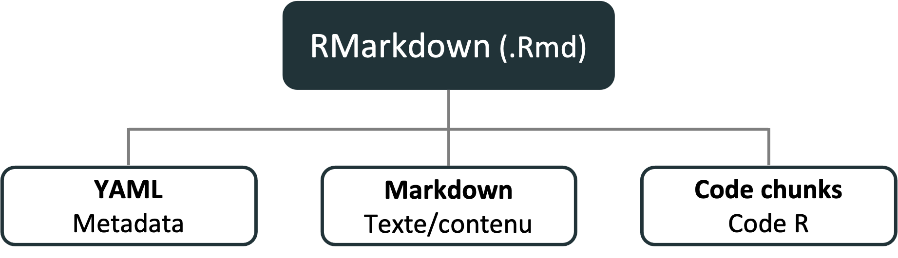

---
class: inverse, center, middle

# Le cahier de laboratoire RMarkdown

<hr width="65%" size="0.3" color="orange" style="margin-top:-20px;"></hr>

---

# C'est quoi le RMarkdown

.center[

]

- Un outil pour intégrer du texte, du code et des résultats
- Un format de fichier (`.Rmd`) pour créer des documents dynamiques avec R
- Un paquet R

---
# Pourquoi RMarkdown?

- Documentation (dynamique) des analyses
- Facilite la partage/communication des résultats
- Utilisable sur les systèmes de controle de version (Git)
- Reproductible!

---
# L'anatomie du RMarkdown

<br>
.center[

]

---
# L'anatomie du RMarkdown

.center[

]

---
# L'anatomie du RMarkdown

.center[

]

<span style="color:rgb(101, 136, 71);">Metadata</span> + <span style="color:rgb(255, 199, 65);">Texte</span> + <span style="color:rgb(100, 164, 213);">Code chunk</span> = RMarkdown

---
# Exercice

1. Ouvrir Rstudio
2. Installer le paquet RMarkdown si necessaire (`install.packages('Rmarkdown')`)
3. Creer nouveau document RMarkdown (bouton vert en haut à gauche)
4. Identifier le YAML, texte, et code chunk du document `.Rmd`
5. Compiler le document en html (bouton 🧶 `knit`)

---
# Le YAML (metadata)

- les métadonnées et les options du document sont définies ici
- La syntaxe est `cle: value`
- Commence et se termine entre trois tirets `---`
- Toujours au début du document

```r
---
title: "Mon titre"
author: "Willian Vieira"
date: "10/03/2021"
output: html_document
    toc: true
---
```

Les options d'output dépendent de la sortie.

Voir `?html_document`, `?pdf_document`, `?word_document`


---
# Markdown (contenu)

Plein texte avec une syntaxe minimaliste pour la mise en forme du texte

.font90[
.pull-left[
```md
# Titre 1
## Titre 2
### Titre 3

Ce mot est en *italique* et celui-ci
en **gras**.
Ici nous avons du `code`.
```
<br><br><br><br><br><br>
]


.pull-right[

# Titre 1
## Titre 2
### Titre 3

Ce mot est en *italique* et celui-ci
en **gras**.
Ici nous avons du `code`.
]
]

---
# Markdown - listes

.font90[
.pull-left[
```md
Le texte qui suit est une liste :
- Premier item
- Second item
- Troisième item

Pour faire une énumération : 
1. Item 1
2. Item 2
3. Item 3
```
]

.pull-right[
Le texte qui suit est une liste :
- Premier item
- Second item
- Troisième item

Pour faire une énumération : 
1. Item 1
2. Item 2
3. Item 3
]
]

---
# Markdown - images

```md

```


---
# Markdown - liens

```md
Voici le [lien](https://github.com/EcoNumUdS/BIO500) pour le GitHub du cours BIO500.
```

Voici le [lien](https://github.com/EcoNumUdS/BIO500) pour le GitHub du cours BIO500.


---
# Markdown - tables

.font90[
.pull-left[
```md
| Time          | Session | Topic    |
|:--------------|:-------:|---------:|
| _left_        | _center_| _right_  |
| 01:00 - 01:50 | 1       | Anatomy  |
| 01:50 - 02:00 |         | *Break*  |
| 02:00 - 02:45 | 2       | Tables   |
| 02:45 - 03:00 |         | *Break*  |
```
]

.pull-right[

| Time          | Session | Topic    |
|:--------------|:-------:|---------:|
| _left_        | _center_| _right_  |
| 01:00 - 01:50 | 1       | Anatomy  |
| 01:50 - 02:00 |         | *Break*  |
| 02:00 - 02:45 | 2       | Tables   |
| 02:45 - 03:00 |         | *Break*  |

]]

<br><br><br><br><br><br><br><br><br>
- Le `:` spécifie l'alignement
- Possibilité d'utiliser des packages R spécialisés pour imprimer des tableaux automatiquement à partir de R (nous les verrons au dernier cours)


---
# Code chunk (script R)

L'utilité de Rmarkdown est de combiner du texte, du code et des images dans le même document

### Code dans le document Rmarkdown :

.font80[
````md
Le code R doit être à l'intérieur d'un bloc de code (*code chunk*). Par example:

```{r}`r ''`
data(iris)
iris_setosa <- subset(iris, Species == 'setosa')
head(iris_setosa)
```
````
]

---
# Code chunk (script R)

### Sortie Rmarkdown une fois compilé :

.font80[

```{r}
data(iris)
iris_setosa <- subset(iris, Species == 'setosa')
head(iris_setosa)
```
]

---
# Code chunk (script R)

.pull-left[
### :

.font80[
````md
```{r}`r ''`
data(iris)
plot(iris$Sepal.Length, iris$Sepal.Width)
```
````
]]

.pull-right[
### Sortie:

.font80[
```{r}
data(iris)
plot(iris$Sepal.Length, iris$Sepal.Width)
```
]]

---
# Inclure du code directement dans un texte pour imprimer des valeurs

### Code Rmarkdown:

```{r,eval=FALSE}
le jeu de données *iris* comprend `r length(unique(iris$Species))` espèces
avec un total de `r nrow(iris)` fleurs mesurées.
```

### Sortie:

le jeu de données *iris* comprend `r length(unique(iris$Species))` espèces avec un total de `r nrow(iris)` fleurs mesurées.

---
# Configuration des code chunk

.font80[
Nommer le bloc de code (utile pour débogage)
````md
```{r plot_iris}`r ''`
plot(iris$Sepal.Length, iris$Sepal.Width)
```
````
`echo=FALSE`:  afficher les résultats, mais pas le code
````md
```{r plot_iris, echo=FALSE}`r ''`
plot(iris$Sepal.Length, iris$Sepal.Width)
```
````
`eval=FALSE`:  afficher le code, mais le code n'est pas évalué
````md
```{r plot_iris, eval=FALSE}`r ''`
plot(iris$Sepal.Length, iris$Sepal.Width)
```
````
`include=FALSE`: évaluer le code, mais rien n'est affiché
````md
```{r plot_iris, include=FALSE}`r ''`
plot(iris$Sepal.Length, iris$Sepal.Width)
```
````
]

---
# Ajuster la taille de la figure

````md
```{r plot_iris, fig.height = 3, fig.width = 5, fig.align = "center"}`r ''`
plot(iris$Sepal.Length, iris$Sepal.Width)
```
````

```{r plot_iris, echo=FALSE, fig.height = 4, fig.width = 6, fig.align = "center"}
plot(iris$Sepal.Length, iris$Sepal.Width)
```

---
# Configuration des code chunk

.font70[
```{r}
str(knitr::opts_chunk$get())
```
]


---
# L'univers RMarkdown


.font60[*Source: Ulrik Lyngs*]

---
# Autres ressources disponibles en ligne :

- R Markdown: The Definitive Guide [https://bookdown.org/yihui/rmarkdown/](https://bookdown.org/yihui/rmarkdown/)
- RMarkdown gallery [https://rmarkdown.rstudio.com/gallery.html](https://rmarkdown.rstudio.com/gallery.html)
- ResearchDown [https://insileco.github.io/ResearchDown/](https://insileco.github.io/ResearchDown/)

---
class: inverse, center, middle

# Travail pour la semaine

<hr width="65%" size="0.3" color="orange" style="margin-top:-20px;"></hr>

---
