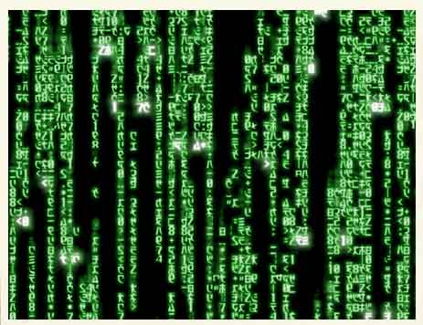

# Séance 2

- Ces diapositives sont disponibles en [version web](https://econumuds.github.io/BIO500/cours2/) et en [PDF](./assets/pdf/S2-BIO500.pdf).
- L'ensemble du matériel de cours est disponible sur la page du portail [moodle](https://www.usherbrooke.ca/moodle2-cours/course/view.php?id=12189).


--- .transition

# Les données en biologie

---

# La collecte de données

<div style='text-align:center;'>
</img>
</div>

--- &twocol

# Le constat

*** =left

Trop souvent en écologie, les données sont représentées et entreposées dans un format proche des analyses que l'on veut réaliser.

Par exemple, on utilise une matrice $site \times espèces$ pour analyser la structure des communautées.

La question ne devrait jamais conditionner notre facon de stocker l'information sur un système écologique.

*** =right

<div style='text-align:center;'>
</img>
</div>


---

# La collecte de données en biologie

## D'abord, qu'est ce qu'une donnée en écologie?


<!-- Présenter qu'est qu'une données biologiques, comme elle est représentée -->
<!-- Qu'est ce qui est représenté en ligne versus en colonne -->


<div style='text-align:center;'>
</img>
</div>


---

# La collecte de données en biologie

## Le problème de multidimensionnalité

<div style='text-align:center;'>
</img>
</div>


---

# La collecte de données en biologie

## Le problème de multidimensionnalité

<div style='text-align:center;'>
</img>
</div>

**Note:** Pour la prise de données de facteurs environnementaux (abiotiques), on retrouverait une forme de type 3n.

---

# La collecte de données en biologie

## **En biologie**, on classifie les données selon 4 dimensions/classes d'information:

1. Biotique/abiotique
2. Taxonomique
3. Temporelle
4. Spatial

Au sein de ce cours, nous nous attarderons à la façon de structurer ses données. Les spécificités propres à chacune de ces dimensions seront présentées. D'abord le format des données, puis les types de données.

--- .transition

#  Le format des données

--- &twocol

#  Le format des données

*** =right

## Format long

```{r echo=FALSE}
library("knitr")
ids <- c("567-1","567-2","567-3","598","876")
esp <- c("acsa","acsa","acsa","piru","abba")
annees <- c(2010,2010,2010,2011,2014)
dhp_mm <- c(460,100,120,380,160)
df <- data.frame(ID=ids,esp=esp,annees=annees,dhp_mm=dhp_mm)
kable(df,format="markdown")
```

- Nom de colonnes court, sans accent, sans espace et explicite.
- Si possible, attachez les unités au nom de la colonne.

*** =left

## Format large

```{r echo=FALSE}
library(reshape2)
df2 <- dcast(ids + esp ~ annees, data=df, value.var="dhp_mm")
names(df2)[1] <- "ID"
kable(df2,format="markdown")
```

- Privilégier le format long
- Une ligne = une observation

--- &twocol

#  Le format des données: tableaux

## Garder l'approche un tableau doit contenir un type d'information:

*** =left

```{r echo=FALSE}
ID_plot <- c("A","A","A","B","B")
ids <- c(567,567,567,598,876)
sub_ids <- c(1,2,3,NA,NA)
df <- data.frame(ID_plot=ID_plot,ID_arbre=ids,ID_multi=sub_ids,esp=esp,annees=annees,dhp_mm=dhp_mm)
kable(df,format="markdown")
```

*** =right

```{r echo=FALSE, warnings=FALSE}
clim <- data.frame(ID_plot=c('A','B','B'),annees=c(2010,2011,2014),pp_tot_mm=c(880,560,900),temp_max_deg=c(24,26,28))
kable(melt(clim,id=c("ID_plot",'annees'),value.name="valeur"),format="markdown")
```

- Si l'on veut ajouter des données sur le climat, on ouvrira un nouveau tableau.

--- &twocol

#  Le format des données: colonnes

## Ne pas agréger l'information dans une seule colonne

*** =left

```{r echo=FALSE}
ids <- c("567-1","567-2","567-3","598","876")
esp <- c("acsa","acsa","acsa","piru","abba")
annees <- c(2010,2010,2010,2011,2014)
dhp_mm <- c(460,100,120,380,160)
df5 <- data.frame(ID_arbre=ids,esp=esp,annees=annees,dhp_mm=dhp_mm)
kable(df5,format="markdown")
```


- Une colonne = une information

*** =right

```{r echo=FALSE}
ids <- c("567","567","567","598","876")
sub_ids <- c("1","2","3",NA,NA)
df <- data.frame(ID_arbre=ids,ID_multi=sub_ids,esp=esp,annees=annees,dhp_mm=dhp_mm)
kable(df,format="markdown")
```

---

#  Le format des données: colonnes

## <span style="color:rgb(194, 0, 0);"> Important:</span> votre fichier de données brutes (destiné au stockage à long terme) ne doit pas contenir de champ calculé (c.a.d. une nouvelle colonne avec une moyenne, etc..)


--- .transition

#  Les types de données

---

# Les données biotiques et abiotiques

## **En informatique**, on distingue plusieurs types de données:

| Appelation                | Type                 | Valeurs     | Taille           |
|---------------------------|----------------------|-------------|------------------|
| `BOLEAN`                  | Boléen               | vrai/faux   | 1 octet          |
| `INTEGER`                 | Entiers              | -998, 123   | 1 à 4 octets     |
| `DOUBLE`, `FLOAT`         | Nombres réels        | 9.98, -4.34 | 4 à 8 octets     |
| `CHAR`,`VARCHAR`          | Chaine de caractères | lapin       | n x 1 à 8 octets |
| `TIMESTAMP`,`DATE`,`TIME` | Dates et heures      | 1998-02-16  | 4 à 8 octets     |


- Ce sont ces types qui seront utilisés pour entreposer nos données biotiques et abiotiques.
- Le choix d'un type approprié permet de réduire la taille du fichier de données.

---

# Les données temporelles

La plupart des languages/programmes disposent d'un type `TIMESTAMP`, `DATE` et `TIME` pour représenter une donnée temporelle.

On utilisera préférablement la norme [ISO8601](https://fr.wikipedia.org/wiki/ISO_8601) pour représenter ces données.

- `TIMESTAMP` (Heure et temps): On utilisera la notation `YYYY-MM-ddThh:mm:ss`. *ex. `1977-04-22T01:00:00-05:00`*
- `DATE`: On utilisera la notation `YYYY-MM-dd`. *ex. 1997-04-22*
- `TIME`: On utilisera la notation `HH:mm:ss` dans un systéme de 24 heures. *ex. 01:30:00.*

---

# Les données temporelles

 Gardez à l'esprit que vos données pourraient être réutilisées à travers le Monde. Les dates ne sont pas représentées de la même manière que l'on soit en Amérique du Nord ou en Europe. **Il est donc important de normaliser la saisie de ce type d'information.**

--- &twocol

# Les données temporelles

Une autre représentation de la date du jour peut-être basé sur le calendrier Julien.

*** =left

<div style='text-align:center;'>
</img>
</div>

*** =right

- **Inconvénient:** Le jour julien doit toujours être accompagné de l'année (YYYY).
- **Avantage:** simplifie les analyses temporelles intra-annuelles.

--- &twocol

# Les données taxonomiques

*Un exemple avec l'érable à sucre*

*** =left

**Selon vous quelle option est la meilleure?**

```{r echo=FALSE}
way <- c("1. Code spécifique à l'étude","2. Code du ministère","3. Genre et espèce","4. Nom vernaculaire","5. Numéro Taxonomique (TSN - ITIS)")
ex <- c("ACSA","ERS","Acer saccharum","Érable à sucre","28731")
df <- data.frame(Option=way,Exemple=ex)
kable(df,format="markdown")
```

*** =right

<div style='text-align:center;'>
</img>
</div>


--- &twocol

# Les données taxonomiques

*Un exemple avec l'érable à sucre*

*** =left

```{r echo=FALSE}
kable(df,format="markdown")
```

*** =right

>- **Option 1 et 2:** Doit être associé à des métadonnées. Risque de perte du fichier attaché.

>- **Option 3:** Le genre et l'espèce peuvent changer à travers le temps.

>- **Option 4:** Le nom vernaculaire des espèces est le pire choix. Le nom vernaculaire est propre à un pays, à une région géographique, à une culture/dialecte.


--- &twocol

# Les données taxonomiques

*Un exemple avec l'érable à sucre*

*** =left

```{r echo=FALSE}
library("knitr")
way <- c("1. Code spécifique à l'étude","2. Code du ministère","3. Genre et espèce","4. Nom vernaculaire","5. Numéro Taxonomique (TSN - ITIS)")
ex <- c("ACSA","ERS","Acer saccharum","Érable à sucre","28731")
df <- data.frame(Option=way,Exemple=ex)
kable(df,format="markdown")
```

*** =right


>- **Option 5:** Cette option couplée à l'option 3, est le meilleur choix.


---

# Les données taxonomiques

## On privilégie généralement l'utilisation de code espèce standardisée:

1. ITIS
2. VASCAN (Plantes vasculaires du Canada)
3. NCBI

**Avantage:** Chacune de ces institutions/infrastructures nous permettent de valider et retirer l'ensemble de la classification taxonomique d'une espèce à partir de son code. Même si l'identifiant change (nouvelle classification), nous serons en mesure de trouver le nouvel identifiant taxonomique à partir de l'ancien.

**Exemple:** [https://www.itis.gov/servlet/SingleRpt/SingleRpt?search_topic=TSN&search_value=28731#null](https://www.itis.gov/servlet/SingleRpt/SingleRpt?search_topic=TSN&search_value=28731#null)


---

# Les données spatiales

## Il existe plus de [65 familles de projections géographiques](https://en.wikipedia.org/wiki/List_of_map_projections) pour représenter des coordonnées sur la planète, en voici 3 des plus connues:

<div style='text-align:center;'>
</img>
</div>

- Il est important de choisir un bon système de projection pour minimiser la déformation spatiale (surtout à nos latitudes)

>- À nos latitudes, on privilégiera l'utilisation d'une projection conique. Les ministères du Québec conseillent généralement l'utilisation d'une [projection conique conforme de Lambert](https://fr.wikipedia.org/wiki/Projection_conique_conforme_de_Lambert).

---

# Les données spatiales

- **Ce qu'il est important de savoir:** des coordonnées spatiales sans système de projection ne veulent strictement rien dire.
- Ainsi, lorsque l'on entrepose des données spatiales, trois colonnes doivent être représentées:
  - La coordonnée en X
  - La coordonnée en Y
  - La projection écrite en texte (voir votre GPS), ou préférablement l'identifiant unique de la projection.

---

# Les données spatiales

## Deux bases de données connues permettent de fournir des identifiants uniques:

1. `EPSG`: *European Petroleum Survey Group.*
2. `SRID`: *Spatial reference system*.

Ces deux identifiants sont généralement identiques et peuvent être trouvés à cette adresse: [http://spatialreference.org/](http://spatialreference.org/)

**Exemple:** [http://spatialreference.org/ref/epsg/2138/](http://spatialreference.org/ref/epsg/2138/)


---

#  L'absence de données

## On peut représenter l'absence de données de plusieurs façons:

- Laisser la cellule vide (`NULL`)
- Mettre un `NA` (*Not Available*)
- Mettre un 0
- Mettre `-9999` dans une colonne numérique

## Selon vous, quelle est l'action la plus appropriée ?

---

#  Le format des données

## On peut représenter l'absence de données de plusieurs façons:

- Laisser la cellule vide: montre que l'information n'a pas été saisie (un oublie)

>- Mettre un `NA` (*Not Available*): Montre que l'information est réellement indisponible (car le NA est saisie par un humain).

>- <span style="text-decoration: line-through;"> Mettre un 0 </span>: **JAMAIS** (empêche la distinction entre un vrai d'un faux 0, influence la moyenne)

>- Mettre `-9999` dans une colonne numérique: Ce choix peut être utilisé seulement pour les jeux de données très importants (centaine de Megas-octet), et doit être référencé dans les métadonnées.


---

# Choisir le bon type et format de données

Si l'on ne choisit pas le type de données approprié, cela aura diverses conséquences:

- Des problèmes de performance (ex. : il est plus rapide de faire une recherche sur un nombre que sur une chaîne de caractères)
- Un comportement contraire à celui attendu (ex. : trier sur un nombre stocké comme tel, ou sur un nombre stocké comme une chaîne de caractères ne donnera pas le même résultat)
- L'impossibilité d'utiliser des fonctionnalités propres à un type de données (ex. : stocker une date comme une chaîne de caractères vous prive des nombreuses fonctions temporelles disponibles).

<!-- Point supplémentaire pour les avancées: - Un gaspillage de mémoire (ex. : si vous stockez de toutes petites données dans une colonne faite pour stocker de grosses quantités de données) -->

---

# Finalement...

Pourquoi prendre soins de ces données ?

Pour en savoir davantage:

- [Broman KW, Kara W (2017) Data organization in spreadsheets. The American Statistician.](http://www.tandfonline.com/doi/abs/10.1080/00031305.2017.1375989)
- [Hart EM, Barmby P, LeBauer D, Michonneau F, Mount S, Mulrooney P, et al. (2016) Ten Simple Rules for Digital Data Storage. PLoS Comput Biol](http://journals.plos.org/ploscompbiol/article?id=10.1371/journal.pcbi.1005097)

--- .transition

# Entreposer et archiver ses données écologiques


<!-- TRANSTION vers SQL

# La collecte de données

En biologie, la collecte de données se résume à un hypercube.

Comme nous le verrons plus tard cette multidimensionnalité complique notre tâche, car il est difficile de la représenter dans un tableau excel (n-2). -->


---

# Où sommes-nous?

<div style='text-align:center;'>
</img>
</div>

---

# Pourquoi bien entreposer ces données?

<div style='text-align:center;'>
<figure>
  </img>
</figure>
</div>

[Vines et al., 2013](https://www.nature.com/news/scientists-losing-data-at-a-rapid-rate-1.14416)

---

# Les entrepôts existants

1. Les fichiers textes comme les CSV, TSV (Format libre et ouvert)
2. Les tableurs comme MS Excel (Logiciel propriétaire), Libre Office Calc. (Logiciel libre)
3. Les fichiers hierarchiques/structurés HDF, NetCDF (Format libre et ouvert)
4. Les bases de données relationnelles

---

# Le Tesseract de la biologie

<div style='text-align:center;'>
</img>
</div>

- Il est difficile de stocker les données écologiques dans un tableau excel (n-2) lorsque les données écologiques ont (n-4).
- Conduit à une redondance dans l'information (par exemple. repeter les coordonnées de l'emplacement du site lorsqu'il est mesuré plusieurs fois).

---

# Les bases de données (BDs) à la rescousse

<div style='text-align:center;'>
  </img>
</div>

- Les BDs permettent de redimensionner ce problème (plusieurs tableaux de n-2 avec des relations) grâce au modèle d'entités-relations.
- Chaque table correspond à une dimension. Les tables sont liées entre elles par des relations. Cette structure est appelée [schéma en étoile](https://en.wikipedia.org/wiki/Star_schema).

---

# Avantages des bases de données

- **Maintenir l'intégrité entre les enregistrements de nos tableaux**. Une observation ne peut être faite sur un site qui n'existe pas.
- **Normaliser et contrôler la qualité des données**. Chaque colonne est un type précis de données. Des contraintes peuvent être appliquées sur chaque colonne.
- **Éviter les redondances dans le stockage de l'information** (obtenir une [forme normale](https://fr.wikipedia.org/wiki/Forme_normale_(bases_de_donn%C3%A9es_relationnelles)), voir la section [Format de donnée du cours 2](https://econumuds.github.io/BIO500/cours2/#14).

---

# Avantages des bases de données

## Autres avantages indéniables:

- Obtenir un gain de temps et de performance.
- Séparer les données brutes des données destinées aux analyses.
- Rendre flexible la préparation des données pour les analyses.
- Pemettre le travail simultané de plusieurs utilisateurs grâce à l'approche client-serveur.
- Déclencher des procédures de sauvegardes.
- Suivre les modifications/ajouts à la BD (journal de transactions).

--- &twocolw w1:40% w2:60%

# L'approche client-serveur


*** =left

<div style='text-align:center;'>
  </img>
</div>


*** =right

- Le **serveur** est un ordinateur contenant la base de données.
- Si le serveur est votre ordinateur, on se connectera alors **localement** (environnement de développement).
- Si le serveur est physiquement ailleurs (mais accessible via le réseau), on parlera de **serveur distant** (environnement de production).


--- &twocolw w1:40% w2:60%

# L'approche client-serveur


*** =left

<div style='text-align:center;'>
  </img>
</div>


*** =right

- Le **client** peut être un logiciel, tout comme un langage installé sur votre ordinateur.
- On se sert de ce langage ou logiciel pour interagir avec le serveur de base de données présent localement ou à distance.
- On peut donc avoir plusieurs **clients** sur un même ordinateur.

--- &twocolw w1:40% w2:60%

# L'approche client-serveur

*** =left

<div style='text-align:center;margin-top:10px;'>
  </img>
</div>
<div style='text-align:center;margin-top:10px;'>
  </img>
</div>

*** =right

- Il existe une grande diversité de clients, mais nous utiliserons essentiellement les trois suivants:
  - **pgadmin3**: logiciel avec une interface graphique.
  - **R**: language de programmation scientifique.

<!-- - **psql**: un autre language utile (si le temps le permet). -->

<!-- Question, qu'est qui distingue un logiciel d'un langage? -->

**Note:** La plupart des langages de programmation disposent de librairies permettant de se connecter à une base de données sur un serveur local ou distant.

--- &twocolw w1:40% w2:60%

# L'approche client-serveur


*** =left

<div style='text-align:center;'>
  </img>
</div>


*** =right

**Le client** se connecte pour effectuer différentes opérations:

1. Créer une base de données.
2. Créer des tables avec des relations.
3. Insérer des données.
4. Interroger les données par requête.
5. Supprimer des données ou des tables.
6. Mettre à jour des données ou des tables.
7. Supprimer la base de données.


--- &twocolw w1:40% w2:60%

# L'approche client-serveur


*** =left

<div style='text-align:center;'>
  </img>
</div>


*** =right

**Le serveur** répond avec des données, des messages d'erreurs ou des status (e.g. Données insérées).

---

# L'approche client-serveur avec multi-utilisateurs

## On pourrait envisager la situation suivante...


<div style='text-align:center;'>
  </img>
</div>

L'approche multi-utilisateurs peut uniquement se faire si le serveur est distant.

--- .transition

# Les Systèmes de Gestion de Base de Données (SGBDs)

--- &twocol

# Les SGBDs

*** =left

<div style='text-align:center;'>
  </img>
</div>

*** =right

- Les base de données sont présentes sur un serveur.
- Pour créer, interroger, gérer et maintenir des bases de données, on utilisera un **[Système de Gestion de Base de Données](https://fr.wikipedia.org/wiki/Syst%C3%A8me_de_gestion_de_base_de_donn%C3%A9es) (souvent appelé SGBD)** installé sur le serveur.

--- &twocol

# La diversité des SGBDs

*** =left

## Il en existe une multitude:

<div style='text-align:center;'>
  </img>
</div>

*** =right

>- Mais ces systèmes disposent tous d'un dénominateur commun: le `langage SQL`
>- Dans ce cours, nous utiliserons le système de gestion de données `PostgreSQL`.

---

# Le langage SQL

## Définition

> Le SQL (Structured Query Language) est le langage des SGBDs. Il permet de communiquer avec une base de données.

---

# Le langage SQL

## Le `SQL` permet de:

1. Créer une base de données (`CREATE DATABASE`).
2. Créer des tables et établir des relations (`CREATE TABLE`).
3. Insérer des données (`INSERT`).
4. Interroger les données par requête (`SELECT`).
5. Supprimer des données ou des tables (`DROP`, `DELETE`).
6. Mettre à jour des données ou des tables (`UPDATE`, `ALTER`).
7. Supprimer la base de données (`DROP DATABASE`).

Chacune de ces commandes est une instruction `SQL` envoyée au serveur pour manipuler et interroger la base de données.

---

# Le langage SQL

## Pour cette séance, nous nous attarderons seulement à:

1. Créer une base de données (`CREATE DATABASE`).
2. Créer des tables et établir des relations (`CREATE TABLE`).
3. Supprimer ou modifier des tables (`DROP TABLE`, `ALTER TABLE`).
4. Supprimer la base de données (`DROP DATABASE`).

Soyez attentifs, car le travail de cette semaine consiste à écrire un script qui permet la création de la base de données (les tables et leurs relations) pour entreposer les données que vous avez collectées lors de la séance 2.

--- .transition

# Conceptualisation d'une base de données en 5 étapes

---

# Étape 1. Faire une liste des variables

**Exercice (15-20 minutes):**

1. Dresser la liste des informations collectées par les différents groupes.
2. Regrouper les variables communes entre les équipes pour obtenir une ontologie conjointe.

---

# Étape 2. Regrouper les variables dans des tables

**Exercice (15-20 minutes):** Regrouper les variables dans des tables.

1. Déterminer les tables/entités:
  - Qu'elles sont les unités d'échantillonnage? Autrement dit, sur quelles entités portent nos mesures?
2. Remplir les tables avec les variables de l'étape 1.


À ce stade de la conceptualisation, une table est une entité possédant des attributs. Chaque attribut est une colonne.

---

# Étape 3. Établir le type d'association entre les tables

## Le concept d'association

<div style='text-align:center;'>
  </img>
</div>

---

# Étape 3. Établir le type d'association entre les tables

## Il existe plusieurs types d'association:

| Table 1   | Table 2   | Relation                                       | exemple                        |
|:----------|:----------|:-----------------------------------------------|:-------------------------------|
| 1         | 1         | *one-to-one*                                   | personne ←→ permis de conduire |
| 0..1      | 1         | optionnel dans la table 1, *one-to-one*        | permis de conduire ←→ personne |
| 0..n ou n | 0..n or n | optionnel dans les deux tables, *many-to-many* | personne ←→ livre              |
| 1..n ou n | 1         | *many-to-one*                                  | personne ←→ lieu de naissance  |

**Exercice (5 minutes)**: Quel(s) type(s) d'association retrouve-t-on entre nos tables?

---

# Étape 4. Établir les clés primaires et étrangères

## Le concept des clés primaires et des clés étrangères

<div style='text-align:center;'>
  </img>
</div>

## Important:
  - Une clé primaire garantie le caractère unique d'un enregistrement (ligne d'une table).
  - Une clé primaire ne peut donc jamais être `NULL`.
  - Une clé primaire peut être composite, une combinaison de colonnes.

---

# Étape 4. Établir les clés primaires et étrangères

**Exercice (5 minutes)**

1. Déterminer quels sont les attributs/colonnes garantissant le caractère unique d'un enregistrement (ligne d'une table).
2. Déterminer quelles sont les clés étrangères.


---

# Étape 5. Assigner un type de données aux attributs

Chaque attribut d'une table doit correspondre à un type de données:

| Appelation                | Type                 | Valeurs     | Taille           |
|:--------------------------|:---------------------|:------------|:-----------------|
| `BOLEAN`                  | Boléen               | vrai/faux   | 1 octet          |
| `INTEGER`                 | Entiers              | -998, 123   | 1 à 4 octets     |
| `DOUBLE`, `FLOAT`         | Nombres réels        | 9.98, -4.34 | 4 à 8 octets     |
| `CHAR`,`VARCHAR`          | Chaine de caractères | lapin       | n x 1 à 8 octets |
| `TIMESTAMP`,`DATE`,`TIME` | Dates et heures      | 1998-02-16  | 4 à 8 octets     |

Pour tous les types de données, [voir la documentation PostgreSQL](http://docs.postgresql.fr/9.2/datatype.html)

**Exercice (15 minutes):** Associer à chaque attribut un type de données.

---

# En résumé

## Finalement, qu'est-ce qu'un modèle conceptuel pour une base de données?

Une façon de représenter l'information dans un modèle de type entités-relations où chaque entité (table) possède des attributs (colonnes).

L'étape suivante est de transcrire ce modèle conceptuel des données en modèle logique de données (c.a.d compréhensible par l'ordinateur).

--- .transition

# Transcrire ces étapes en SQL

---

# Les grandes étapes

1. Spécifier la connexion avec le serveur
2. Créer la base de données
3. Créer les tables et spécifier les clés
4. Ajouter de l'information dans les tables
5. Faire des requêtes pour extraire l'information

---

# Se connecter au SGBD (PostgreSQL)

## Pour que le client communique avec la SGBD, les informations de connection au serveur sont indispensables:

1. `host`: L'adresse du serveur. `localhost` si la base de données est sur votre ordinateur.
2. `port`: La base de données écoute sur un port spécifique du serveur.
3. `user`: le nom d'utilisateur
4. `password`: le mot de passe de l'utilisateur.
5. `dbname`: le nom de la base de données

---&twocolw w1:50% w2:50%

# Se connecter au SGBD (PostgreSQL) via R

*** =right

```{r, warnings=FALSE, message=FALSE}
library(RPostgreSQL)
con <- dbConnect(PostgreSQL(), host="localhost",
        port=5433, user= "postgres", password=NA)
```

```{r, eval=FALSE}
dbSendQuery(con,"Instructions SQL à envoyer")
```

*** =left

- `con` est un objet contenant la connexion avec le serveur.
- On utilisera la fonction `dbSendQuery()` pour envoyer les instructions SQL.
- Le deuxième argument de la fonction `dbSendQuery()` est une chaine de caractères contenant les instructions SQL.

---&twocolw w1:45% w2:50%

# Se connecter au SGBD (PostgreSQL) via pgAdmin3

*** =right

<div style='text-align:center;margin-top:10px;'>
  </img>
</div>

*** =left

- On préfère parfois un interface graphique pour interagir avec la SGBD.

---&twocolw w1:50% w2:50%

# Création de la base de données via R

```{r, error=FALSE}
dbSendQuery(con,"CREATE DATABASE bd_films;")
```

La SGBD nous répond... mais elle n'a pas grand chose à ajouter.

## Important:

1. En SQL, chaque instruction se termine par un point-virgule.
2. Les instructions sont écrites en majuscules et les variables en minuscules.
3. Toutes les instructions SQL sont énumérées et expliquées en Français à cette adresse: [http://docs.postgresql.fr/9.5/sql-commands.html](http://docs.postgresql.fr/9.5/sql-commands.html)

---

# Création de la base de données via R

Puis, on se connecte à cette nouvelle base de données grâce à la fonction `dbConnect()`:

```{r}
dbConnect(con,dbname="bd_films")
```

---&twocol

# Création d'une table avec clé primaire

*** =left

Voici un exemple d'instruction SQL pour créer la table `films`.

```sql
CREATE TABLE films (
    code        char(5),
    titre       varchar(40),
    date_prod   date,
    genre       varchar(10),
    duree       interval hour to minute,
    PRIMARY KEY (code,titre)
);
```

*** =right

- `films` est le nom de la table
- Chaque attribut de la table (`code`,`titre` etc) dispose d'un type de données (`char(5)`, `varchar(40)` etc)
- La dernière ligne correspond aux contraintes de la table telle que la clé primaire.
- **Question:** Cette clé primaire est composite ou simple?

---&twocol

# Création d'une table avec clé étrangère

*** =left

Si l'on veut créer une table `acteurs` et référencer cette table à la table `films`.

```sql
CREATE TABLE acteurs (
    nom         varchar(40),
    prenom      varchar(40),
    naissance   date,
    code        char(5),
    titre       varchar(40),
    PRIMARY KEY (nom,prenom),
    FOREIGN KEY (code, titre) REFERENCES
        films (code, titre) ON DELETE CASCADE
);
```

*** =right

- On déclare `prenom` et `nom` comme étant la clé primaire de la table `acteurs`.
- On référence les attributs `code` et `titre` comme étant la clé étrangère.

---&twocol

# Création d'une table avec clé étrangère

*** =left

Si l'on veut créer une table `acteurs` et référencer cette table à la table `films`.

```sql
CREATE TABLE acteurs (
    nom         varchar(40),
    prenom      varchar(40),
    naissance   date,
    code        char(5),
    titre       varchar(40),
    PRIMARY KEY (nom,prenom),
    FOREIGN KEY (code, titre) REFERENCES
        films (code, titre) ON DELETE CASCADE
);
```

*** =right

## Important:

- On ne peut plus insérer d'acteurs jouant dans un film qui n'est pas référencé dans la table `films`. C'est ce que l'on appelle l'intégrité référentielle.
- Lorsque l'on supprime un enregistrement dans `films`, les acteurs référencés à ce film vont être automatiquement supprimés grâce à l'instruction `CASCADE`.


---

# Création d'une table avec R

## On se sert de R pour envoyer l'instruction SQL de création de la table:

```{r eval=FALSE}
films_sql <- "
CREATE TABLE films (
    code        char(5),
    titre       varchar(40),
    did         integer,
    date_prod   date,
    genre       varchar(10),
    duree       interval hour to minute,
    PRIMARY KEY(code,titre)
);"

dbSendQuery(con,films_sql)

```

---

# Création d'une table

## Exercice pour le travail de session (20 minutes):

En vous inspirant des [exemples](http://docs.postgresqlfr.org/9.5/sql-createtable.html) et de la syntaxe SQL expliquée précédemment, écrivez le script contenant les instructions SQL permettant la création de table la `personnes`.


---

# Supprimer la base de données

```{r}
dbSendQuery(con,"DROP DATABASE bd_films;")
dbDisconnect(con)
```

---

# Lectures et travail pour la semaine prochiane

## Travail

Maintenant que vous en savez plus sur le format des données, vous devez écrire le script R pour créer votre base de données en spécifiant les tables, les champs et les clés liant les tables entre elles.

---

# Lectures et travail pour la semaine prochaine

## Travail

- Poisot et al. 2014. Moving toward a sustainable ecological science: don't let data go to waste ! Ideas in Ecology and Evolution 6: 11-19
- Mills et al. 2015. Archivin Primary Data: Solutions for Long-term Studies. Trends in Ecology and Evolution.
