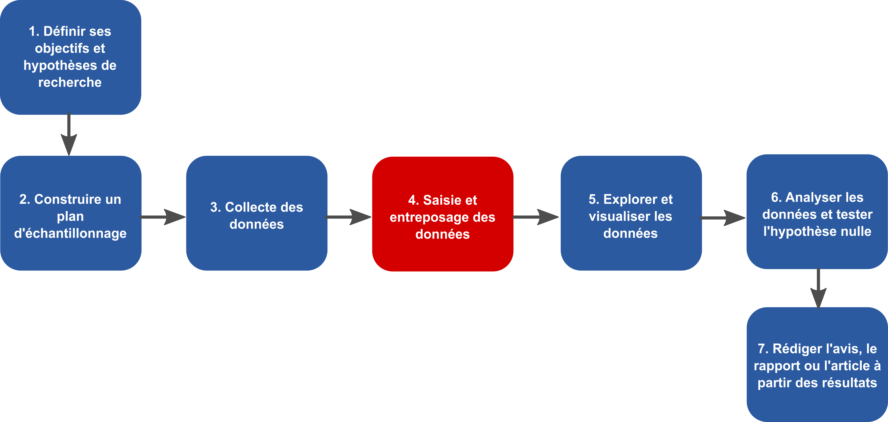
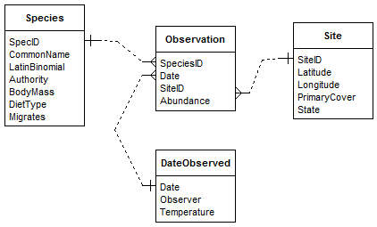
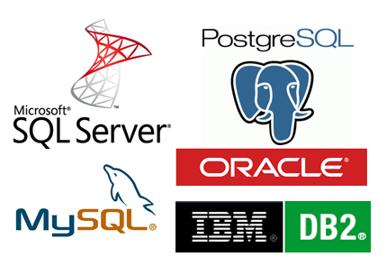
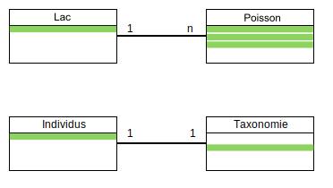
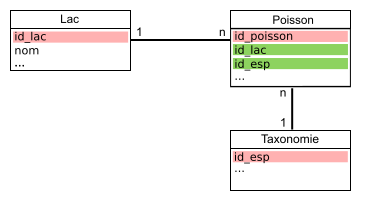

# Séance 3

- Ces diapositives sont disponibles en [version web](https://econumuds.github.io/BIO500/cours3/) et en [PDF](./assets/pdf/S3-BIO500.pdf).
- L'ensemble du matériel de cours est disponible sur la page du portail [moodle](https://www.usherbrooke.ca/moodle2-cours/course/view.php?id=12188).

<!-- TODO 1: Mettre cours 2 en PDF -->
<!-- TODO 2: Changer le lien moodle -->

--- .transition

# L'organisation des données

---

# Où sommes-nous?

<div style='text-align:center;'>
</img>
</div>

---

# Le Tesseract de la biologie

<div style='text-align:center;'>
</img>
</div>

- Il est difficile de stocker les données écologiques dans un tableau excel (n-2) lorsque les données écologiques ont (n-4).

---

# Les bases de données (BDs) à la rescousse

<div style='text-align:center;'>
  </img>
</div>

- Les BDs permettent de redimensionner ce problème (plusieurs tableaux de n-2 avec des relations) grâce au modèle d'entités-relations.
- Chaque table correspond à une dimension. Les tables sont liées entre elles par des relations. Cette structure est appelée [schéma en étoile](https://en.wikipedia.org/wiki/Star_schema).

---

# Avantages des bases de données

- **Maintenir l'intégrité entre les enregistrements de nos tableaux**. Une observation ne peut être faite sur un site qui n'existe pas.
- **Normaliser et contrôler la qualité des données**. Chaque colonne est un type précis de données. Des contraintes peuvent être appliquées sur chaque colonne.
- **Éviter les redondances dans le stockage de l'information** (obtenir une [forme normale](https://fr.wikipedia.org/wiki/Forme_normale_(bases_de_donn%C3%A9es_relationnelles)), voir la section [Format de donnée du cours 2](https://econumuds.github.io/BIO500/cours2/#14).  

---

# Avantages des bases de données

## Autres avantages indéniables:

- Obtenir un gain de temps et de performance.
- Séparer les données brutes des données destinées aux analyses.
- Rendre flexible la préparation des données pour les analyses.
- Pemettre le travail simultané de plusieurs utilisateurs grâce à l'approche client-serveur.
- Déclencher des procédures de sauvegardes.
- Suivre les modifications/ajouts à la BD (journal de transactions).

--- &twocolw w1:40% w2:60%

# L'approche client-serveur


*** =left

<div style='text-align:center;'>
  </img>
</div>


*** =right

- Le **serveur** est un ordinateur contenant la base de données.
- Si le serveur est votre ordinateur, on se connectera alors **localement** (environnement de développement).
- Si le serveur est physiquement ailleurs (mais accessible via le réseau), on parlera de **serveur distant** (environnement de production).


--- &twocolw w1:40% w2:60%

# L'approche client-serveur


*** =left

<div style='text-align:center;'>
  </img>
</div>


*** =right

- Le **client** peut être un logiciel, tout comme un langage installé sur votre ordinateur.
- On se sert de ce langage ou logiciel pour interagir avec le serveur de base de données présent localement ou à distance.
- On peut donc avoir plusieurs **clients** sur un même ordinateur.

--- &twocolw w1:40% w2:60%

# L'approche client-serveur

*** =left

<div style='text-align:center;margin-top:10px;'>
  </img>
</div>
<div style='text-align:center;margin-top:10px;'>
  </img>
</div>

*** =right

- Il existe une grande diversité de clients, mais nous utiliserons essentiellement les trois suivants:
  - **pgadmin3**: logiciel avec une interface graphique.
  - **R**: language de programmation scientifique.
  - **psql**: un autre language utile (si le temps le permet).

<!-- Question, qu'est qui distingue un logiciel d'un langage? -->

**Note:** La plupart des langages de programmation disposent de librairies permettant de se connecter à une base de données sur un serveur local ou distant.

--- &twocolw w1:40% w2:60%

# L'approche client-serveur


*** =left

<div style='text-align:center;'>
  </img>
</div>


*** =right

**Le client** se connecte pour effectuer différentes opérations:

1. Créer une base de données.
2. Créer des tables avec des relations.
3. Insérer des données.
4. Interroger les données par requête.
5. Supprimer des données ou des tables.
6. Mettre à jour des données ou des tables.
7. Supprimer la base de données.


--- &twocolw w1:40% w2:60%

# L'approche client-serveur


*** =left

<div style='text-align:center;'>
  </img>
</div>


*** =right

**Le serveur** répond avec des données, des messages d'erreurs ou des status (e.g. Données insérées).

---

# L'approche client-serveur avec multi-utilisateurs

## On pourrait envisager la situation suivante...


<div style='text-align:center;'>
  </img>
</div>

L'approche multi-utilisateurs peut uniquement se faire si le serveur est distant.

--- .transition

# Les Systèmes de Gestion de Base de Données (SGBDs)

--- &twocol

# Les SGBDs

*** =left

<div style='text-align:center;'>
  </img>
</div>

*** =right

- Les base de données sont présentes sur un serveur.
- Pour créer, interroger, gérer et maintenir des bases de données, on utilisera un **[Système de Gestion de Base de Données](https://fr.wikipedia.org/wiki/Syst%C3%A8me_de_gestion_de_base_de_donn%C3%A9es) (souvent appelé SGBD)** installé sur le serveur.

--- &twocol

# La diversité des SGBDs

*** =left

## Il en existe une multitude:

<div style='text-align:center;'>
  </img>
</div>

*** =right

>- Mais ces systèmes disposent tous d'un dénominateur commun: le `langage SQL`
>- Dans ce cours, nous utiliserons le système de gestion de données `PostgreSQL`.

---

# Le langage SQL

## Définition

> Le SQL (Structured Query Language) est le langage des SGBDs. Il permet de communiquer avec une base de données.

---

# Le langage SQL

## Le `SQL` permet de:

1. Créer une base de données (`CREATE DATABASE`).
2. Créer des tables et établir des relations (`CREATE TABLE`).
3. Insérer des données (`INSERT`).
4. Interroger les données par requête (`SELECT`).
5. Supprimer des données ou des tables (`DROP`, `DELETE`).
6. Mettre à jour des données ou des tables (`UPDATE`, `ALTER`).
7. Supprimer la base de données (`DROP DATABASE`).

Chacune de ces commandes est une instruction `SQL` envoyée au serveur pour manipuler et interroger la base de données.

---

# Le langage SQL

## Pour cette séance, nous nous attarderons seulement à:

1. Créer une base de données (`CREATE DATABASE`).
2. Créer des tables et établir des relations (`CREATE TABLE`).
3. Supprimer ou modifier des tables (`DROP TABLE`, `ALTER TABLE`).
4. Supprimer la base de données (`DROP DATABASE`).

Soyez attentifs, car le travail de cette semaine consiste à écrire un script qui permet la création de la base de données (les tables et leurs relations) pour entreposer les données que vous avez collectées lors de la séance 2.

--- .transition

# Conceptualisation d'une base de données en 5 étapes

---

# Étape 1. Faire une liste des variables

**Exercice (15-20 minutes):**

1. Dresser la liste des informations collectées par les différents groupes.
2. Regrouper les variables communes entre les groupes pour obtenir une ontologie conjointe.

---

# Étape 2. Regrouper les variables dans des tables

**Exercice (15-20 minutes):** Regrouper les variables dans des tables.

1. Déterminer les tables/entités:
  - Qu'elles sont les unités d'échantillonnage? autrement dit, sur quelles entités portent nos mesures?
2. Remplir les tables avec les champs de l'étape 1.


À ce stade de la conceptualisation, une table est une entité possédant des attributs. Chaque attribut est une colonne.

---

# Étape 3. Établir le type d'association entre les tables

## Le concept d'association

<div style='text-align:center;'>
  </img>
</div>

---

# Étape 3. Établir le type d'association entre les tables

## Il existe plusieurs types d'association:

| Table 1   | Table 2   | Relation                                       | exemple                        |
|:----------|:----------|:-----------------------------------------------|:-------------------------------|
| 1         | 1         | *one-to-one*                                   | personne ←→ permis de conduire |
| 0..1      | 1         | optionnel dans la table 1, *one-to-one*        | permis de conduire ←→ personne |
| 0..n ou n | 0..n or n | optionnel dans les deux tables, *many-to-many* | personne ←→ livre              |
| 1..n ou n | 1         | *many-to-one*                                  | personne ←→ lieu de naissance  |

**Exercice (5 minutes)**: Quel(s) type(s) d'association retrouve-t-on entre nos tables?

---

# Étape 4. Établir les clés primaires et étrangères

## Le concept des clés primaires et des clés étrangères

<div style='text-align:center;'>
  </img>
</div>

## Important:
  - Une clé primaire garantie le caractère unique d'un enregistrement (ligne d'une table).
  - Une clé primaire ne peut donc jamais être `NULL`.
  - Une clé primaire peut être composite, une combinaison de colonnes.

---

# Étape 4. Établir les clés primaires et étrangères

**Exercice (5 minutes)**

1. Déterminer quelles sont les attributs/colonnes garantissant le caractère unique d'un enregistrement (ligne d'une table).
2. Déterminer quelles sont les clés étrangères.


---

# Étape 5. Assigner un type de données aux attributs

Chaque attribut d'une table doit correspondre à un type de données:

| Appelation                | Type                 | Valeurs     | Taille           |
|:--------------------------|:---------------------|:------------|:-----------------|
| `BOLEAN`                  | Boléen               | vrai/faux   | 1 octet          |
| `INTEGER`                 | Entiers              | -998, 123   | 1 à 4 octets     |
| `DOUBLE`, `FLOAT`         | Nombres réels        | 9.98, -4.34 | 4 à 8 octets     |
| `CHAR`,`VARCHAR`          | Chaine de caractères | lapin       | n x 1 à 8 octets |
| `TIMESTAMP`,`DATE`,`TIME` | Dates et heures      | 1998-02-16  | 4 à 8 octets     |

Pour tous les types de données, [voir la documentation PostgreSQL](http://docs.postgresql.fr/9.2/datatype.html)

**Exercice (15 minutes):** Associer à chaque attribut un type de données.

---

# En résumé

## Finalement, qu'est-ce qu'un modèle conceptuel pour une base de données?

Une façon de représenter l'information dans un modèle de type entités-relations où chaque entité (table) possède des attributs (colonnes).

L'étape suivante est de transcrire ce modèle conceptuel des données en modèle logique de données (c.a.d compréhensible par l'ordinateur).

--- .transition

# Transcrire ces étapes en SQL

---

# Se connecter au SGBD (PostgreSQL)

## Pour que le client communique avec la SGBD, les informations de connection au serveur sont indispensables:

1. `host`: L'adresse du serveur. `localhost` si la base de données est sur votre ordinateur.
2. `port`: La base de données écoute sur un port spécifique du serveur.
3. `user`: le nom d'utilisateur
4. `password`: le mot de passe de l'utilisateur.
5. `dbname`: le nom de la base de données

---&twocolw w1:50% w2:50%

# Se connecter au SGBD (PostgreSQL) via R

*** =right

```{r, warnings=FALSE, message=FALSE}
library(RPostgreSQL)
con <- dbConnect(PostgreSQL(), host="localhost",
        port=5432, user= "postgres", password=NA)
```

```{r, eval=FALSE}
dbSendQuery(con,"Requête SQL à envoyer")
```

*** =left

- `con` est un objet contenant la connection avec le serveur.
- On utilisera la fonction `dbSendQuery()` pour envoyer les instructions SQL.
- Le deuxième argument de la fonction `dbSendQuery()` est une chaine de caractère contenant la requête SQL.

---&twocolw w1:45% w2:50%

# Se connecter au SGBD (PostgreSQL) via pgAdmin3

*** =right

<div style='text-align:center;margin-top:10px;'>
  </img>
</div>

*** =left

- On préfère parfois une interface graphique pour interagir avec la SGBD.

---&twocolw w1:50% w2:50%

# Création de la base de données via R

## La première étable consiste à créer une base de données.

```{r, error=FALSE}
dbSendQuery(con,"CREATE DATABASE bd_films;")
```

La SGBD nous répond... mais elle n'a pas grand chose à ajouter.

## Important:

1. En SQL, chaque instruction se termine par un point-virgule.
2. Les instructions sont écrites en majuscule et les variables en minuscule.
3. Toutes les instructions SQL sont énumérées et expliquées en Français à cette adresse: [http://docs.postgresql.fr/9.5/sql-commands.html](http://docs.postgresql.fr/9.5/sql-commands.html)

---

# Création de la base de données via R

## Puis, on se connecte à cette nouvelle base de données grâce à la fonction `dbConnect()`:

```{r}
dbConnect(con,dbname="bd_films")
```

---

# Création des tables

```sql
CREATE TABLE films (
    code        char(5),
    titre       varchar(40),
    did         integer,
    date_prod   date,
    genre       varchar(10),
    duree       interval hour to minute,
    CONSTRAINT code_titre PRIMARY KEY(code,titre)
);
```

---

# Modifier une table existante


---

# Supprimer la base de données

```{r}
dbSendQuery(con,"DROP DATABASE bd_films;")
dbDisconnect(con)
```
