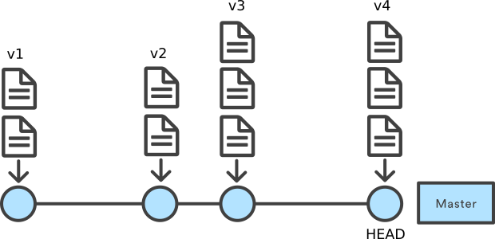
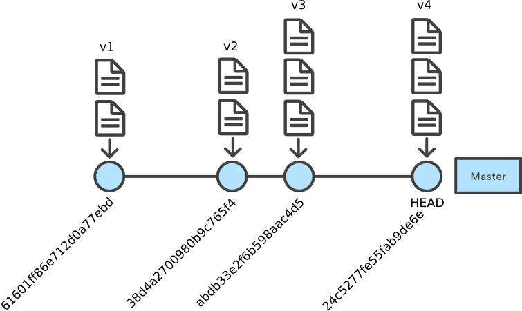

# Séance 5

- Ces diapositives sont disponibles en [version web](https://econumuds.github.io/BIO500/cours4/) et en [PDF](./assets/pdf/S4-BIO500.pdf).
- L'ensemble du matériel de cours est disponible sur la page du portail [moodle](https://www.usherbrooke.ca/moodle2-cours/course/view.php?id=12189).

--- .transition

# Les outils pour la reproductibilité

---

# Les étapes du travail d'un biologiste

<div style='text-align:center;'>
</img>
</div>


--- .transition

# Git: Un système de controle de version

---&twocol

# Une situation courante

*** =left

## Une situation qui vous est familière:

```bash
MonTravailSession/
  |___ data/
        |___ data_01122018.csv
        |___ data_011022018.csv
  |___ rapportVeg_jean_v1_01012018.docx
  |___ rapportVeg_juliette_v1_01012018.docx
  |___ rapportVeg_rémi_v1_04012018.docx
  |___ rapportVeg_rémi_v2_10012018.docx
  |___ rapportFinal_20012018.docx
```

*** =right

## le travail d'équipe

Ses difficultées

- Multi-utilisateurs
- Garder une trace de l'historique de modifications **d'un ensemble de fichiers**.
- Revenir aux versions précédentes
- comparer des versions d'un fichier.

---

# Système de controle éxistants

- Mettre une screenshot de Dropbox, et de Word pour tracker les versions.

---

# Qu'est ce que Git?

C'est un système qui permet de suivre l'ajout et les modifications pour un ensemble de fichier. C'est le cahier de lab du programmeur.

- Logiciel libre
- Soutenu par une large communauté (12 millions d'utilisateurs dans le monde)
- Par défault, Git est installé par défault sur les machines Linux et MacOSX
- Il peut être installé sur Windows: [https://git-scm.com/download/win](https://git-scm.com/download/win)

---

# Qu'est ce que Git?

Il présente l'avantage d'être extrement versatile mais le désavantage de fonctionner seulement avec les fichiers plein texte.

**Question**: Qu'est ce qu'un fichier plein texte?

<!-- TODO: Qu'est ce qu'un fichier plein texte? Est-ce que je peux faire du contrôle de version avec un document word -->

---

# Initialisation d'un dépôt Git

Git suit les modifications à l'intérieur d'un dossier que l'on appelle dépôt (`repository`). Pour initialiser le suivi d'un répertoire (initialiser un dépôt), il vous suffit d'utiliser la commande `git init`.

```bash
mkdir ~/Documents/travail_BIO500 # Créer un répertoire de travail dans le répertoire Documents.
cd  ~/Documents/travail_BIO500 # Se déplacer vers ce répertoire
git init # Initialiser le suivi de version de ce dossier.
ls -la # Lister le contenu du répertoire de travail.
```

Le dossier `.git` permet de garder une trace de l'ensemble des opérations que vous allez faire dans ce répertoire.

---

# Exercice: Initialiser votre répertoire de travail avec git

**À l'aide de votre terminal:**

1. Créer un dossier (`mkdir`)
2. Créer un fichier (`touch`)
3. Initialiser votre dépot `git` (`git init`)
4. Vérifier que le dossier caché (`.git`) se trouve dans votre nouveau répertoire

---

# Git en 3 étapes

On modifie le ou les fichiers, on ajoute la modification à Git puis on met un commentaire sur la modification apportée.

1. Modification d'un ou plusieurs fichiers sources
2. `git add monFichier1.txt monFichier2.txt` - Ajout des fichiers modifiés
3. `git commit -m "mon commentaire"` - Commentaire sur la modification apportée

On répète ces étapes à plusieurs reprises au cours de l'écriture d'un document et/ou de l'avancé d'un projet.

---

# Git status

Votre meilleur ami, `git status`, permet de prendre connaissance de l'état de notre dépôt Git.

```bash
Sur la branche master

Validation initiale

Fichiers non suivis:
  (utilisez "git add <fichier>..." pour inclure dans ce qui
  sera validé)


        monFichier1.txt

aucune modification ajoutée à la validation mais des
fichiers non suivis sont présents (utilisez "git add" pour
les suivre).
```


---

# Exercice: Effectuer votre premier `commit`

## Première partie

1. Déplacer vous dans votre répertoire de travail
2. Ajouter un fichier intituler `travail_BIO500.txt` et remplisser le de faux texte
3. Effectuer un `git status`

## Deuxième partie

4. Ajouter ce fichier à votre dépot git (`git add`)
5. Effectuer un `git status`
6. Décrire la modification que vous venez d'apporter (`git commit`)

À chaque `git status`, prenez le temps de regarder la sortie (message)

---

# Exercice: Effectuer votre premier `commit`

## Troisième partie

7. Modifier le fichier `travail_BIO500.txt`
8. Ajouter la modification à votre dépot git (`git add`)
9. Effectuer un `git status`

À chaque `git status`, prenez le temps de regarder la sortie (message)

## Quatrième partie

7. Modifier à nouveau le fichier `travail_BIO500.txt`
8. Effectuer un `git diff`


--- &twocol

# Quelques notions de base

*** =left

<div style='text-align:center;'>
</img>
</div>

*** =right

- Une branche (`master` par défault): c'est un série de commentaires (`commit`)
- Le dernier commentaire (`commit`) est ce que l'on appelle la tête de la brance (`HEAD`), elle contient la version la plus à jour des fichiers.
- À chaque commentaires d'édition (`commit`) est attaché une version des fichiers.

---

# Le journal de Git

```bash
cd Documents/Git/BIO500 # Ceci est mon chemin d'accès
git log
```

```bash
commit 38d4a2700980b9c765f4abdb33e2f6b598aac4d5
Author: Steve Vissault <s.vissault@yahoo.fr>
Date:   Wed Feb 28 20:38:05 2018 -0500

    Modifs sur plan de match

commit 61601ff86e712d0a77ebd24c5277fe55fab9de6e
Author: Steve Vissault <s.vissault@yahoo.fr>
Date:   Wed Feb 28 20:33:20 2018 -0500

    Modifications au cours3 (retrait slides), ajout reponses
```

--- &twocol

# Le journal de Git

*** =left

```bash
commit 38d4a2700980b9c765f4abdb33e2f6b598aac4d5
Author: Steve Vissault <s.vissault@yahoo.fr>
Date:   Wed Feb 28 20:38:05 2018 -0500

    Modifs sur plan de match

commit 61601ff86e712d0a77ebd24c5277fe55fab9de6e
Author: Steve Vissault <s.vissault@yahoo.fr>
Date:   Wed Feb 28 20:33:20 2018 -0500

    Modifications au cours3 (retrait slides)
```

*** =right

<div style='text-align:center;'>
</img>
</div>


--- &twocol

# Se déplacer sur la branche `master`

*** =left

```bash
git checkout 4abdb33e2f6b598aac4d5
```

Permet de se déplacer vers un `commit` précis.

*** =right

<div style='text-align:center;'>
</img>
</div>

--- &twocol

# Se déplacer sur la branche `master`

*** =left

```bash
git checkout master
```

Permet de se déplacer vers un `commit` le plus récent.

*** =right

<div style='text-align:center;'>
</img>
</div>

---.transition

# Le makefile

---

# Les étapes du travail d'un biologiste

<div style='text-align:center;'>
</img>
</div>

---

# Qu'est-ce que le makefile ?

**Définition**: le makefile est un fichier qui contient un ensemble de directives qui sont exécutées par l'ordinateur. Les instructions et leurs dépendances sont spécifiées dans le makefile.

---

# À quoi il sert ?

Le makefile est un logiciel permettant d'exécuter une série d'instructions, lorsqu'elles sont nécessaires. Les dépendances sont vérifiées et seulement les instructions qui requierent une mise à jour sont exécutées.

Nous utiliserons le makefile pour assurer la reproductibilité de la démarche entreprise dans le cours. L'ensemble des instructions nécessaires à la production du rapport, de la création de la base de données à la compilation du document écrit, seront contenues dans le makefile.

---

# Objectifs de la leçon

- Reconnaitre les parties importantes d'un makefile, les règles, les cibles, les dépendances et les actions
- Écrire un makefile simple
- Exécuter un makefile à partir du terminal
- Préparer le makefile pour le projet de session

---

# Anatomie du makefile

```bash
<target>: <dependencies...>
  <commands>
```

---

# `target`

La cible est habituellement le nom d'un fichier généré par la commande.

---

# `dependencies...`

Une dépendance (également appelée _"prerequesite"_) est un fichier qui est utilisé pour créer un autre fichier appelée cible (`"target"`).

La _target_ peut contenir plusieurs dépendances.

Il est néanmoins possible d'avoir un fichier cible qui ne requiert pas de dépendance.

---

# `commands`

La commande est l'action à réaliser. Dans notre cas, nous utiliserons une commande pour exécuter un script R comme :

```bash
Rscript script.R
```

Nous verrons plus tard dans la session le langage de mise en forme LaTeX. Dans ce cas, la commande serit:

```bash
pdflatex manuscrit.tex
```

---

# Un exemple

```bash
# Troisième étape, on produit une figure à partir du modèle
# et des données
figure.pdf: model.Rdata data.txt
  Rscript script3.R

# Seconde étape, on fait un modèle statistique à partir
# de ces données
model.Rdata: data.txt
  Rscript script2.R

# Première étape, on génère des données
data.txt :
  Rscript script1.R
```

Ce fichier s'appelle makefile (sans extension) et il est exécuté en inscrivant simplement la commande `make nomDeLaCible`.

---

# Étape par étape

`Rscript` est un programme permettant d'exécuter du code R sans passer par la console R. On peut utiliser le terminal pour appeler le programme `Rscript` et lui donner comme argument un script R: `Rscript script1.R`

Les commandes sont espacées par une *tabulation* ou 8 espaces. Assurer vous que votre tabulation corresponds bien à 8 espaces.

Ensemble, la cible, les dépendances et les actions constituent une règle. Cet exemple a donc 3 règles.

---

# Comment créer un premier makefile

- Ouvrez un nouveau document au moyen de atom
- Copiez les commandes de l'exemple
- Sauvergardez le fichier, avec pour nom makefile
- Assurez vous de trouvez les 3 scripts dans le dépôt git

---

# Script 1

```{r eval=FALSE}
  set.seed(1)
  X <- runif(25, 0, 100)
  Y <- rnorm(25, mean = X*2 + 10, sd = 25)
  write.table(cbind(X,Y), file = "data.txt")
```

---

#  Script 2

```{r eval=FALSE}
data <- read.table("~/Bureau/exemple/data.txt", header = T)
model <- lm(data$Y ~ data$X)
save(model, file = "~/Bureau/exemple/model.Rdata")
```

---

#  Script 3

```{r eval=FALSE}
data <- read.table("~/Bureau/exemple/data.txt", header = T)
load("~/Bureau/exemple/model.Rdata")

pdf("resultat.pdf", 7 5)
plot(data$X, data$Y, xlab = "X", ylab = "Y")
abline(model)
dev.off()
```

---

#  Exécuter un makefile

Il n'est pas nécessaire de nommer le makefile *makefile*. On peut toujours spécifier un autre nom et l'exécuter ainsi :

```{bash eval = FALSE}
make -f MonMakefile
```

---

# Les dépendances

- Exécutez le makefile une première fois.
- Ensuite, modifiez une valeur dans le fichier data.txt.
- Exécutez le makefile à nouveau pour voir ce qui se produit.

---

# Le makefile comme outil de reproductiblité

La rédaction du makefile nous force à spécifier les différentes étapes de notre démarche, à identifier les entrées et les sorties de différentes instructions à l'ordinateur. De cette façon, le makefile permet de documenter rigoureusement la démarche réalisée.

Il s'agit aussi d'un aide-mémoire qui permet de se rappeler des étapes.

---

# Exercice

Conceptualisez les différentes étapes de la démarche du travail de session jusqu'à présent.

Identifiez les entrées, les sorties et les actions.

---

# Les messages de make

Il est possible de forcer make à réaliser certaines actions. Par exemple, si on exécute à nouveau make

```bash
make
```

On obtient le message :

```bash
make : 'data.txt' is up to date
```

---

# Les messages de make

On peut forcer une étape, par exemple le calcul du modèle, ainsi :

```bash
make model.Rdata
```

Dans ce cas-ci, on obtient le message :

```bash
make: Nothing to be done for 'script2.R'
```

---

# Les messages de make

*up to date* signifie que le makefile a une règle dont la cible est le nom du fichier et qu'il est à jour

*Nothing to be done* indique que le fichier existe, mais que soit

- il n'y a pas de règle pour ce fichier
- il y a une règle, mais aucune action à réaliser

---

# Nettoyage du dépôt en fin de script

Il arrive que certains scripts génèrent des fichiers temporaires qui ne doivent pas être conservés inutilement.

Dans l'exemple précédent, on pourrait vouloir éliminer le modèle, qui n'est finalement utilisé que pour réaliser la figure. On peut ainsi inscrire à la fin du makefile :

```bash
clean :
  rm -f model.Rdata
```

`rm -f model.Rdata` va éliminer à la toute fin l'objet R contenant le modèle intitulé `model.Rdata`. Notez ici qu'il n'y a pas de dépendance, ce qui indique que cette opération sera systématiquement exécutée.

---

# Dépendances

L'ordre de présentation des dépendances est arbitraire. Elles ne seront pas nécessairement vérifiées dans l'ordre présenté.

Un truc est de schématiser les dépendances (des noeuds) et les actions (des flèches)

---

# Autres ressources disponibles en ligne :

https://swcarpentry.github.io/make-novice/02-makefiles/

https://gist.github.com/isaacs/62a2d1825d04437c6f08

http://gl.developpez.com/tutoriel/outil/makefile/

http://icps.u-strasbg.fr/people/loechner/public_html/enseignement/GL/make.pdf

--- .transition

# Travail pour la semaine

---

# Consignes

- Identifiez clairement vos questions de recherche
- Planifiez les requêtes à réaliser pour traiter les données
- Incluez les requêtes dans le makefile

---

# Lectures

Sandve et al. 2013. Ten Simple Rules for Reproducible Computational
Research. PLoS Computational Biology. 9: e1003285

Silberzahn et Uhlman. 2015. Many hands make tight work. Nature 526 : 189-191.

Barba. 2016. The hard road to reproducibility. Science 354: 142.
