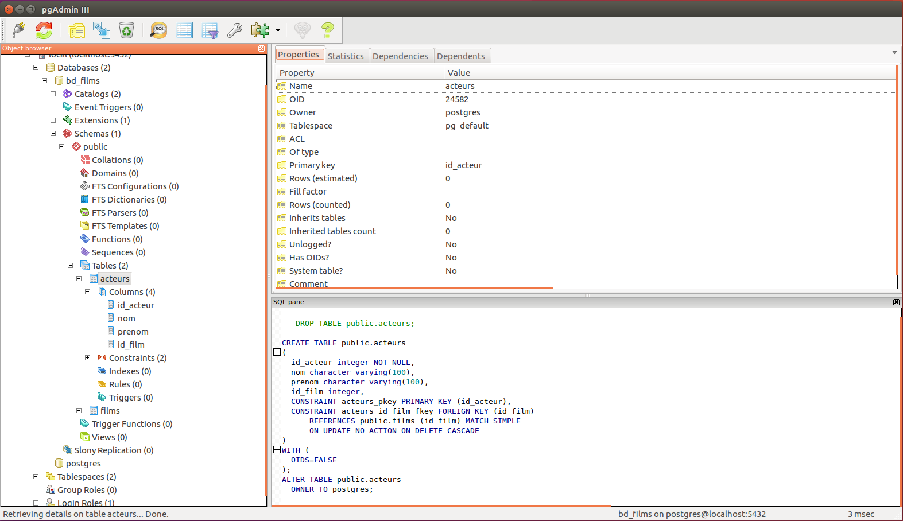

# Séance 4

- Ces diapositives sont disponibles en [version web](https://econumuds.github.io/BIO500/cours4/) et en [PDF](./assets/pdf/S4-BIO500.pdf).
- L'ensemble du matériel de cours est disponible sur la page du portail [moodle](https://www.usherbrooke.ca/moodle2-cours/course/view.php?id=12189).

<!-- TODO 1: Mettre cours 2 en PDF -->
<!-- TODO 2: Changer le lien moodle -->

---

# Les grandes étapes

1. Spécifier la connexion avec le serveur
2. Créer la base de données
3. Créer les tables et spécifier les clés
4. Ajouter de l'information dans les tables
5. Faire des requêtes pour extraire l'information

**Important:**

1. Pour cette partie assurez vous que êtes connecté au réseau **Aerius Sécurisé**.
2. Pour ceux dont la VM ne fonctionne pas, il possible de faire les exercices de ce cours sur Windows ou MacOSX.


--- .transition

# Retour rapide sur la séance de la semaine dernière

---

# Connexion au serveur


```{r echo=FALSE, include=FALSE}
library(RPostgreSQL)

con <- dbConnect(PostgreSQL(),
        host="localhost",
        port=5432,
        user= "postgres")

# On créé la base de données et on ferme la connexion
dbSendQuery(con,"DROP DATABASE IF EXISTS bd_films;")
dbSendQuery(con,"CREATE DATABASE bd_films;")
dbDisconnect(con)

# On se connecte à la nouvelle base de données
con <- dbConnect(PostgreSQL(),
        host="localhost",
        port=5432,
        user= "postgres",
        dbname="bd_films")
```

```{r eval=FALSE}
library(RPostgreSQL)

con <- dbConnect(PostgreSQL(),
        host="localhost",
        port=5432,
        user= "postgres")

# On créé la base de données et on ferme la connexion
dbSendQuery(con,"DROP DATABASE IF EXISTS bd_films;")
dbSendQuery(con,"CREATE DATABASE bd_films;")
dbDisconnect(con)

# On se connecte à la nouvelle base de données
con <- dbConnect(PostgreSQL(),
        host="localhost",
        port=5432,
        user= "postgres",
        dbname="bd_films")
```

**Question:** Sur ce script, où sont les instructions SQL? Òu sont les commandes R?

---

# Création de la table `films`

```{r}
tbl_films <- "CREATE TABLE films (
    id_film     integer,
    titre       varchar(300),
    annee_prod   integer,
    PRIMARY KEY (id_film)
);"

dbSendQuery(con,tbl_films)
```

---

# Création de la table `acteurs`


```{r}
tbl_acteurs <- "CREATE TABLE acteurs (
    id_acteur   integer,
    nom         varchar(100),
    prenom      varchar(100),
    id_film     integer,
    PRIMARY KEY (id_acteur),
    FOREIGN KEY (id_film) REFERENCES films (id_film) ON DELETE CASCADE
);"

dbSendQuery(con,tbl_acteurs)
```

---

# pgAdmin3

`pgAdmin3` est un client avec une interface graphique permettant de visualiser si les opérations de création de tables ont bien été réalisées.

<div style='text-align:center;margin-top:10px;'>
  </img>
</div>


--- .transition

# Ajouter de l'information dans les tables

---

# SQL - `INSERT`

On veut maintenant insérer des données dans les tables `acteurs` et `films`.

## L'instruction `INSERT` permet d'insérer une ligne à la fois:

```sql
INSERT INTO films(id_film,titre,annee_prod) VALUES (1,'la vie est belle',1997);
INSERT INTO acteurs(id_acteur,prenom,nom,id_film) VALUES(1,'Nicoletta','Braschi',1);
INSERT INTO acteurs(id_acteur,prenom,nom,id_film) VALUES(2,'Roberto','Benigni',1);
```

---

# SQL - `COPY ... FROM`

L'instruction SQL `COPY ... FROM` permet d'insérer plusieurs lignes à la fois:

```sql
COPY films FROM '/Users/SteveVissault/Documents/Git/BIO500/cours4/pres/assets/donnees/bd_beacon/bd_films.csv'
WITH FORMAT CSV HEADER DELIMITER ';';
```

Documentation: [http://docs.postgresql.fr/9.5/sql-copy.html](http://docs.postgresql.fr/9.5/sql-copy.html)

---

# RPostgreSQL - `dbWriteTable`

La librairie RPostgreSQL peut nous aider plus facilement à accomplir cette tâche:

```{r}
# Lecture des fichiers CSV
bd_films <- read.csv2(file='./assets/donnees/bd_beacon/bd_films.csv')
bd_acteurs <- read.csv2(file='./assets/donnees/bd_beacon/bd_acteurs.csv')

# Injection des enregistrements dans la BD
dbWriteTable(con,append=TRUE,name="films",value=bd_films, row.names=FALSE)
dbWriteTable(con,append=TRUE,name="acteurs",value=bd_acteurs, row.names=FALSE)
```

---

# Exercice 1 (10-15 minutes)

Ce premier exercice est important pour la suite de la séance.  

1. Recréer la base de données `bd_films` avec ses deux tables `films` et `acteurs`
2. Insérer les données [bd_acteurs.csv](./assets/donnees/bd_beacon/bd_acteurs.csv) et [bd_films.csv](./assets/donnees/bd_beacon/bd_acteurs.csv) dans les deux tables à l'aide de la commande R `dbWriteTable()`

---

# pgAdmin3

Il est également possible d'insérer des données à partir du logiciel `pgAdmin3`.

---.transition

# Les requêtes

---&twocol

# Sélectionner des tables et des colonnes


*** =left


```{r}
sql_requete <- "SELECT * FROM films LIMIT 10;"

films <- dbGetQuery(con,sql_requete)
head(films)
```

*** =right

- `*` permet de ne pas spécifier une colonne en particulier.
- Cette requête retournera toutes les colonnes de la table `films`
- Note: L'instruction `LIMIT` est utiliser dans les prochaines diapos afin de permettre le rendu des requêtes sur une diapo.

---&twocol

# Sélectionner des enregistrements unique

*** =left


```{r}
sql_requete <- "SELECT DISTINCT nom, prenom
FROM acteurs LIMIT 10;"

films <- dbGetQuery(con,sql_requete)
head(films)
```

*** =right

- L'instruction `DISTINCT` permettra de retourner la combinaison unique de noms et prénoms présent dans la table acteurs.

---&twocol

# Sélectionner des tables et des colonnes

## La connexion est ouverte et toujours accessible depuis l'objet `con`.

*** =left


```{r}
sql_requete <- "
SELECT id_film, titre, annee_prod
  FROM films LIMIT 10
;"

films <- dbGetQuery(con,sql_requete)
head(films)
```

*** =right

- `SELECT` spécifie les colonnes.
- `FROM` spécifie la table.
- On peut également ajouter une `LIMIT`.
- [Documentation SQL Select](http://docs.postgresqlfr.org/9.5/sql-select.html).


---&twocol

# Ordonner la table

*** =left

```{r}
sql_requete <- "
SELECT titre, annee_prod, id_film
  FROM films ORDER BY annee_prod DESC
;"
derniers_films <- dbGetQuery(con,sql_requete)
head(derniers_films)
```

*** =right

- `ORDER BY` permet de trier par ordre croissant (`ASC`) ou décroissant (`DESC`).

---&twocol

# Critères avec `NULL`

*** =left

```{r}
sql_requete <- "
SELECT id_film, titre, annee_prod
  FROM films WHERE annee_prod IS NOT NULL
  ORDER BY annee_prod DESC
;"
annees_films <- dbGetQuery(con,sql_requete)
head(annees_films)
```

*** =right

- `WHERE`, spécifie les critères de la requête.
- `annee_prod IS NULL` permet d'obtenir seulement les films n'ayant pas d'année de production.

---&twocolw w1:55% w2:45%

# Combiner les critères

*** =left

```{r}
sql_requete <- "
SELECT id_film, titre, annee_prod
  FROM films WHERE
  (annee_prod >= 1930 AND annee_prod <= 1940)
  OR (annee_prod >= 1950 AND annee_prod <= 1960)
  ORDER BY annee_prod
;"
derniers_films <- dbGetQuery(con,sql_requete)
head(derniers_films)
```

*** =right

- Multi-critères avec `AND` et `OR`
- Les parenthèses définissent les priorités d'opérations.
- Opérateurs de comparaison: `>=`,`<=`, `=` (Valeurs numériques)
- [Documentation sur les opérateurs de comparaisons](https://www.postgresql.org/docs/9.1/static/functions-comparison.html)

---&twocolw w1:55% w2:45%

# Critères sur le texte avec `LIKE`

*** =left

```{r}
sql_requete <- "
SELECT id_film, titre, annee_prod
  FROM films WHERE titre LIKE '%Voyage%'
;"
derniers_films <- dbGetQuery(con,sql_requete)
head(derniers_films)
```

*** =right

- Rechercher dans le texte: `LIKE`
- `%`: n'importe quels caractères
- `_`: un seul caractère (exemple: `_1_` peut renvoyer `113` ou encore `A1C`)
- Le critère contraire est aussi possible avec `NOT` (exemple: `WHERE titre NOT LIKE '%voyage%'`)

---

# Exercice 4 (10 minutes)

Dans ta table `acteurs`, essayer de trouver votre acteur préféré avec `LIKE` ou avec `= 'votre_acteur_pref'`


---&twocol

# Agréger l'information (1 ligne)

*** =left

```{r}
sql_requete <- "
SELECT avg(annee_prod) AS moyenne,
  min(annee_prod), max(annee_prod)
  FROM films;"

resume_films <- dbGetQuery(con,sql_requete)
head(resume_films)
```

*** =right

- Pour faire une synthèse de l'information sur une seule ligne.
- Faire des opérations sur les champs numérique: `max`, `min`, `sum`, `avg`, `count`.
- Mais aussi les opérations classiques: `*`, `/`, `-` etc.
- Renommer les colonnes avec `AS`.

---&twocol

# Agréger l'information (plusieurs lignes par groupe)

*** =left

```{r}
sql_requete <- "
SELECT count(titre) AS nb_films, annee_prod
  FROM films
  GROUP BY annee_prod;"

resume_films <- dbGetQuery(con,sql_requete)
head(resume_films)
```

*** =right

- `COUNT` permet de dénombrer le nombre de lignes.
- `GROUP BY` définit les champs sur lequel se fera l'agrégation des données.

---

# Exercice 5 (10 minutes)

À l'aide de la base de données `bd_films`, dénombrer le nombre d'acteurs par films

Quels sont les 10 acteurs les plus prolifiques?

---.transition

# Jointures entre tables

---

# Jointures entre tables

Le `INNER JOIN` est un type de jointure, renvoyant seulement les films et les acteurs ayant un identifiant `id_film` commun.

```{r}
sql_requete <- "
SELECT titre, annee_prod, films.id_film, acteurs.id_film
  FROM films
  INNER JOIN acteurs ON films.id_film = acteurs.id_film
  ;"

acteurs_films <- dbGetQuery(con,sql_requete)
head(acteurs_films,4)
```

---

# Les type de jointures

<div style='text-align:center;margin-top:10px;'>
  </img>
</div>


---

# Jointures entre tables

On peut spécifier la jointure avec `USING` seulement si les deux clés possèdent le même nom.

```{r}
sql_requete <- "
SELECT titre, annee_prod, nom, prenom
  FROM films
  INNER JOIN acteurs USING (id_film)
  ;"

acteurs_films <- dbGetQuery(con,sql_requete)
head(acteurs_films,4)
```

---

# Exercice 4 (10-15 minutes)

## Combien il y a d'acteurs par film depuis les 10 dernières années?

Toujours avec la même base de données,
on voudrait savoir le nombre d'acteurs par film depuis les 10 dernières années.

---

# Exercice 5 (10-15 minutes)

## Existe-t-il un film sans acteurs?

En vous servant des types de jointures, on voudrait savoir s'il existe des films sans acteurs.


---&twocolw w1:55% w2:45%

# Requêtes emboitées

*** =right

- On s'interroge sur le nombre moyen d'acteurs par années.

- Pour ce faire, on peut bâtir une requête à partir d'une autre requête.

*** =left

```{r}
sql_requete <- "
SELECT annee_prod, avg(nb_acteurs) AS moy_acteurs FROM (
  SELECT titre, annee_prod, count(nom) AS nb_acteurs
    FROM films
    INNER JOIN acteurs USING (id_film)
    GROUP BY annee_prod, titre
) AS nb_acteurs_film
GROUP BY annee_prod;"

moy_acteurs <- dbGetQuery(con,sql_requete)
head(moy_acteurs)
```

---&twocolw w1:55% w2:45%

# Filtrer les requêtes à posteriori

*** =right

- Il est possible de filtrer à posteriori sur la requête avec `HAVING`.

*** =left

```{r}
sql_requete <- "
SELECT annee_prod, avg(nb_acteurs) AS moy_acteurs FROM (
  SELECT titre, annee_prod, count(nom) AS nb_acteurs
    FROM films
    INNER JOIN acteurs USING (id_film)
    GROUP BY annee_prod, titre
) AS nb_acteurs_film
GROUP BY annee_prod
HAVING avg(nb_acteurs) > 10;"

nb_acteurs <- dbGetQuery(con,sql_requete)
head(nb_acteurs)
```

---.transition

# Sauvegarder les requêtes

---

# Sauvegarder une requête

Nous avons vu précédemment `COPY ... FROM chemin_vers_fichier` pour insérer des enregistrements dans les tables.

Il existe aussi l'instruction `COPY ... TO chemin_vers_fichier` pour sauvegarder une requête.

```sql
COPY (SELECT * FROM films WHERE titre LIKE 'A%')
TO '/home/etudiant/Documents/films_A.csv' WITH DELIMITER ';' CSV HEADER;
```

---

# Sauvegarder une requête

Afin de sauvegarder les requêtes obtenues dans R par `dbGetQuery()`, il est possible d'utiliser les fonctions d'écritures tels que `write.table()` ou encore `write.csv()`.

Il existe une façon de faire des requêtes dans `pgAdmin3` et d'en sauvegarder les résultats grâce à l'outils `Query`.

---.transition

# Les requêtes stockées

---

# Les requêtes stockées: les vues

Les vues permettent de stocker directement les requêtes à l'intérieur de la base de données afin d'interroger la vue ultérieurement.

```sql
CREATE VIEW moyenne_acteurs AS (
  SELECT annee_prod, avg(nb_acteurs) AS moy_acteurs FROM (
    SELECT titre, annee_prod, count(nom) AS nb_acteurs
      FROM films
      INNER JOIN acteurs USING (id_film)
      GROUP BY annee_prod, titre
  ) AS nb_acteurs_film
  GROUP BY annee_prod
  );
```

Il sera possible d'atteindre cette vue plus tard avec:

```sql
SELECT * FROM moyenne_acteurs;
```

---.transition

# Manipuler les enregistrements

---

# Mettre à jour des enregistrements

On peut mettre à jour des enregistrements d'une table avec des critères spécifiques.

```sql
UPDATE films SET genre = 'Dramatique' WHERE genre = 'Drame';
```

**Note:** On peut pas faire de modifications d'enregistrements sur des vues, seulement sur les tables directement.

[Documentation sur la commande UPDATE](http://docs.postgresqlfr.org/8.3/sql-update.html)


---

# Supprimer des enregistrements  

On peut supprimer des enregistrements d'une table avec des critères spécifiques.

```sql
DELETE FROM films WHERE genre <> 'Comédie musicale';
```

Ou sans critères, pour supprimer tous les enregistrements.

```sql
DELETE FROM films;
```

[Documentation sur la commande DELETE](http://docs.postgresqlfr.org/8.3/sql-delete.html)

---.transition

# Travail de la semaine

---

# Travail de la semaine

1. Créer la base de données et injecter les données
2. Faire les requêtes suivantes :
  - Nombre de liens par étudiant
  - Décompte de liens par paire d'étudiants
  - Enregistrer le résultat des requêtes
3. En post-traitement sur R :
  - Calculer le nombre d'étudiants, le nombre de liens et la connectance du réseau
  - Calculer le nombre de liens moyens par étudiant et la variance
4. Écrire un script qui réalise les étapes 1-3 d'un bloc

Vous devez remettre les 4 scripts qui permettent d'exécuter l'ensemble de ces étapes. Assurez vous que le script fonctionne sur la machine virtuelle et entre des utilisateurs différents.

---.transition

# Découper les scripts avec R

---&twocol

# Découper les étapes de son travail

*** =left

## Script 1 - Créer et interroger la BD

```{r eval=FALSE}
# Création des tables
dbSendQuery(con, "CREATE TABLE films (
    id_film     integer,
    titre       varchar(300),
    annee_prod   integer,
    PRIMARY KEY (id_film)
);")

# On lit le fichier à insérer
bd_films <- read.csv2(file='./assets/donnees/
                      bd_beacon/bd_films.csv')

# On écrit dans la table
dbWriteTable(con,append=TRUE,name="films",
            value=bd_films, row.names=FALSE)

# On fait une Requête
annees <- dbGetQuery(con,"SELECT DISTINCT
                  annee_prod FROM films;")
```

*** =right

## Script 2 - Analyse des données

```{r eval=FALSE}
# On appelle le script 1
source('/chemin/vers/script1/scrip1.R')

# List les objets R dans l'environnement
ls()

# On verra apparaitre l'objet 'annees'
# que l'on pourra utiliser
# pour la suite du travail

```

---.transition

# Discussion
