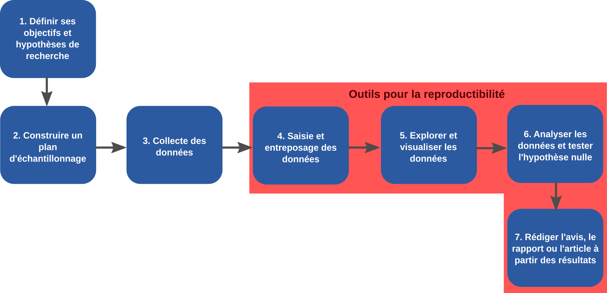

# Séance 5

- Ces diapositives sont disponibles en [version web](https://econumuds.github.io/BIO500/cours5/) et en [PDF](./assets/pdf/S5-BIO500.pdf).
- L'ensemble du matériel de cours est disponible sur la page du portail [moodle](https://www.usherbrooke.ca/moodle2-cours/course/view.php?id=12189).
- Vous trouverez du matériel supplémentaire dans le [cours](http://kevincazelles.fr/talks/assets/QCBSGraphsR/Rgraphics.html#4) de [Kevin Cazelles](http://kevincazelles.fr/) et [Nicolas Casajus](http://www.cen.ulaval.ca/membre.aspx?id=3945098&membre=ncasajus) lors d'un atelier de communication visuelle du CSBQ.
- Certaines diapositives sont également extraites de la présentation de [David Taylor](http://dtdata.io/prm/intro_dataviz_csbq.pdf)

---.transition

# Le makefile

---

# Les étapes du travail d'un biologiste

<div style='text-align:center;'>
</img>
</div>

---

# Qu'est-ce que le makefile ?

**Définition**: le makefile est un fichier qui contient un ensemble de directives qui sont exécutées par l'ordinateur. Les instructions et leurs dépendances sont spécifiées dans le makefile.

---

# À quoi il sert ?

Le makefile est un logiciel permettant d'exécuter une série d'instructions, lorsqu'elles sont nécessaires. Les dépendances sont vérifiées et seulement les instructions qui requièrent une mise à jour sont exécutées.

Nous utiliserons le makefile pour assurer la reproductibilité de la démarche entreprise dans le cours. L'ensemble des instructions nécessaires à la production du rapport, de la création de la base de données à la compilation du document écrit, seront contenues dans le makefile.

---

# Objectifs de la leçon

- Reconnaitre les parties importantes d'un makefile, les règles, les cibles, les dépendances et les actions
- Écrire un makefile simple
- Exécuter un makefile à partir du terminal
- Préparer le makefile pour le projet de session

---

# Anatomie du makefile

```bash
<target>: <dependencies...>
  <commands>
```

---

# `target`

La cible est habituellement le nom d'un fichier généré par la commande.

---

# `dependencies...`

Une dépendance (également appelée _"prerequesite"_) est un fichier qui est utilisé pour créer un autre fichier appelée cible (`"target"`).

La _target_ peut contenir plusieurs dépendances.

Il est néanmoins possible d'avoir un fichier cible qui ne requiert pas de dépendances.

---

# `commands`

La commande est l'action à réaliser. Dans notre cas, nous utiliserons une commande pour exécuter un script R comme :

```bash
Rscript script.R
```

Nous verrons plus tard dans la session le langage de mise en forme LaTeX. Dans ce cas, la commande serait:

```bash
pdflatex manuscrit.tex
```

---

# Un exemple

```bash

# Première étape, on génère des données
data.txt :
  Rscript script1.R

# Seconde étape, on fait un modèle statistique à partir
# de ces données
model.Rdata: data.txt
  Rscript script2.R

# Troisième étape, on produit une figure à partir du modèle
# et des données
figure.pdf: model.Rdata data.txt
  Rscript script3.R

```

Ce fichier s'appelle makefile (sans extension) et il est exécuté en inscrivant simplement la commande `make nomDeLaCible`.

---

# Étape par étape

`Rscript` est un programme permettant d'exécuter du code R sans passer par la console R. On peut utiliser le terminal pour appeler le programme `Rscript` et lui donner comme argument un script R: `Rscript script1.R`

Les commandes sont espacées par une *tabulation* ou 8 espaces. Assurez vous que votre tabulation corresponds bien à 8 espaces.

Ensemble, la cible, les dépendances et les actions constituent une règle. Cet exemple a donc 3 règles.

---

# Comment créer un premier makefile

- Ouvrez un nouveau document au moyen de atom
- Copiez les commandes de l'exemple
- Sauvergardez le fichier, avec pour nom makefile
- Assurez vous de trouver les 3 scripts dans le dépôt git

---

# Script 1


```r
  set.seed(1)
  X <- runif(25, 0, 100)
  Y <- rnorm(25, mean = X*2 + 10, sd = 25)
  write.table(cbind(X,Y), file = "data.txt")
```

---

#  Script 2


```r
data <- read.table("data.txt", header = T)
model <- lm(data$Y ~ data$X)
save(model, file = "model.Rdata")
```

---

#  Script 3


```r
data <- read.table("data.txt", header = T)
load("model.Rdata")

pdf("resultat.pdf", 7 5)
plot(data$X, data$Y, xlab = "X", ylab = "Y")
abline(model)
dev.off()
```

---

#  Exécuter un makefile

Il n'est pas nécessaire de nommer le makefile *makefile*. On peut toujours spécifier un autre nom et l'exécuter ainsi :


```bash
make -f MonMakefile
```

---

# Les dépendances

- Exécutez le makefile une première fois.
- Ensuite, modifiez une valeur dans le fichier data.txt.
- Exécutez le makefile à nouveau pour voir ce qui se produit.

---

# Le makefile comme outil de reproductiblité

La rédaction du makefile nous force à spécifier les différentes étapes de notre démarche, à identifier les entrées et les sorties de différentes instructions à l'ordinateur. De cette façon, le makefile permet de documenter rigoureusement la démarche réalisée.

Il s'agit aussi d'un aide-mémoire qui permet de se rappeler des étapes.

---

# Exercice

Conceptualisez les différentes étapes de la démarche du travail de session jusqu'à présent.

Identifiez les entrées, les sorties et les actions.

---

# Les messages de make

Il est possible de forcer make à réaliser certaines actions. Par exemple, si on exécute à nouveau make

```bash
make
```

On obtient le message :

```bash
make : 'data.txt' is up to date
```

---

# Les messages de make

On peut forcer une étape, par exemple le calcul du modèle, ainsi :

```bash
make model.Rdata
```

Dans ce cas-ci, on obtient le message :

```bash
make: Nothing to be done for 'script2.R'
```

---

# Les messages de make

*up to date* signifie que le makefile a une règle dont la cible est le nom du fichier et qu'il est à jour

*Nothing to be done* indique que le fichier existe, mais que

- il n'y a pas de règle pour ce fichier
- il y a une règle, mais aucune action à réaliser

---

# Nettoyage du dépôt en fin de script

Il arrive que certains scripts génèrent des fichiers temporaires qui ne doivent pas être conservés inutilement.

Dans l'exemple précédent, on pourrait vouloir éliminer le modèle, qui n'est finalement utilisé que pour réaliser la figure. On peut ainsi inscrire à la fin du makefile :

```bash
clean :
  rm -f model.Rdata
```

`rm -f model.Rdata` va éliminer à la toute fin l'objet R contenant le modèle intitulé `model.Rdata`. Notez ici qu'il n'y a pas de dépendance, ce qui indique que cette opération sera systématiquement exécutée.

---

# Dépendances

L'ordre de présentation des dépendances est arbitraire. Elles ne seront pas nécessairement vérifiées dans l'ordre présenté.

Un truc est de schématiser les dépendances (des noeuds) et les actions (des flèches)

---

# Autres ressources disponibles en ligne :

https://swcarpentry.github.io/make-novice/02-makefiles/

https://gist.github.com/isaacs/62a2d1825d04437c6f08

http://gl.developpez.com/tutoriel/outil/makefile/

http://icps.u-strasbg.fr/people/loechner/public_html/enseignement/GL/make.pdf

---

# Lectures

Milcu, A. et al. 2018. Genotypic variability enhances the reproducibility of an ecological study. Nature Ecology and Evolution 2 : 279-287.

