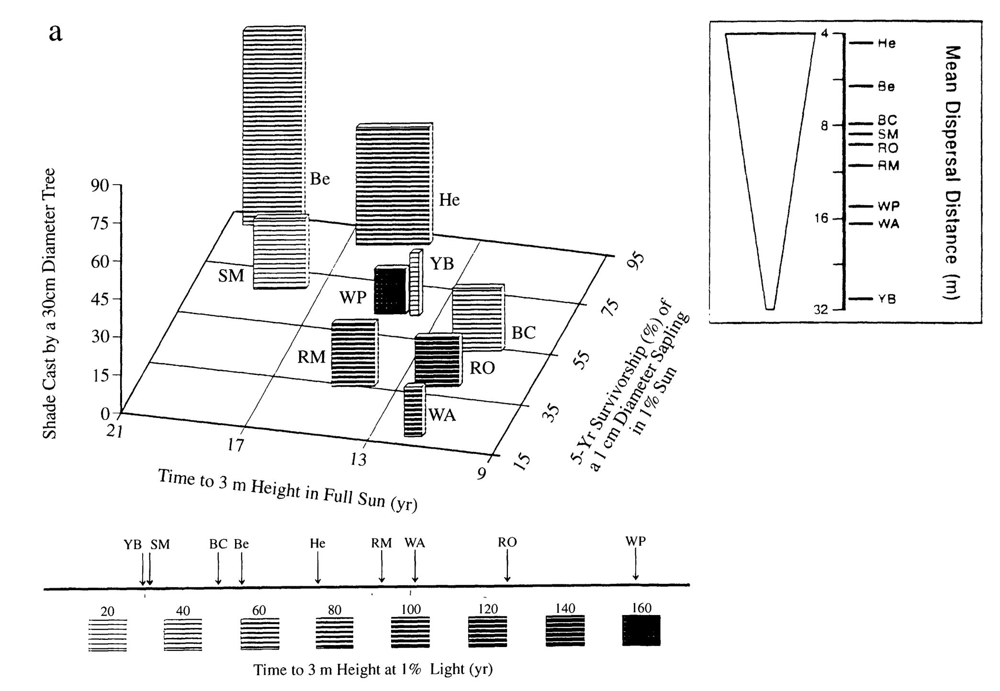
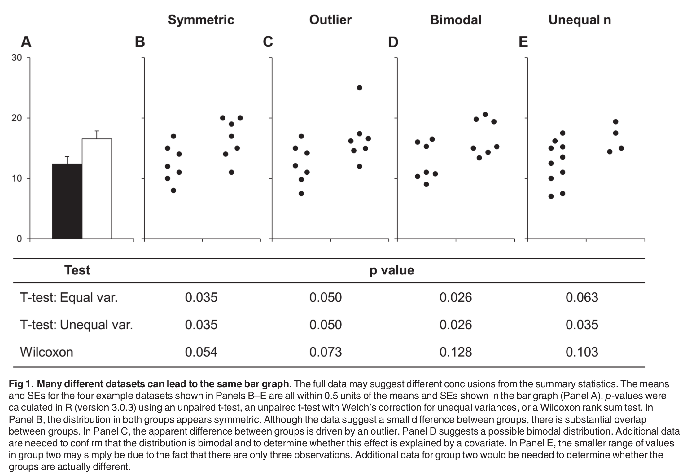
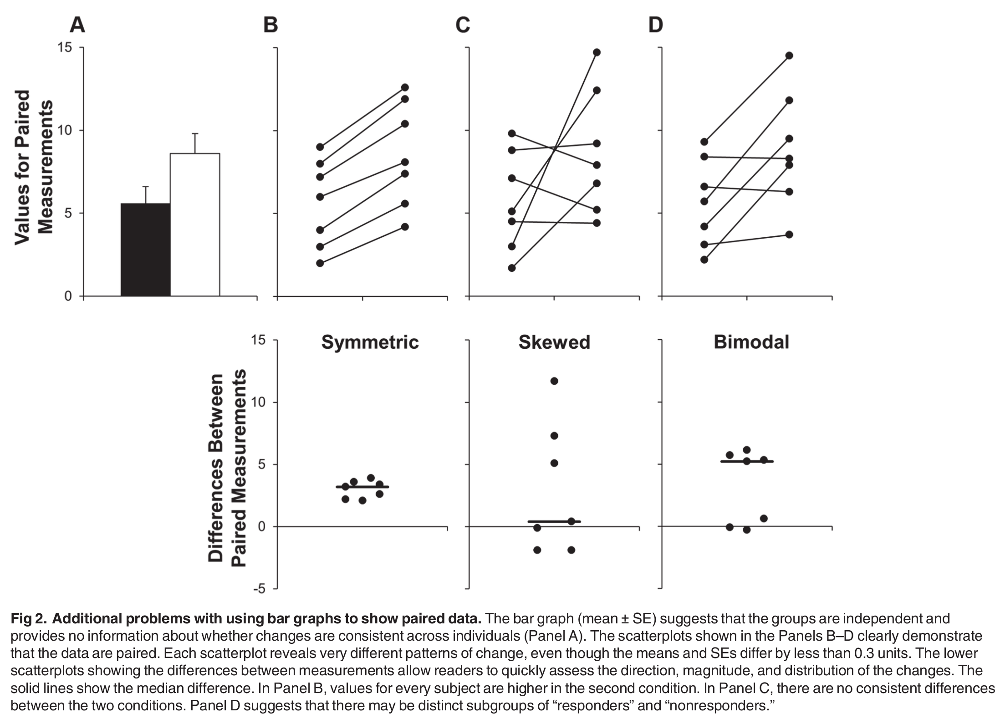

# Séance 5

- Ces diapositives sont disponibles en [version web](https://econumuds.github.io/BIO500/cours5/) et en [PDF](./assets/pdf/S5-BIO500.pdf).
- L'ensemble du matériel de cours est disponible sur la page du portail [moodle](https://www.usherbrooke.ca/moodle2-cours/course/view.php?id=12189).
- Vous trouverez du matériel supplémentaire dans le [cours](http://kevincazelles.fr/talks/assets/QCBSGraphsR/Rgraphics.html#4) de [Kevin Cazelles](http://kevincazelles.fr/) et [Nicolas Casajus](http://www.cen.ulaval.ca/membre.aspx?id=3945098&membre=ncasajus) lors d'un atelier de communication visuelle du CSBQ.
- Certaines diapositives sont également extraites de la présentation de [David Taylor](http://dtdata.io/prm/intro_dataviz_csbq.pdf)

--- .transition

# Qu'est-ce qui fait une bonne figure ?

---

# Trop d'information

<div style='text-align:center;margin-top:10px;'>
  </img>
</div>

---

# Non respect des normes graphiques

<div style='text-align:center;margin-top:10px;'>
  </img>
</div>

---

# Abus de symboles et de couleurs

<div style='text-align:center;margin-top:10px;'>
  </img>
</div>


---.transition

# L'art graphique

---

# L'importance des graphiques

<!-- La représentation visuelle de nos données est un **outil de persuasion** permettant d'illustrer nos résultats auprès du public et de nos pairs. Cet outil permet également de mieux comprendre les relations à l'intérieur de nos données par la visualisation. -->

## La représentation visuelle des données permet de:

- Synthétiser l'information.
- Communiquer plus efficacement qu'un tableau.
- Explorer nos données par la visualisation.
- Présenter nos résultats et convaincre.

---

# Explorer nos données par la visualisation

## Voici un exemple illustrant l'importance de visualiser ses données:

<div style='text-align:center;margin-top:10px;'>
  </img>
</div>

---

# Explorer nos données par la visualisation

## Voici un exemple illustrant l'importance de visualiser ses données:

<div style='text-align:center;margin-top:10px;'>
  </img>
</div>

--- &twocol

# Communiquer par les graphiques

*** =left

- Les graphiques sont généralement **plus efficaces à communiquer** un message/un résultat qu'un tableau.

- **Problème:** La représentation graphique peut parfois nous conduire à une **fausse interprétation**. L'idée est de transmettre une idée sans biaiser le lecteur.

*** =right

<div style='text-align:center;margin-top:10px;'>
  </img>
</div>

<!-- - Problème: ratio 8/3 -->

--- &twocol

# Communiquer par les graphiques

<div style='text-align:center;margin-top:10px;'>
  </img>
</div>


<!-- - Problème: ratio 8/3 -->


---

# Communiquer par les graphiques

<div style='text-align:center;margin-top:10px;'>
  </img>
</div>

---

# Communiquer par les graphiques

<div style='text-align:center;margin-top:10px;'>
  </img>
</div>


---.transition

# Règles et composantes graphiques

--- &twocol

# Les composantes graphiques

*** =left

- Les axes et échelles.
- Le titre de la figure.
- La légende
- Le [type de représentation des données](http://www.datavizcatalogue.com/).


*** =right

<div style='text-align:center;margin-top:10px;'>
  </img>
</div>

--- &twocol

# Les règles graphiques

*** =left

- Une figure doit renvoyer un seul message/résultat.
- Chaque élément d'une figure doit **aider à comprendre** ce message.
- **Choisir le bon type de représentation** permet de mettre en valeur plus facilement ce qui doit être illustré.
- **Attention aux normes graphiques**: Choix des couleurs, taille des caractères, épaisseur de la ligne, disposition des marges, cadrage etc.

*** =right

<div style='text-align:center;margin-top:10px;'>
  </img>
</div>

---

# Quelques conseils

- Ne pas **JAMAIS** utiliser de diagramme en pointe de tarte

<div style='text-align:center;margin-top:10px;'>
  </img>
</div>

--- &twocol

# Quelques conseils

*** =left

- Éviter les figures 3D.
- Limiter le nombre de dimensions (3 ou 4 dimensions max).
- La multi-dimensionnalité peut être gérée en:
  - Modifiant la forme et la la taille des points
  - Ajoutant des couleurs

*** =right

<div style='text-align:center;margin-top:10px;'>
  </img>
</div>


--- &twocol

# Quelques conseils

- Limiter le ratio encre/données afin de faciliter la lecture.

<div style='text-align:center;margin-top:10px;'>
  </img>
</div>


--- .transition

# Types de figures

---

# Diagramme de dispersion (Scatter plot)

```{r, echo=FALSE,out.height = '550px', dpi=300, fig.align="center"}
arbres  <- read.csv2("donnees/arbres.csv")
densite <- table(arbres[,c(3,5)])
elevation <- as.numeric(row.names(densite))
plot(elevation, densite[,1], pch = 19, xlab = "Elevation", ylab = "Densité")
points(elevation, densite[,3])
```

---

# Diagrammes à bâtons (Bar plot)

```{r, echo=FALSE,out.height = '550px', dpi=300, fig.align="center"}
arbres  <- read.csv2("donnees/arbres.csv")
n_tot <- table(arbres$esp)
barplot(n_tot)
```

---

# Histogrammes

```{r, echo=FALSE,out.height = '550px', dpi=300, fig.align="center"}
hist(densite[,3])
```

--- &twocol

# Représentation 3-D

```{r, echo=FALSE,out.height = '550px', dpi=300, fig.align="center"}
x <- 10*(1:nrow(volcano))
y <- 10*(1:ncol(volcano))
image(x, y, volcano, col = terrain.colors(100), axes = FALSE)
axis(1, at = seq(100, 800, by = 100))
axis(2, at = seq(100, 600, by = 100))
box()
title(main = "Maunga Whau Volcano", font.main = 4)
```

---

# Lignes de contour

```{r, echo=FALSE,out.height = '550px', dpi=300, fig.align="center"}
x <- 10*(1:nrow(volcano))
y <- 10*(1:ncol(volcano))
image(x, y, volcano, col = terrain.colors(100), axes = FALSE)
axis(1, at = seq(100, 800, by = 100))
axis(2, at = seq(100, 600, by = 100))
box()
title(main = "Maunga Whau Volcano", font.main = 4)
contour(x, y, volcano, levels = seq(90, 200, by = 5),
add = TRUE, col = "black")
```

--- .transition

# Faire une figure étape par étape avec R

---

# Prépares les données adéquatement

- Habituellement un `data.frame` ou `une matrice`
- Une observation par ligne (format long)

--- &twocol

# Ouvrir une fenêtre graphique

*** =left
```{r, eval = FALSE}
dev.new(width = 10, height = 7)
```

*** =right
```{r, echo=FALSE,out.width = '100%', dpi=300, fig.align="center"}
dev.new(width = 10, height = 7)
```

--- &twocol

# Fixer certains paramètres

```{r, eval = FALSE}
# Fixer la largeur et la hauteur des marges
par(mar = c(5,6,2,1))

# Fixer le nombre de figures en colonnes et rangées
par(mfrow = c(1,1))
```

*** =right
```{r, echo=FALSE,out.width = '100%', dpi=300, fig.align="center"}
par(mar = c(5,6,2,1))
```

--- &twocol

# Démarrer une figure avec `plot()`

*** =left
```{r, eval = FALSE}
arbres <- read.csv2("donnees/arbres.csv")
densite <- table(arbres[,c(3,5)])
elevation <- as.numeric(row.names(densite))
plot(elevation, densite[,1], axes = FALSE,
      xlab = "Élévation", ylab = "Densité")
```

*** =right
```{r, echo=FALSE,out.width = '100%', dpi=300, fig.align="center"}
arbres <- read.csv2("donnees/arbres.csv")
densite <- table(arbres[,c(3,5)])
elevation <- as.numeric(row.names(densite))
plot(elevation, densite[,1], axes = FALSE, xlab = "Élévation", ylab = "Densité")
```

--- &twocol

# Échelles logarithmiques

*** =left
```{r, eval = FALSE}
plot(elevation, densite[,1], axes = FALSE,
      xlab = "Élévation", ylab = "Densité",
      log = "xy")
```

*** =right
```{r, echo=FALSE,out.width = '100%', dpi=300, fig.align="center", warning=FALSE, message=FALSE}
plot(elevation, densite[,1], axes = FALSE, xlab = "Élévation", ylab = "Densité", log = "xy")
```

--- &twocol

# Ajuster les tailles de caractères

## Arguments `cex`, `cex.lab` et `cex.axis`

*** =left
```{r, eval = FALSE}
plot(elevation, densite[,1], axes = FALSE,
      xlab = "Élévation", ylab = "Densité",
      cex.lab = 1.5, cex.axis = 1.25, cex = 1.5)
```

*** =right
```{r, echo=FALSE,out.width = '100%', dpi=300, fig.align="center"}
plot(elevation, densite[,1], axes = FALSE, xlab = "Élévation", ylab = "Densité", cex.lab = 1.5, cex.axis = 1.25, cex = 1.5)
```

--- &twocol

# Modifier les axes

*** =left
```{r, eval = FALSE}
axis(1, seq(0,1000,100))
axis(2)
```

*** =right
```{r, echo=FALSE,out.width = '100%', dpi=300, fig.align="center"}
plot(elevation, densite[,1], axes = FALSE,
      xlab = "Élévation", ylab = "Densité",
      cex.lab = 1.5, cex.axis = 1.25, cex = 1.5)
axis(1, seq(0,1000,100))
axis(2)
```

--- &twocolw w1:55% w2:45%

# Ajouter un titre

*** =left
```{r, eval = FALSE}
title(main = "Densité au long du gradient d'élévation")
```

*** =right
```{r, echo=FALSE,out.width = '100%', dpi=300, fig.align="center"}
plot(elevation, densite[,1], axes = FALSE,
      xlab = "Élévation", ylab = "Densité",
      cex.lab = 1.5, cex.axis = 1.25, cex = 1.5)
axis(1, seq(0,1000,100))
axis(2)
title(main = "Densité au long du gradient d'élévation")
```

--- &twocol

# Superposer des points d'une autre série de données

*** =left
```{r, eval = FALSE}
points(elevation, densite[,3], pch = 19, cex = 1.5)
```

*** =right
```{r, echo=FALSE,out.width = '100%', dpi=300, fig.align="center"}
plot(elevation, densite[,1], axes = FALSE,
      xlab = "Élévation", ylab = "Densité",
      cex.lab = 1.5, cex.axis = 1.25, cex = 1.5)
axis(1, seq(0,1000,100))
axis(2)
title(main = "Densité au long du gradient d'élévation")
points(elevation, densite[,3], pch = 19, cex = 1.5)
```

--- &twocol

# Superposer des lignes

*** =left
```{r, eval = FALSE}
lines(elevation, densite[,1],lty = 1, lwd = 1.5)
lines(elevation, densite[,3], lty  = 3, lwd = 1.5)
```

*** =right
```{r, echo=FALSE,out.width = '100%', dpi=300, fig.align="center"}
plot(elevation, densite[,1], axes = FALSE,
      xlab = "Élévation", ylab = "Densité",
      cex.lab = 1.5, cex.axis = 1.25, cex = 1.5)
axis(1, seq(0,1000,100))
axis(2)
title(main = "Densité au long du gradient d'élévation")
points(elevation, densite[,3], pch = 19, cex = 1.5)
lines(elevation, densite[,1], lty = 1, lwd = 1.5)
lines(elevation, densite[,3], lty = 3, lwd = 1.5)
```

--- &twocolw w1:40% w2:60%

# Ajouter une ligne de tendance

*** =left
```{r, eval = FALSE}
model = lm(densite[,3]~elevation)
summary(model)
abline(model, col = "darkred")
```

*** =right
```{r, echo=FALSE,out.width = '100%', dpi=300, fig.align="center"}
model = lm(densite[,3]~elevation)
summary(model)
```

--- &twocol

# Ajouter une ligne de tendance

*** =left
```{r, eval = FALSE}
model = lm(densite[,3]~elevation)
abline(model, col = "darkred")
```

*** =right
```{r, echo=FALSE,out.width = '100%', dpi=300, fig.align="center"}
plot(elevation, densite[,1], axes = FALSE,
      xlab = "Élévation", ylab = "Densité",
      cex.lab = 1.5, cex.axis = 1.25, cex = 1.5)
axis(1, seq(0,1000,100))
axis(2)
title(main = "Densité au long du gradient d'élévation")
points(elevation, densite[,3], pch = 19, cex = 1.5)
lines(elevation, densite[,1], lty = 1, lwd = 1.5)
lines(elevation, densite[,3], lty = 3, lwd = 1.5)
model = lm(densite[,3]~elevation)
abline(model, col = "darkred")
```


--- &twocol

# Ajouter une légende

*** =left
```{r, eval = FALSE}
legend("top", bty = "n", pch = c(19,1), lty = 1,
    legend = c("Érable à sucre", "Sapin baumier"),
    cex = 1.5)
```

*** =right
```{r, echo=FALSE,out.width = '100%', dpi=300, fig.align="center"}
plot(elevation, densite[,1], axes = FALSE,
      xlab = "Élévation", ylab = "Densité",
      cex.lab = 1.5, cex.axis = 1.25, cex = 1.5)
axis(1, seq(0,1000,100))
axis(2)
title(main = "Densité au long du gradient d'élévation")
points(elevation, densite[,3], pch = 19, cex = 1.5)
lines(elevation, densite[,1], lty = 1, lwd = 1.5)
lines(elevation, densite[,3], lty = 3, lwd = 1.5)
legend("top", bty = "n", pch = c(19,1), lty = 1, legend = c("Érable à sucre", "Sapin baumier"), cex = 1.5)
```

--- &twocol

# Ajouter du texte

*** =left
```{r, eval = FALSE}
r2 <- round(summary(model)$r.squared, 2)
text(x = 850, y = 25, paste("R2=",r2),
    cex = 21.5)

```

*** =right
```{r, echo=FALSE,out.width = '100%', dpi=300, fig.align="center"}
plot(elevation, densite[,1], axes = FALSE,
      xlab = "Élévation", ylab = "Densité",
      cex.lab = 1.5, cex.axis = 1.25, cex = 1.5)
axis(1, seq(0,1000,100))
axis(2)
title(main = "Densité au long du gradient d'élévation")
points(elevation, densite[,3], pch = 19, cex = 1.5)
lines(elevation, densite[,1], lty = 1, lwd = 1.5)
lines(elevation, densite[,3], lty = 3, lwd = 1.5)
legend("top", bty = "n", pch = c(19,1), lty = 1, legend = c("Érable à sucre", "Sapin baumier"), cex = 1.5)
r2 <- round(summary(model)$r.squared, 2)
text(x = 875, y = 25, paste("R2=",r2), cex = 1.5)
```

---

# Pour plus d'information

- `?plot`
- `?par`
- `?axis`
- `?mtext`


--- .transition

# Créer d'autres types de figure

--- &twocol

# Diagramme de dispersion (Scatter plot)

*** =left

```{r, eval = FALSE}
arbres  <- read.csv2("donnees/arbres.csv")
densite <- table(arbres[,c(3,5)])
elevation <- as.numeric(row.names(densite))
plot(elevation, densite[,1], pch = 19,
  xlab = "Elevation", ylab = "Densité")
points(elevation, densite[,3])
```

*** =right

```{r, echo=FALSE,out.height = '500px', dpi=300, fig.align="center"}
arbres  <- read.csv2("donnees/arbres.csv")
densite <- table(arbres[,c(3,5)])
elevation <- as.numeric(row.names(densite))
plot(elevation, densite[,1], pch = 19,
  xlab = "Elevation", ylab = "Densité")
points(elevation, densite[,3])
```

--- &twocol

# Diagrammes à bâtons (Bar plot)

*** =left
```{r, eval = FALSE}
arbres  <- read.csv2("donnees/arbres.csv")
n_tot <- table(arbres$esp)
barplot(n_tot)
```

*** =right
```{r, echo=FALSE,out.height = '500px', dpi=300, fig.align="center"}
arbres  <- read.csv2("donnees/arbres.csv")
n_tot <- table(arbres$esp)
barplot(n_tot)
```

--- &twocol

# Histogrammes

*** =left

```{r, eval = FALSE}
hist(densite[,3])
```

*** =right
```{r, echo=FALSE,out.height = '500px', dpi=300, fig.align="center"}
hist(densite[,3])
```

--- &twocol

# Représentation 3-D

*** =left

```{r, eval = FALSE}
x <- 10*(1:nrow(volcano))
y <- 10*(1:ncol(volcano))

image(x, y, volcano,
  col = terrain.colors(100), axes = FALSE)

axis(1, at = seq(100, 800, by = 100))
axis(2, at = seq(100, 600, by = 100))
box()

title(main = "Maunga Whau Volcano", font.main = 4)
```

*** =right

```{r, echo=FALSE,out.height = '500px', dpi=300, fig.align="center"}
x <- 10*(1:nrow(volcano))
y <- 10*(1:ncol(volcano))

image(x, y, volcano,
  col = terrain.colors(100), axes = FALSE)

axis(1, at = seq(100, 800, by = 100))
axis(2, at = seq(100, 600, by = 100))
box()

title(main = "Maunga Whau Volcano", font.main = 4)
```

--- &twocol

# Lignes de contour

*** =left
```{r, eval = FALSE}
x <- 10*(1:nrow(volcano))
y <- 10*(1:ncol(volcano))

image(x, y, volcano,
  col = terrain.colors(100), axes = FALSE)

axis(1, at = seq(100, 800, by = 100))
axis(2, at = seq(100, 600, by = 100))
box()

title(main = "Maunga Whau Volcano", font.main = 4)

contour(x, y, volcano,
  levels = seq(90, 200, by = 5),
  add = TRUE, col = "black")
```

*** =right

```{r, echo=FALSE,out.height = '500px', dpi=300, fig.align="center"}
x <- 10*(1:nrow(volcano))
y <- 10*(1:ncol(volcano))

image(x, y, volcano,
  col = terrain.colors(100), axes = FALSE)

axis(1, at = seq(100, 800, by = 100))
axis(2, at = seq(100, 600, by = 100))
box()

title(main = "Maunga Whau Volcano", font.main = 4)

contour(x, y, volcano,
  levels = seq(90, 200, by = 5),
  add = TRUE, col = "black")
```

---

# Enregistrer une figure


```{r, eval=FALSE}
dev.copy2pdf(file = "test.pdf")
dev.copy2png(file = "test.png")
dev.copy2eps(file = "test.eps")
```

--- .transition

# Exercice: faire une représentation visuelle de la distribution de degrés

--- .transition

# La visualisation de réseau avec igraph

---

# Installation

```{r}
install.packages("igraph")
library(igraph)
```

---

# Transformer une matrice d'adjacence en objet `igraph`

```{r}
library(igraph)
C <- 0.1
S <- 15
L <- matrix(0, nr = S, nc = S)
L[runif(S*S) < C] = 1
sum(L)
g <- graph.adjacency(L)
```

--- &twocol

# Utiliser la fonction `plot` pour faire une représentation d'un réseau

*** =left
```{r, eval = FALSE}
plot(g)
```

*** =right
```{r, echo=FALSE,out.width = '100%', dpi=300, fig.align="center"}
plot(g)
```

--- &twocol

# Version moins moche dans les paramètres par défaut

*** =left
```{r, eval = FALSE}
plot(g, vertex.label=NA, edge.arrow.mode = 0, 
    vertex.frame.color = NA)
```

*** =right
```{r, echo=FALSE,out.width = '100%', dpi=300, fig.align="center"}
plot(g, vertex.label=NA, edge.arrow.mode = 0, vertex.frame.color = NA)
```


--- .transition

# Exercice : Compiler la matrice d'adjacence et faire une première représentation du réseau avec `igraph`

--- &twocol

# Changer la couleur des noeuds

*** =left
```{r, eval = FALSE}
# Calculer le degré
deg <- apply(L, 2, sum) + apply(L, 1, sum)

# Le rang pour chaque noeud
rk <- rank(deg)

# Faire un code de couleur
col.vec <- heat.colors(S)

# Attribuer aux noeuds la couleur
V(g)$color = col.vec[rk]

# Refaire la figure
plot(g, vertex.label=NA, edge.arrow.mode = 0, 
    vertex.frame.color = NA)
```

*** =right
```{r, echo=FALSE,out.width = '100%', dpi=300, fig.align="center"}
# Calculer le degré
deg <- apply(L, 2, sum) + apply(L, 1, sum)

# Le rang pour chaque noeud
rk <- rank(deg)

# Faire un code de couleur
col.vec <- heat.colors(S)

# Attribuer aux noeuds la couleur
V(g)$color = col.vec[rk]

# Refaire la figure
plot(g, vertex.label=NA, edge.arrow.mode = 0, vertex.frame.color = NA)
```

--- &twocol

# Changer la taille des noeuds

*** =left
```{r, eval = FALSE}
# Faire un code de ctaille
col.vec <- seq(10, 25, length.out = S)

# Attribuer aux noeuds la couleur
V(g)$size = col.vec[rk]

# Refaire la figure
plot(g, vertex.label=NA, edge.arrow.mode = 0, 
    vertex.frame.color = NA)
```

*** =right
```{r, echo=FALSE,out.width = '100%', dpi=300, fig.align="center"}
# Faire un code de ctaille
col.vec <- seq(10, 25, length.out = S)

# Attribuer aux noeuds la couleur
V(g)$size = col.vec[rk]

# Refaire la figure
plot(g, vertex.label=NA, edge.arrow.mode = 0, vertex.frame.color = NA)
```

--- &twocol

# Changer la disposition des noeuds

*** =left
```{r, eval = FALSE}
plot(g, vertex.label=NA, edge.arrow.mode = 0, 
    vertex.frame.color = NA, layout = layout.reingold.tilford(g))
```

*** =right
```{r, echo=FALSE,out.width = '100%', dpi=300, fig.align="center"}
plot(g, vertex.label=NA, edge.arrow.mode = 0, vertex.frame.color = NA, layout = layout.circle(g))
```

--- &twocol

# Changer la disposition des noeuds

*** =left
```{r, eval = FALSE}
plot(g, vertex.label=NA, edge.arrow.mode = 0, 
    vertex.frame.color = NA, layout = layout.circle(g))
```

*** =right
```{r, echo=FALSE,out.width = '100%', dpi=300, fig.align="center"}
plot(g, vertex.label=NA, edge.arrow.mode = 0, vertex.frame.color = NA, layout = layout.circle(g))
```

--- &twocol

# Changer la disposition des noeuds

*** =left
```{r, eval = FALSE}
plot(g, vertex.label=NA, edge.arrow.mode = 0, 
    vertex.frame.color = NA, layout = layout.kamada.kawai(g))
```

*** =right
```{r, echo=FALSE,out.width = '100%', dpi=300, fig.align="center"}
plot(g, vertex.label=NA, edge.arrow.mode = 0, vertex.frame.color = NA, layout = layout.kamada.kawai(g))
```

---

# Calcul de propriétés

## La modularité

```{r}
wtc = walktrap.community(g)
modularity(wtc)
```

---

# Calcul de propriétés

## La distance entre les noeuds

```{r}
distances(g)
```

---

# Calcul de propriétés

## La centralité des noeuds

```{r}
eigen_centrality(g)$vector
```

--- .transition

# Exporter des tableaux

---

# Exporter des tableaux

Exporter des tableaux depuis R vers son document de travail peut être difficile.

## La procédure habituelle serait:

1. Enregistrer le `data.frame` dans un fichier avec la fonction `write.table()` ou `write.csv()`
2. Éditer et faire la mise en page dans MS Excel ou MS Word.

Le package `knitr` permet de faciliter cette procédure en exportant le `data.frame` directement dans son document de travail LaTeX.

---

# Exporter des tableaux

Prenons le jeu de données `iris` directement disponible sous R.

```{r}
data(iris)
class(iris)
head(iris)
```

---

# Exporter des tableaux

Je souhaite maintenant exporter ce `data.frame` en LateX (un format que nous verrons lors de la prochaine séance):

```{r}
library(knitr)
iris_tex <- kable(iris,format="latex")
writeLines(iris_tex, con = "./donnees/iris.tex", sep = "\n", useBytes = FALSE)
```

--- .transition

# Travail # 2

---

# Consignes

- Identifier clairement vos questions de recherche
- Illustrer le réseau de collaborations
- Compléter votre analyse au moyen de 3 figures et 1 tableau

---

# Évaluation

- Clareté des questions et adéquation des figures et du tableau
- Efficacité de la présentation
- Respect de normes graphiques
- Originalité

---

# Lectures

Sandve et al. 2013. Ten Simple Rules for Reproducible Computational
Research. PLoS Computational Biology. 9: e1003285

Silberzahn et Uhlman. 2015. Many hands make tight work. Nature 526 : 189-191.

Barba. 2016. The hard road to reproducibility. Science 354: 142.
