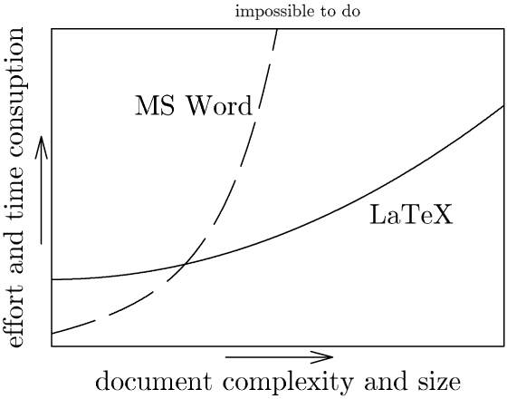
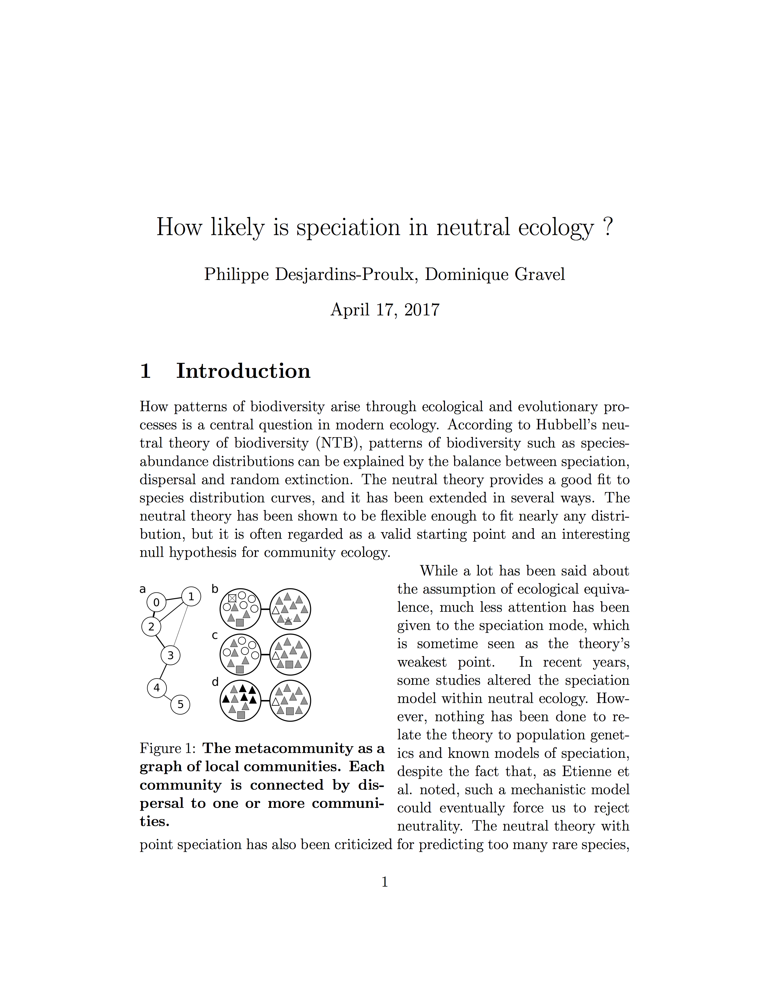
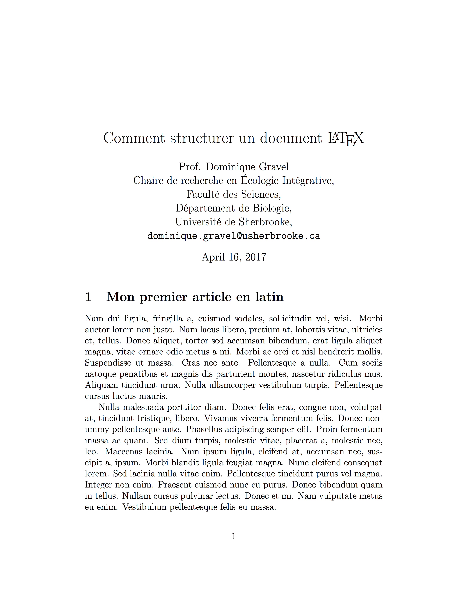
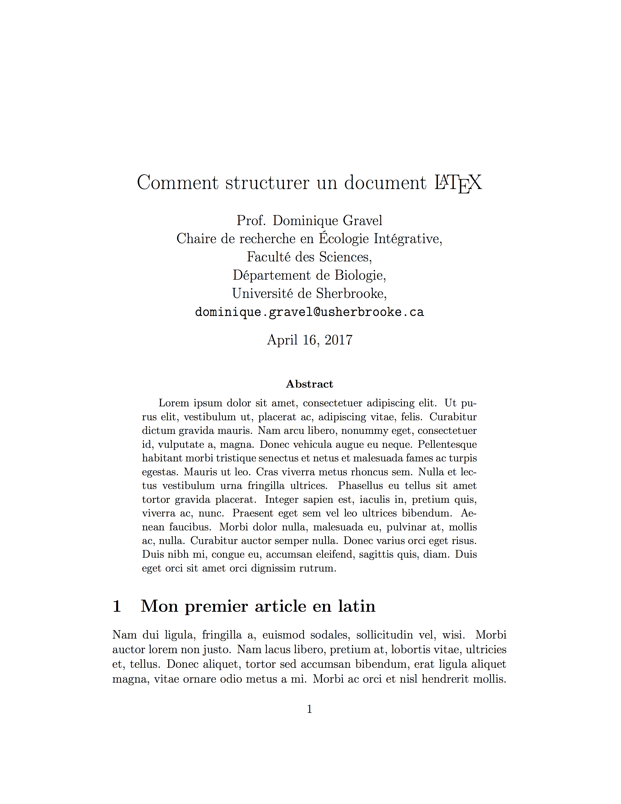
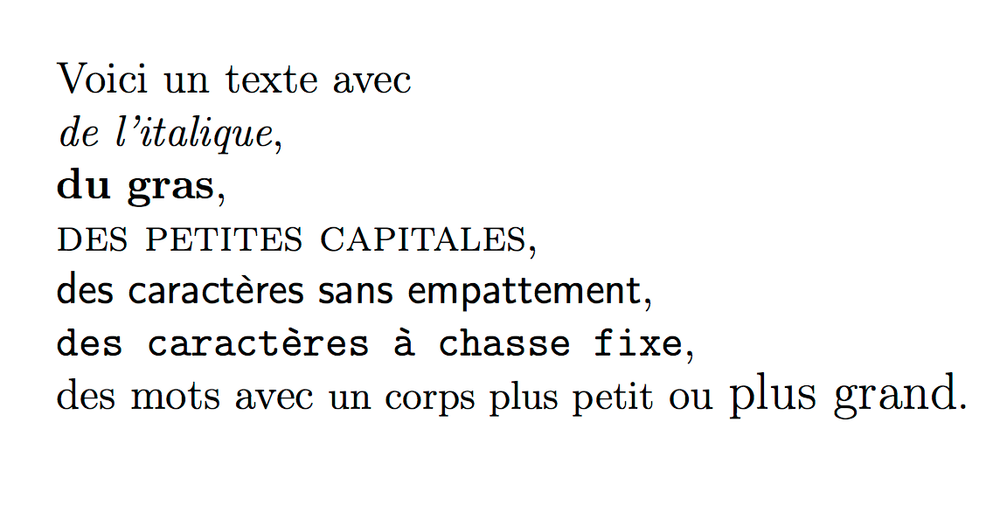
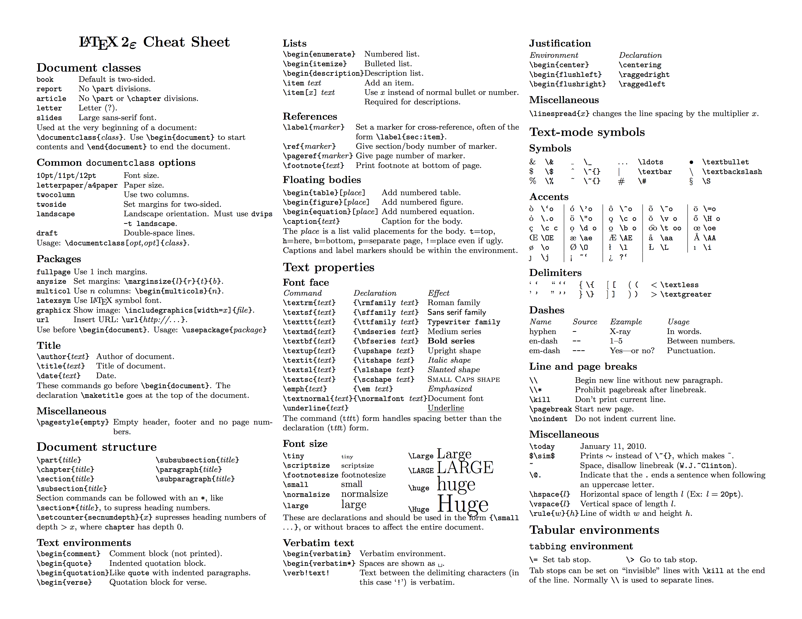

# Séance 6

- Ces diapositives sont disponibles en [version web](https://econumuds.github.io/BIO500/cours6/) et en [PDF](./assets/pdf/S6-BIO500.pdf).
- L'ensemble du matériel de cours est disponible sur la page du portail [moodle](https://www.usherbrooke.ca/moodle2-cours/course/view.php?id=12189).

--- .transition

# Introduction

---

# Où sommes-nous?

<div style='text-align:center;'>
</img>
</div>


---

# Pourquoi $\LaTeX$?

<div style='text-align:center;'>
</img>
</div>

---

# Qu'est ce que $\LaTeX$?

- Language introduit en 1983 par l'informaticien Leslie Lamport.
- C'est un language à balise.
- Concu spécifiquement pour l'écriture de rapports scientifiques.
- L'utilisation de $\LaTeX$ est une norme chez les mathématiciens et les physiciens.

---

# Avantages de $\LaTeX$?

1. Qualité de la mise en page
  - Mise en page automatique
  - Table des matières
  - Gestion des références
2. Performance pour l'intégration de matériel (e.g. figures, tableaux)
3. Stabilité
4. Inter-opérabilité
5. Reproductibilité (tout est scripté)

---&twocol

# La structure d'un document $\LaTeX$

*** =left

```tex
\documentclass[12pt]{article}

\usepackage[T1]{fontenc}
\usepackage[utf8]{inputenc}

\title{Un document minimalist}
\author{Dominique Gravel}

\begin{document}

Je peux écrire du texte ici.

\end{document}
```

*** =right


1. `\documentclass` détermine la classe du document.
2. `\usepackage`: Comme R, $\LaTeX$ permet l'utilisation de librairies. `inputec` et `fontec` sont des librairies permettant de gérer *l'encoding* du document (caractères avec accent etc.). Les `[]` déterminent les options.
4. On ouvre l'environnement `Document` avec `\begin`

---

# Séparer le contenu du contenant

- La mise en page est gérée par des balises et environnements.
- Les balises et environnements déclarent le contenant (la forme)
- Le texte se place entre les balises (le contenu)
- Si l'on change tout simplement de balises $\LaTeX$, on obtient une nouvelle mise en forme.

--- &twocolw w1:55% w2:45%

# Un exemple d'efficacité

*** =left

```tex
\documentclass[12pt]{article}
\usepackage[utf8]{inputenc}
\usepackage{color,dcolumn,graphicx,hyperref}
\usepackage{wrapfig}

\begin{document}

\title{How likely is speciation in neutral ecology ?}

\author{Philippe Desjardins-Proulx, Dominique Gravel}

\maketitle

\section{Introduction}
```

*** =right

<div style='text-align:center;'>
</img>
</div>

--- &twocolw w1:55% w2:45%

# Un exemple d'efficacité

*** =left

```tex
\documentclass[letterpaper,twocolumn,showkeys]{revtex4-1}
\usepackage[utf8]{inputenc}
\usepackage{color,dcolumn,graphicx,hyperref}
\usepackage{wrapfig}

\begin{document}

\title{How likely is speciation in neutral ecology ?}

\author{Philippe Desjardins-Proulx, Dominique Gravel}

\maketitle

\section{Introduction}
```

*** =right

<div style='text-align:center;'>
</img>
</div>

---

# Autres avantages

- $\LaTeX$ est un language gratuit et OpenSource.
- Stable et doté d'une riche communauté d'utilisateurs.
- Stack Overflow entièrement dédié à $\LaTeX$: [https://tex.stackexchange.com/](https://tex.stackexchange.com/)
- Compilateur en ligne: [https://fr.sharelatex.com/](https://fr.sharelatex.com/)
- Ajustement automatique du contenant au contenu
- Comme R, $\LaTeX$ dispose de plusieurs libraries (packages) pour satisfaire nos besoins.

---

# Désavantages

- La courbe d'apprentissage peut être plus rude.
- La compilation requière plusieurs étapes
- Les erreurs de compilation sont souvent difficiles à comprendre.
- Son principal point faible réside dans l'absence d'un système de révision multi-utilisateurs.

---

# Faire du $\LaTeX$ avec Sublime Text2

1. Créer un dossier sur le bureau qui va contenir le document $\LaTeX$
2. Ouvrir Sublime Text2
3. Sélectionner le dossier nouvellement créé: ```Fichier > Ouvrir```
4. Créer un nouveau document: ```Fichier > Nouveau```
5. Enregistrer le document avec l'extension `.tex`: ```Fichier > Enregistrer sous```

Et voilà, l'extension `.tex` détermine que le fichier est un document $\LaTeX$.


---.transition

# Mon premier document $\LaTeX$

---&twocolw w1:60% w2:35%

# Mon premier document $\LaTeX$

*** =left

```tex
\documentclass[12pt]{article}

\usepackage[T1]{fontenc}
\usepackage[utf8]{inputenc}
\usepackage{lipsum}

\begin{document}

\section{Mon premier article en latin}

% Ceci est un commentaire
\lipsum[2-4]

\end{document}
```

*** =right

## Exercice 1 (10 minutes):

Recopier dans Sublime Text 2 ce code `.tex`.

**Note:** `\usepackage{lipsum}` est un package permettant de générer du faux texte (latin de mise en forme).


---.transition

# La compilation d'un document $\LaTeX$ sans bibliographie

---

# La compilation

Afin d'obtenir le rendu PDF de notre document, nous devons compiler ce dernier à l'aide du compilateur `pdflatex`.


- **Étape 1.** Ouvrir le terminal (touches Ctrl+Alt+t).

- **Étape 2.** À l'aide de la commande `cd` (*Change Directory*), se déplacer dans le terminal vers le dossier qui vient d'être créé:

```bash
cd ~/Bureau
```
```bash
cd /home/etudiant/Bureau
```

---&twocolw w1:50% w2:45%

# La compilation

*** =left

- **Étape 3.** Compiler le document avec la commande:

```bash
pdflatex mon_document.tex
```

- **Étape 4.** Une fois la compilation terminée, les deux dernières lignes de la sortie devraient être:

```bash
Output written on doc.pdf (1 page, 31402 bytes).
Transcript written on doc.log.
```

*** =right

<div style='text-align:center;'>
</img>
</div>


---&twocolw w1:50% w2:45%

# Définir les métadonnées

*** =left

```tex
\title{Comment structurer un document \LaTeX{}}
\author{Prof. Dominique Gravel\\
   Chaire de recherche en Écologie Intégrative,\\
   Faculté des Sciences,\\
   Département de Biologie,\\
   Université de Sherbrooke,\\
   \texttt{dominique.gravel@usherbrooke.ca}}
\date{\today}
```

*** =right

- On définit les métadonnées avec `\title`, `\author`, `\date`.
- Les métadonnées doivent être placées avant l'environnement `\begin{document}`.
- Les `\\` dans la balise `\author` permettent une mise à la ligne.
- Enfin, la balise `\today` remplie la date du jour pour nous.

Note : pour une date en français, il faut utiliser le package `\usepackage[french]{babel}`

---&twocolw w1:50% w2:45%

# Créer la page titre à partir des métadonnées

*** =left

La page titre est générée grâce à la balise `\maketitle` dans l'environnement document.


```tex
[...]

\begin{document}

\maketitle

[...]

\end{document}
```

*** =right

<div style='text-align:center;'>
</img>
</div>

---

# Exercice 3

Ajouter les métadonnées puis compiler le document avec la page titre.

---&twocolw w1:50% w2:45%

# Insérer un résumé

*** =left

On écrit notre résumé entre dans l'environnement `abstract`.

```tex
[...]

\begin{document}

\maketitle

\begin{abstract}
\lipsum[1]
\end{abstract}

\section{Mon premier article en latin}
\lipsum[2-4]

\end{document}
```

*** =right

<div style='text-align:center;'>
</img>
</div>

---&twocolw w1:50% w2:45%

# Ajouter des sections

*** =left

```tex
[...]

\begin{document}

\section{Ma première section}

\section{Ma seconde section}

\subsection{Une sous-section de la seconde section}

\subsubsection{Une sous-section de sous-section}

\section*{Une troisième section sans numéro}

\end{document}
```

*** =right

- Nous n'avons pas besoin d'utiliser de `\begin` ou `\end`.
- Une section est numérotée par défault.
- Pour éviter cette numérotation vous pouvez ajouter une `*` avant les accolades.

---&twocolw w1:50% w2:45%

# Insérer la table des matières

*** =left

```tex
[...]

\begin{document}

\maketitle

\tableofcontent

\section{Ma première section}

\section{Ma seconde section}

\subsection{Une sous-section de la seconde section}

\subsubsection{Une sous-section de sous-section}

\section*{Une troisième section sans numéro}

\end{document}
```

*** =right

La simple déclaration de la balise `\tableofcontent` permet la création d'une table des matières.

---

# Exercice 4

Ajouter des sections au document, et construir la table des matières.
Prendre le temps de lire la sortie affichée par le compilateur `pdflatex`.

---

# Le fichier auxiliaire (`.aux`)

Lors du dernier exercice, la table des matières n'était pas insérée dans le document.

1. La première compilation scanne le document à la recherche de références internes telles que les sections.

  #### Écriture d'un fichier `mon_document.aux`:

  ```bash
  \relax
  \@writefile{toc}{\contentsline {section}{\numberline {1}Mon premier article en latin}{1}}
  ```

2. La deuxième compilation assemble l'ensemble du document à partir du fichier `mon_document.aux` de la première compilation.

## Il faut deux compilations successives pour obtenir la table des matières dans le document pdf.


---

# Le fichier auxiliaire (`.aux`)

<div style='text-align:center;'>
</img>
</div>


---.transition

# Mise en forme du document

---&twocolw w1:50% w2:45%

# Emphase sur le texte

*** =left

```tex
[...]
\begin{document}

Voici un texte
\textit{en italique},
\textbf{en gras},
\textsc{avec des petites capitales},
\textsf{avec des caractères sans empattement},
\texttt{avec des caractères à chasse fixe},
avec des mots avec {\small{un corps plus petit}}
ou {\large{plus grand}}.

\end{document}
```

*** =right

<div style='text-align:center;'>
</img>
</div>

<!-- Il est également possible de combiner la mise en forme:

```bash
\textit{\textbf{Ceci est du texte}}
``` -->

[Documentation complémentaire en FR](https://fr.wikibooks.org/wiki/LaTeX/Mise_en_forme_du_texte)

---

# Votre meilleur professeur

<div style='text-align:center;'>
</img>
</div>

---

# Taille de la police de caractères

**Corps très petit**

```tex
\footnotesize texte très petit \normalsize, ou bien
\begin{footnotesize} texte très petit \end{footnotesize}
```

**Corps petit**

```tex
\small texte petit \normalsize, ou bien
\begin{small} texte petit \end{small}
```

**Corps grand**

```tex
\large texte grand \normalsize, ou bien
\begin{large} texte grand \end{large}
```

**Corps très grand**

```tex
\Large texte très grand \normalsize, ou bien
\begin{Large} texte très grand \end{Large}.
```

---

# Alignement des paragraphes

Par défault, les paragraphes sont justifiés.

**Alignement gauche**

```tex
\raggedleft texte à gauche
\begin{flushleft} texte très petit \end{flushleft}
```

**Alignement à droite**

```tex
\raggedright texte à droite
\begin{flushright} texte à droite \end{flushright}
```

**Alignement au centre**

```tex
\centering texte au centre
\begin{center} texte au centre \end{center}
```

---&twocolw w1:50% w2:45%

# Indentation des paragraphes

*** =left

Par défault, la première ligne des paragraphes est indentée.

```tex
[...]
\setlength{\parindent}{10mm}

\begin{document}

\lipsum[1]
\noindent\lipsum[2]
\lipsum[3]

\end{document}
```

`\noindent`: permet de retirer l'indentation pour un paragraphe spécifique.
`\setlength{\parindent}{10mm}`: permet de spécifier l'indentation pour l'ensemble du document.

*** =right

<div style='text-align:center;'>
</img>
</div>

---

# Indentation des paragraphes

## $\LaTeX$ couvre un grand nombre d'unités:

- `pt`: 1/72.27 pouces, utilisé dans la plupart des éditeurs de texte.
- `mm`: Millimètres
- `cm`: Centimètres
- `em`: Grossièrement la hauteur d'un 'M' (relatif à la police de caractères)
- `ex`: Grossièrement la hauteur d'un 'x' (relatif à la police de caractères)

---

# Interlignes

Pour spécifier si le document doit être en double ou simple interlignes, il suffit d'ajouter le package `setspace` et d'y rattacher l'option désirée.

```tex
\documentclass[12pt]{article}

\usepackage[T1]{fontenc}
\usepackage[utf8]{inputenc}
\usepackage[singlespacing]{setspace}
OU
\usepackage[onehalfspacing]{setspace}
OU
\usepackage[doublespacing]{setspace}

```

**Attention:** Les packages doivent toujours se retrouver dans le préambule, c.a.d avant le `\begin{document}`

---&twocolw w1:50% w2:45%

# Séparateur entre paragraphes

Par défault, il n'y a pas d'espace entre les paragraphes.

*** =left

```tex
[...]
\setlength{\parskip}{2em}

\begin{document}

\lipsum[1]
\noindent\lipsum[2]
\lipsum[3]

\end{document}
```

*** =right

- `\setlength{\parskip}{2em}`: permet de mettre de déterminer l'espace désiré entre les paragraphes.

- Attention, comme `\setlength{\parindent}{10mm}`, cette configuration doit être placée dans le préambule pour être appliquée sur l'ensemble du document.

---

# Double colonnes et double page

Il est possible de basculer un document d'une colonne à deux colonnes en une ligne de commande grâce aux options de la classe de document (`\documentclass`).

```tex
\documentclass[11pt,twocolumn,doublepage]{article}

\begin{document}

\lipsum[1]
\noindent\lipsum[2]
\lipsum[3]

\end{document}
```

`\usepackage{multicol}` permet encore d'aller plus loin en offrant davantage de fonctionnalités.
Pour le constater, vous pouvez vous rendre sur [https://fr.sharelatex.com/learn/Multiple_columns](https://fr.sharelatex.com/learn/Multiple_columns)

---&twocolw w1:50% w2:45%

# Saut de page et saut de section

*** =left

```tex
\documentclass[11pt,twocolumn]{article}

\begin{document}

\section{Introduction}

\lipsum[1]
\clearsection

\section{Matériels et méthodes}

\lipsum[2]
\clearpage

\lipsum[3]

\end{document}
```

*** =right

- `\clearpage`: le texte écrit après cette commande est renvoyé sur une nouvelle page.
- `\cleardoublepage`: le texte écrit après cette commande est renvoyé sur une nouvelle page (recto).
- `\clearsection`: même comportement que `\clearpage` mais pour une section.

---

# Espacements, justification verticale et horizontale.

## Justification:

- `\vfill` introduit un espace « ressort » : cette balise pousse ce qu'il y a à gauche et à droite pour occuper tout l'espace restant sur la ligne.
- `\hfill`, même chose mais cette balise pousse ce qu'il y a au dessus et en dessous pour occuper tout l'espace restant sur la page.

Le `\hfill` est très pratique pour la page titre d'un document qui a généralement besoin d'une justification horizontale.

## Espacements:

- `\hspace{1em}` et `\vspace{1em}` déterminent un espacement fixe entre deux éléments (une figure et un texte par exemple)

Pour ceux qui sont familiés avec le traitement de texte (MS Word), c'est l'équivalent (en mieux) des tabulations.

---

# Taille et marges du document

Les marges du document peuvent être définis grâce au package `geometry`:

```tex
\usepackage{geometry}

\geometry{
letterpaper,
landscape,
left=20mm,
right=20mm,
top=20mm,
bottom=20mm
}

OU

\usepackage[letterpaper,landscape,margin=20mm]{geometry}
```

Pour un contrôle fin des marges, vous pouvez vous rendre sur ce site: [https://fr.sharelatex.com/learn/Page_size_and_margins](https://fr.sharelatex.com/learn/Page_size_and_margins).


---

# Références internes au document

Il est possible à tout moment de référer une partie de son document à une section particulière grâce aux balises `\label` et `\ref`. On appelle ça des *ancres de page*.

```tex
[...]
\begin{document}

\section{Introduction}
\label{sec:intro}

\subsection{Les réseaux écologiques}
\label{subsec:res}

Dans mon introduction (section \ref{sec:intro}), je vous ai présenté les réseaux écologiques
(section \ref{subsec:res},\href{ielab.recherche.usherbrooke.ca}{site internet}).

\end{document}
```

Les numéros de sections s'ajusteront automatiquement si vous ajoutez ou enlevez des sections.

<!-- **Important:** Tout comme la table des matières, il faudra deux compilations consécutives pour visualiser les références dans le texte.
-->

---

# Personnalisation du document

Les références internes (`\ref` et `\href`) du document auront des couleurs par défault.
Vous pouvez modifier ce comportement par défaut en modifiant la balise `\hypersetup` suivante:

```tex
\hypersetup{
   backref=true,                           % Permet d ajouter des liens dans
   pagebackref=true,                       % les bibliographies
   hyperindex=true,                        % Ajoute des liens dans les index.
   colorlinks=true,                        % Colorise les liens.
   breaklinks=true,                        % Permet le retour à la ligne dans les liens trop longs.
   urlcolor= blue,                         % Couleur des hyperliens.
   linkcolor= blue,                        % Couleur des liens internes.
   bookmarks=true,                         % Créé des signets pour Acrobat.
   bookmarksopen=true,                     % Si les signets Acrobat sont créés,
                                           % les afficher complètement.
   pdftitle={Mon document au format TeX},  % Titre du document.
                                           % Informations apparaissant dans
   pdfauthor={PoluX},                      % dans les informations du document
   pdfsubject={Projet wikiBooks}           % sous Acrobat.
}
```

---

# Exercice 5 (15 minutes):

Reproduire la page titre du département de Biologie (sans utiliser les métadonnées et `\maketitle`).

Si vous désirez, utilisez les métadonnées pour produire la page titre. La procédure est la suivante:

```tex
[...]

\begin{document}

\makeatletter
\begin{titlepage}

Ceci est le titre du document: \@title
Il a été écrit par \@author\space le \@date

\end{titlepage}
\makeatother

[...]
```

---.transition

# Les principaux environnements $\LaTeX$

---&twocolw w1:50% w2:45%

# Ajouter une figure

*** =left

```tex
\begin{figure}

\includegraphics[width=0.35\textwidth]{fig.eps}

\caption{The metacommunity as a graph
  of local communities. Each community is
  connected by dispersal to one or more
  communities.}  

\end{figure}
```
*** =right

- `\begin{figure}` ouvre l'environnement figure
- `\includegraphics` spécifie la figure à ajouter et sa taille relative
- `\caption` définie la légende de la figure
- `\end{figure}` ferme l'environnement figure

---&twocol

# Ajouter une équation

*** =left

Dans le texte:

```tex
La théorie de la biogéographie
des îles donne la richesse
en espèces $S$ à l'équilibre
au point où les courbes
$I(S)$ et $E(S)$ se croisent.
```

*** =right

En retrait du texte:

```tex
\begin{equation}
  S^* = \frac{I}{I+E}
\end{equation}
```


---&twocol

# Ajouter un tableau - structure

*** =left

```tex
\begin{table}[]
\centering
\caption{Une légende adéquate}
\label{my-label}
\begin{tabular}{lc|r}
aligné à gauche & au centre & à droite  \\
\hline
val11 & val12 & val13   \\
val21 & val22 & val23   \\
val31 & val32 & va33  
\end{tabular}
\end{table}
```


*** =right

<br/>
<br/>
<div style='text-align:center;'>
</img>
</div>


---

# Ajouter un tableau - quelques astuces


- 1- Nous avons vu, la semaine dernière, la fonction R `kable()`. Cette fonction nous permet d'obtenir un tableau de R directement en format $\LaTeX$:

```r
library(knitr)
kable(CO2, format="latex")
```

<br/>

- 2- Pour des tableaux de formes plus complexes, la tâche peut être lourde, il existe des outils en ligne pour dessiner des tableaux et obtenir le code $\LaTeX$ associé (voir  [http://www.tablesgenerator.com](http://www.tablesgenerator.com)).

---

# Ajouter une ancre à ces environnements

On utilise `\label` comme pour les sections.

```tex
\begin{equation}
  label{eq:tib}
  S^* = \frac{I}{I+E}
\end{equation}
```

Et ensuite on y réfère dans le texte ainsi:

```tex
La théorie de la biogéographie des îles donne la richesse
en espèces $S$ à l'équilibre au point où les courbes
$I(S)$ et $E(S)$ se croisent, ce qui donne pour solution \ref{eq:tib}.
```

---&twocol

# Ajouter des énumérations

*** =left

## On peut y aller simplement de points

```tex
\begin{itemize}
  \item Premier élément
  \item Second élément
  \item Troisième élément
\end{itemize}
```

*** =right

## Ou encore d'une liste numérotée

```tex
\begin{enumerate}
  \item Premier élément
  \item Second élément
  \item Troisième élément
\end{enumerate}
```

---.transition

# La bibliographie

---

# Les entrées `bibtex`

Les références que l'on va citer sont entreposer dans un fichier `.bib`.

Le fichier doit contenir des entrées `bibtex` qui ressemblent à:

```tex
@article{gravel2006a,
  title={Reconciling niche and neutrality: the continuum hypothesis},
  author={Gravel, Dominique and Canham, Charles D and Beaudet, Marilou and Messier, Christian},
  journal={Ecology letters},
  volume={9},
  number={4},
  pages={399--409},
  year={2006},
  publisher={Wiley Online Library}
}
```

## Exercice 6

**Étape 1.** Ouvrez un nouveau fichier et enregistrer ce fichier `mabiblio.bib` au même emplacement que votre fichier `.tex`

---

# Les entrées `bibtex`

La plupart des journaux et portail de recherche fournissent des entrées `bibtex` pour citer les publications:

- Par exemple: [Google scholar](https://scholar.google.fr/scholar?q=Dominique+Gravel&btnG=&hl=en&as_sdt=0%2C5)

Des logiciels de bibliographie telle que EndNote, Zotero et Mendeley pemettent d'obtenir des entrées `bibtex`.

Si vous voulez en savoir davantage: [http://steveviss.github.io/Talk_bib/#1](http://steveviss.github.io/Talk_bib/#1)


## Exercice 6 (suite)

**Étape 2.** En vous servant de Google Scholar, remplissez votre fichier `mabiblio.bib` avec 2 entrées bibtex.


---&twocolw w1:45% w2:52%

# Déclarer le fichier `bibtex`

*** =left

```tex
\documentclass[12pt]{article}

[...]

\begin{document}

Je vais citer un très bon
article \cite{gravel2006a}.

\bibliographystyle{plain}
% Le fichier .bib doit
% être avec le fichier .tex

\bibliography{monfichierbib}
% Noter ici que l'on ne met
% pas l'extension du fichier.

\end{document}
```

*** =right

Nous désirons maintenant nous servir des entrées `bibtex` dans le document $\LaTeX$ afin de citer ces références.

- `\bibliography{}`: permet de spécifier le nom du fichier `.bib`.
- `\bibliographystyle{}`: permet de choisir le style de bibliographie. Il en existe plusieurs: `plain`, `unsrt`, `alpha`, `abbrv`, `apalike` etc..

Vous pouvez trouver davantage d'information [ici](https://fr.wikibooks.org/wiki/LaTeX/Gestion_de_la_bibliographie).

---

# Exercice 6 (suite)

**Étape 3.** En vous servant de votre fichier que vous venez d'enregistrer (`mabiblio.bib`), citez vos deux références dans votre document à l'aide de la commande `\cite`.

```tex
\documentclass[12pt]{article}

[...]

\begin{document}

Je vais citer un très bon
article \cite{gravel2006a}.

\bibliographystyle{plain}
% Le fichier .bib doit être avec le fichier .tex

\bibliography{monfichierbib}
% Noter ici que l'on ne met pas l'extension du fichier.

\end{document}
```

---

# Compiler le document $\LaTeX$ avec bibliographie

La compilation d'un document avec bibliographie requière l'utilisation du compilateur `bibtex`.
## La compilation se déroule donc en trois étapes dans le terminal:

1. Scanner le fichier `.tex` à la recherche de références aux figures, sections etc.

  ```bash
  pdflatex monfichier.tex
  ```

2. Scanner le fichier `.tex` à la recherche des balises `\cite{}`

  ```bash
  bibtex monfichier.tex
  ```

3. Compiler le document final en se servant des `.aux` (étape 1) et `.bbl` (étape 2)

  ```bash
  pdflatex monfichier.tex
  ```

Et voilà, nous avons un document final.

---

# Exercice 6 (suite)

**Étape 4.** En vous servant de votre terminal, compilez votre document $\LaTeX$ avec vos deux citations.

## Rappel, la compilation se déroule en trois étapes:

1. `pdflatex monfichier.tex` scanne le fichier `.tex` à la recherche de références aux figures, tableaux et sections etc.
2. `bibtex monfichier.tex` scanne le fichier `.tex` à la recherche des balises `\cite{}`
3. `pdflatex monfichier.tex` compile le document final en se servant des `.aux` (étape 1) et `.bbl` (étape 2)


---.transition

# Travail 3

---

# Objectif

Écrire un rapport sous forme d'article scientifique

---

# Consignes

Vous devez remettre les résultats de votre analyse des données de collaboration entre les étudiants de la classe.

Le rapport doit contenir :

- L'illustration du réseau
- 3 figures
- 1 tableau
- Un titre et un résumé
- Une courte introduction spécifiant les questions
- Une courte description de la méthode et des résultats
- Une discussion, enrichie de citations provenant de la littérature scientifique
- Une bibliographie

---

# Consignes

Nous vous demandons de remettre les scripts permettant de générer l'ensemble du document, incluant la création de la base de données, les requêtes, les figures et tableaux, ainsi que le document LaTeX.

À terme, selon les principes de science reproductible, nous devrions pouvoir exécuter l'ensemble de votre analyse sur un autre ordinateur, sans avoir à changer le code.

---

# Évaluation

- Respect des consignes (tous les éléments sont inclus - 60%)
- Reproductibilité (30%)
- Originalité (10%)
